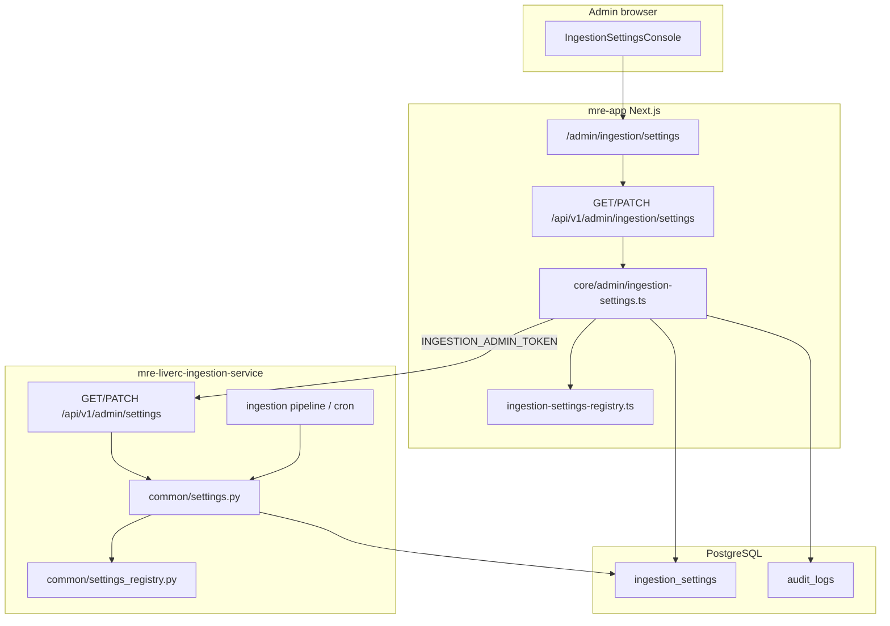

# Admin Ingestion Settings Console

**Status:** Implemented — normative for implementers; code wins on conflict.  
**Route:** `/admin/ingestion/settings`  
**ADR:** [ADR-20260608](../adr/ADR-20260608-admin-ingestion-settings-console.md)

---

## 1. Summary

Administrators need a **Settings** console under the existing admin area to view
and change LiveRC ingestion configuration without editing `.env.docker` for
routine tuning.

The console displays every registered setting grouped by category, shows
**effective value**, **source** (database / environment / default), and **apply
mode** (runtime / restart / read-only). Runtime-tunable values persist in
PostgreSQL and override environment defaults.

**Existing admin ingestion page** (`/admin/ingestion`) remains for **job
triggers** (track sync, event ingestion). Settings live on a sibling route or
tab to avoid mixing operational actions with configuration.

---

## 2. Goals and non-goals

### 2.1 Goals

| Goal                      | Detail                                                         |
| ------------------------- | -------------------------------------------------------------- |
| Discoverability           | All ingestion env vars and site-policy knobs visible in one UI |
| Safe editing              | Validation, confirm dialogs, audit log on every write          |
| Correct apply semantics   | UI states when restart is required vs immediate effect         |
| Cross-service consistency | `scope: both` settings apply to Next.js and Python             |
| Cron parity               | Nightly jobs read the same effective config as the API         |

### 2.2 Non-goals (v1)

- Restarting Docker containers from the UI
- Editing `DATABASE_URL` or other secrets (read-only, masked)
- Per-user ingestion preferences (global admin config only)
- Real-time config push to multiple ingestion replicas (single container v0.1.1)

---

## 3. System context



---

## 4. Component map

| Layer           | Path / artefact                                               | Responsibility                          |
| --------------- | ------------------------------------------------------------- | --------------------------------------- |
| Page            | `src/app/(authenticated)/admin/ingestion/settings/page.tsx`   | Auth gate, layout, breadcrumbs          |
| Organism        | `src/components/organisms/admin/IngestionSettingsConsole.tsx` | Grouped form, save, confirm dialogs     |
| Molecules       | Reuse `LabeledSwitch`, `StandardInput`, `Modal`, `Tooltip`    | Atomic design compliance                |
| Nav             | `src/components/AdminNav.tsx`                                 | Link to Settings (or Ingestion sub-nav) |
| Next API        | `src/app/api/v1/admin/ingestion/settings/route.ts`            | GET, PATCH                              |
| Core            | `src/core/admin/ingestion-settings.ts`                        | Merge DB + env, audit, proxy to Python  |
| Registry        | `src/core/admin/ingestion-settings-registry.ts`               | Canonical key definitions (TS)          |
| Prisma          | `IngestionSetting` model                                      | Persistent overrides                    |
| Python API      | `ingestion/api/routes/admin_settings.py`                      | GET/PATCH/reload                        |
| Python resolver | `ingestion/common/settings.py`                                | Effective value lookup + cache          |
| Python registry | `ingestion/common/settings_registry.py`                       | Mirror of TS registry                   |

---

## 5. Effective value resolution

For each registered key `K`:

1. If row exists in `ingestion_settings` where `key = K`, use `value` (typed
   parse).
2. Else if `process.env[K]` / `os.getenv(K)` is set, use env value.
3. Else use registry `default`.

Each GET response includes:

```json
{
  "key": "MRE_RECENT_EVENTS_DAYS",
  "effectiveValue": 7,
  "source": "database",
  "applyMode": "runtime",
  "envValue": 7,
  "dbValue": 7,
  "defaultValue": 7,
  "pendingRestart": false
}
```

For `applyMode: restart`, changing env still requires container restart; DB
overrides should **not** be used for those keys (registry marks them
`writable: false` in UI).

---

## 6. Apply modes

| applyMode  | Writable in UI              | On save                                                |
| ---------- | --------------------------- | ------------------------------------------------------ |
| `runtime`  | Yes                         | UPSERT `ingestion_settings`; call Python reload; audit |
| `restart`  | No (display env + doc link) | N/A — runbook instructs edit `.env.docker` + restart   |
| `readonly` | No                          | N/A — code constants or derived readouts               |

**Runtime reload scope:**

- Python: invalidate `settings` cache; reload `SitePolicy` if policy keys
  changed
- Next.js: short TTL cache or read DB on each `assertScrapingEnabled()` call
- Cron: read DB at job start via `settings` module (not stale `.env.cron` copy)

---

## 7. Setting scopes

| scope       | Read by                      | Example                              |
| ----------- | ---------------------------- | ------------------------------------ |
| `ingestion` | Python ingestion + cron only | `INGESTION_QUEUE_MAX_CONCURRENT`     |
| `app`       | Next.js only                 | (reserved; none in v1)               |
| `both`      | Next.js + Python             | `MRE_SCRAPE_ENABLED`                 |
| `telemetry` | `mre-telemetry-worker`       | `TELEMETRY_WORKER_POLL_INTERVAL_SEC` |

Telemetry settings display a note: **Changes apply to `mre-telemetry-worker`;
restart that container after save** until hot reload is implemented.

---

## 8. Site policy

Site policy (`policies/site_policy/policy.json`) is not a flat env var. Phase 3
adds a **Site policy** panel:

- v1 editor: validated JSON with schema check
- v2: form fields per host rule (`pattern`, `crawlDelaySeconds`,
  `maxConcurrency`)

Effective policy = base JSON file merged with optional DB blob
(`ingestion_settings` key `site_policy_overrides` or dedicated column).

Both `ingestion/common/site_policy.py` and `src/lib/site-policy.ts` must load
dynamically (remove static JSON import in Next.js for override support).

---

## 9. Security

| Control            | Implementation                                                           |
| ------------------ | ------------------------------------------------------------------------ |
| Authentication     | NextAuth session; admin flag on user                                     |
| Authorization      | `requireAdmin()` on all Next.js admin settings routes                    |
| Service-to-service | `INGESTION_ADMIN_TOKEN` header; Python rejects missing/invalid token     |
| Network            | Python admin routes listen on internal Docker network only               |
| Audit              | `audit_logs.action = ingestion.settings.update` with `{ key, old, new }` |
| Secrets            | Mask `DATABASE_URL`, passwords; never PATCH                              |
| Dangerous ops      | Confirm modal: disable scrape, `MAX_INGESTS=0`, disable queue            |

---

## 10. UI specification

### 10.1 Layout

- Max width: match other admin pages (`max-w-5xl` or `max-w-7xl`)
- Sections as cards (same pattern as `IngestionControls.tsx`)
- Sticky footer or top bar: **Save changes** (disabled until dirty)
- Unsaved navigation warning

### 10.2 Categories (match registry)

1. Scraping and safety
2. Async ingestion queue
3. Track sync
4. Recent events auto-ingest
5. Practice day discovery
6. Telemetry worker
7. Infrastructure (read-only)
8. Site policy (Phase 3)
9. Code constants (read-only, Phase 1)

### 10.3 Field affordances

| Type                 | Control                                 |
| -------------------- | --------------------------------------- |
| `boolean`            | `LabeledSwitch`                         |
| `integer` / `number` | `StandardInput` + min/max hint          |
| `enum`               | `<select>`                              |
| `duration_seconds`   | Integer + unit label                    |
| `path`               | Read-only text                          |
| `json`               | Textarea with validate button (Phase 3) |

Each field shows: label, description tooltip, effective value badge (source),
apply mode chip.

### 10.4 Copy rules

- No em dashes in UI strings (per `docs/AGENTS.md`)
- Use middle dot for compound status: `Runtime · DB override`

---

## 11. Observability

Log and metric hooks (implement in Phase 2):

- Structured log: `ingestion_settings_updated` with `key`, `admin_user_id`
- Counter: `mre_ingestion_settings_updates_total{key=...}`
- Audit log is source of truth for compliance review

---

## 12. Testing strategy

| Layer      | Tests                                                               |
| ---------- | ------------------------------------------------------------------- |
| Registry   | TS + Python parity test (keys match)                                |
| Resolver   | Unit: precedence DB > env > default                                 |
| Next API   | Integration: admin forbidden for non-admin; validation errors       |
| Python API | Unit: token auth; PATCH rejects unknown keys                        |
| E2E        | Admin login → view settings → change kill switch → verify audit row |

See
[18-ingestion-testing-strategy.md](liverc-ingestion/18-ingestion-testing-strategy.md).

---

## 13. Related documentation

- [33 - Settings registry](liverc-ingestion/33-ingestion-settings-registry-and-runtime-config.md)
- [Implementation plan](../implimentation_plans/admin-ingestion-settings-console-2026-06.md)
- [Runbook](../operations/admin-ingestion-settings-runbook.md)
- [API reference](../api/admin-ingestion-settings-api.md)
- [Admin user guide](../user-guides/admin-ingestion-settings.md)
