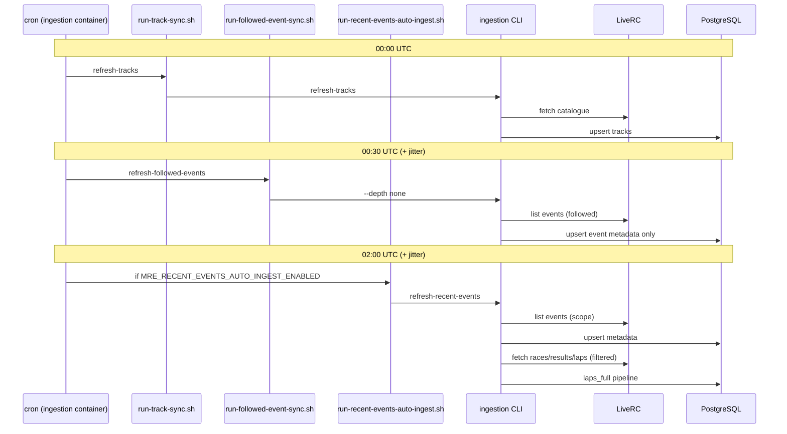

# 31. Recent Events Auto-Ingest (LiveRC)

**Status:** Implemented (feature-gated for cron, default off)  
**Feature codename:** `recent-events-auto-ingest`  
**Primary CLI command:** `refresh-recent-events` (in
`ingestion/cli/commands.py`; filter logic in
`ingestion/ingestion/recent_events.py`)  
**Cron gate:** `MRE_RECENT_EVENTS_AUTO_INGEST_ENABLED` (default `false`)  
**ADR:** [ADR-20260531-scheduled-recent-events-auto-ingest.md](../../adr/ADR-20260531-scheduled-recent-events-auto-ingest.md)

---

## 1. Summary

MRE already runs **nightly track catalogue sync** and **nightly followed-track
event metadata refresh** (`--depth none`). Those jobs discover events but do
**not** pull races, results, or laps unless an admin or user triggers full
ingestion manually.

**Recent Events Auto-Ingest** closes that gap for a configurable window (default
**7 calendar days**): after each run, newly discovered events whose event date
falls in that window are automatically ingested at **`laps_full`** depth,
subject to caps, kill switches, and LiveRC courtesy limits.

### 1.1 Goals

| Goal                          | Detail                                                                                                                                           |
| ----------------------------- | ------------------------------------------------------------------------------------------------------------------------------------------------ |
| Fresh data without manual CLI | Club and regional events appear in MRE with full lap data shortly after LiveRC publishes results.                                                |
| Bounded LiveRC load           | Date filter + per-run ingest caps + sequential track processing + existing site policy / crawl-delay.                                            |
| Safe by default               | Only ingest events that are **new to MRE** or still at `ingest_depth = none`; skip `laps_full` unless `--re-ingest-stale` is explicitly enabled. |
| Operable                      | Structured logs, Prometheus counters, cron wrapper, documented rollback via env vars.                                                            |

### 1.2 Non-goals (v1)

- Real-time or sub-hourly polling of LiveRC.
- Full re-ingestion of every event on every track every night.
- UI for configuring per-user auto-ingest rules (CLI + env + cron only in v1).
- Ingesting events older than the configured window (use existing
  `refresh-events --ingest-all` for backfill).

---

## 2. Relationship to existing automation

Current cron (`ingestion/crontab`) — all three entries are active:

| UTC time     | Script                             | Command                                       | Effect                                                                                                                               |
| ------------ | ---------------------------------- | --------------------------------------------- | ------------------------------------------------------------------------------------------------------------------------------------ |
| `0 0 * * *`  | `run-track-sync.sh`                | `refresh-tracks`                              | Updates global track catalogue; marks missing tracks `is_active=false`.                                                              |
| `30 0 * * *` | `run-followed-event-sync.sh`       | `refresh-followed-events --depth none`        | Upserts event metadata for **`is_followed=true`** tracks only; **no lap ingest**.                                                    |
| `0 2 * * *`  | `run-recent-events-auto-ingest.sh` | `refresh-recent-events` (defaults, `--quiet`) | Discover + **full ingest** for recent events on configured track scope. Skipped unless `MRE_RECENT_EVENTS_AUTO_INGEST_ENABLED=true`. |

Staggering **2 hours** after track sync avoids racing the catalogue upsert and
spreads LiveRC load away from midnight UTC peak.

`refresh-followed-events --depth none` remains valuable: it updates entry/driver
counts and event names for **all** followed tracks without the cost of lap
ingest. `refresh-recent-events` is complementary, not a replacement.

### 2.1 Nightly schedule (sequence)



---

## 3. Behaviour specification

### 3.1 Track scope (`--tracks`)

| Mode       | Query                                   | Default?             | Use case                                                              |
| ---------- | --------------------------------------- | -------------------- | --------------------------------------------------------------------- |
| `followed` | `Track.is_active AND Track.is_followed` | **Yes (v1 default)** | Production-safe rollout; matches admin `is_followed` ingestion scope. |
| `active`   | `Track.is_active`                       | No                   | Full catalogue scan; high LiveRC load — staging / opt-in only.        |
| `all`      | All rows in `tracks`                    | No                   | Debugging only; includes inactive tracks.                             |

v1 **production default:** `--tracks followed`.

### 3.2 Recency window (`--days`)

- **Default:** `7`
- **Semantics:** Include an event if its **`event_date`** (UTC calendar date
  derived from stored `Event.eventDate`) satisfies:

  `event_date >= (run_started_at_utc.date() - days + 1)`  
  and  
  `event_date <= run_started_at_utc.date()`

  The `+ 1` makes a 7-day window inclusive of today and the prior six calendar
  days.

- **Multi-day events:** If `event_date_end` is populated and **later** than
  `event_date`, also include the event when **any** day of
  `[event_date, event_date_end]` overlaps the window (intersection non-empty).
  This prevents missing a weekend meeting whose `event_date` is the Friday
  start.

- **Future-dated events:** Events with `event_date > today` are **excluded**
  from auto-ingest (metadata upsert may still occur during discovery).

### 3.3 Ingestion depth

- Auto-ingest always uses pipeline depth **`laps_full`** when ingestion is
  triggered.
- Discovery/upsert always runs (metadata refresh) for events returned from
  LiveRC list fetch, same as `_refresh_events_for_track` today.

### 3.4 Which events receive full ingest

After upsert, candidate events for `laps_full` must satisfy **all** of:

1. Event date (or range) overlaps the recency window (§3.2).
2. Event age ≥ `--min-event-age-hours` (default **12**) — avoids ingesting
   events still on track (in-progress mains).
3. Not already at `ingest_depth = laps_full` unless `--re-ingest-stale` (default
   off).
4. Run has not exceeded `--max-ingests` (default **50** per run, `0` = unlimited
   for dev).
5. Per-track cap `--max-ingests-per-track` (default **5**) not exceeded.

**Default ingest set (same as today’s `ingest_new_only`):**

- Events **newly inserted** in this run (`new_event_ids`), plus
- Existing rows still at `ingest_depth = none` whose date is in window (handles
  cases where metadata was discovered earlier but never deep-ingested).

### 3.5 Ordering

Process tracks in stable order: `track_name ASC, id ASC`.

Within a track, ingest events in **`event_date DESC`** (most recent first) so
caps prefer the freshest meetings if `--max-ingests` is hit.

### 3.6 Failure isolation

- Failure on one track MUST NOT abort the entire run (match
  `refresh-followed-events`).
- Failure on one event MUST NOT abort the track loop (match
  `_refresh_events_for_track`).
- `IngestionInProgressError` → log warning, count as
  `events_skipped_in_progress`, continue.

### 3.7 Idempotency

Re-running the same cron period is safe:

- Upserts are idempotent on `(source, source_event_id)`.
- Pipeline skips events already at `laps_full` unless `--re-ingest-stale`.
- Advisory locks prevent duplicate concurrent ingest of the same event.

---

## 4. CLI contract

Namespace: `python -m ingestion.cli ingest liverc refresh-recent-events`

### 4.1 Flags

| Flag                      | Type   | Default    | Description                                                                        |
| ------------------------- | ------ | ---------- | ---------------------------------------------------------------------------------- |
| `--days`                  | int    | `7`        | Recency window length in calendar days.                                            |
| `--tracks`                | choice | `followed` | `followed` \| `active` \| `all`                                                    |
| `--min-event-age-hours`   | int    | `12`       | Skip events newer than this many hours (by `event_date` midnight UTC vs run time). |
| `--max-ingests`           | int    | `50`       | Max full ingests per run (`0` = no cap).                                           |
| `--max-ingests-per-track` | int    | `5`        | Max full ingests per track per run.                                                |
| `--re-ingest-stale`       | bool   | off        | Re-run `laps_full` on events already complete (dangerous for cron; admin only).    |
| `--dry-run`               | bool   | off        | Log actions only; no HTTP ingest pipeline calls.                                   |
| `--quiet`                 | bool   | off        | Suppress per-event stdout; summary only.                                           |

**Note:** There is no `--depth` flag; depth is always `laps_full` when
ingesting.

### 4.2 Exit codes

| Code | Meaning                                                                                |
| ---- | -------------------------------------------------------------------------------------- |
| `0`  | Run completed (individual event failures may still have occurred; check logs/metrics). |
| `1`  | Validation error (bad flags, scraping disabled).                                       |
| `2`  | Catastrophic failure (DB unavailable, connector init failure).                         |

### 4.3 Structured log events (required)

| Event                                 | Fields                                                    |
| ------------------------------------- | --------------------------------------------------------- |
| `refresh_recent_events_start`         | `days`, `tracks`, caps, `dry_run`, timestamp              |
| `refresh_recent_events_track_start`   | `track_id`, `source_track_slug`                           |
| `refresh_recent_events_track_done`    | `track_id`, per-track stats                               |
| `refresh_recent_events_event_ingest`  | `event_id`, `source_event_id`, `event_name`, `event_date` |
| `refresh_recent_events_event_skipped` | `reason`, `event_id`, …                                   |
| `refresh_recent_events_complete`      | `totals`, `duration_ms`                                   |

### 4.4 Summary stdout (human)

```
Recent events auto-ingest complete:
  Tracks scanned: 42
  Events listed from LiveRC: 380
  Events upserted (new / updated): 3 / 12
  In window + eligible: 8
  Full ingests: 5 ok, 1 failed, 2 skipped (cap), 0 in-progress
  Laps ingested: 4200
  Duration: 4m 12s
```

---

## 5. Code integration points (as built)

### 5.1 Filter module

The date-window and eligibility logic lives in a dedicated module,
`ingestion/ingestion/recent_events.py`, not inline in the CLI:

```text
recent_events.py
  ├── RecentEventsFilterConfig(days, min_event_age_hours, run_at_utc)
  ├── event_overlaps_window(...) / event_meets_min_age(...)   # §3.2, §3.4
  ├── is_eligible_for_auto_ingest(...)
  ├── build_recent_ingest_candidates(events, config, re_ingest_stale)
  │     → RecentIngestCandidateResult(candidates, events_in_window,
  │        events_eligible, events_skipped_age, events_skipped_already_full)
  └── apply_ingest_caps(candidates, max_ingests_remaining, max_per_track)
        → (selected, skipped_by_cap_count)
```

The `refresh-recent-events` command in `ingestion/cli/commands.py` discovers and
upserts events, builds candidates via `build_recent_ingest_candidates`, applies
caps via `apply_ingest_caps`, then reuses the existing
`_refresh_events_for_track` helper with `events_to_ingest_ids=…`,
`skip_discovery=True`, `discovery_stats=…`, and `dry_run=…` to drive the
`laps_full` loop.

### 5.2 Files (implementation)

| File                                                 | Role                                                  |
| ---------------------------------------------------- | ----------------------------------------------------- |
| `ingestion/ingestion/recent_events.py`               | Filter config + candidate/cap helpers.                |
| `ingestion/cli/commands.py`                          | `refresh-recent-events` command; extended stats dict. |
| `ingestion/scripts/run-recent-events-auto-ingest.sh` | Cron wrapper (mirrors `run-followed-event-sync.sh`).  |
| `ingestion/crontab`                                  | 02:00 UTC job.                                        |
| `ingestion/common/metrics.py`                        | Auto-ingest run/event/duration metrics (§8.1).        |
| `ingestion/scripts/cron-entrypoint.sh`               | Writes `MRE_RECENT_EVENTS_*` env into `.env.cron`.    |
| `docs/operations/environment-variables.md`           | Documents the env vars (§7).                          |
| `ingestion/tests/unit/test_recent_events_filter.py`  | Filter logic unit tests with fixed datetimes.         |

No Prisma schema changes required.

No Next.js UI changes required for v1.

### 5.3 HTTP API

**v1:** CLI + cron only. Do **not** expose a public API that scans all tracks.

Optional **admin-only** trigger later:
`POST /api/v1/admin/ingestion/recent-events` mirroring existing track-sync job
pattern — document as Phase 4 in implementation plan.

---

## 6. LiveRC courtesy and load model

### 6.1 Request budget (followed scope, default caps)

Rough order-of-magnitude per nightly run:

| Step                  | Requests per track | Tracks (example)   | Total              |
| --------------------- | ------------------ | ------------------ | ------------------ |
| Event list page       | 1                  | 40 followed        | 40                 |
| Full ingest per event | 10–200+            | ≤ 50 events capped | ≤ 10k (worst case) |

With defaults (`followed`, `max-ingests=50`), realistic lap-ingest count is
**0–15** events/night, not hundreds.

### 6.2 Active scope warning

`--tracks active` may scan **800+** tracks × 1 list request ≈ **800+ HTTP
requests/night** before any ingest. Only enable with explicit ops approval and
lower caps.

### 6.3 Existing protections (must remain enabled)

- `MRE_SCRAPE_ENABLED` kill switch
- `ingestion/common/site_policy.py` robots.txt + crawl-delay
- Random **0–120 s** jitter in cron wrapper
- Sequential track loop (no parallel track fan-out in v1)
- Playwright fallback only when needed (see connector architecture)

---

## 7. Environment variables

These are read by the cron wrapper (`run-recent-events-auto-ingest.sh`) and
written into `.env.cron` by `ingestion/scripts/cron-entrypoint.sh`:

| Variable                                | Default    | Description                                                           |
| --------------------------------------- | ---------- | --------------------------------------------------------------------- |
| `MRE_RECENT_EVENTS_AUTO_INGEST_ENABLED` | `false`    | Master enable for cron wrapper (in addition to `MRE_SCRAPE_ENABLED`). |
| `MRE_RECENT_EVENTS_DAYS`                | `7`        | Default `--days` when not passed on CLI.                              |
| `MRE_RECENT_EVENTS_TRACKS`              | `followed` | Default `--tracks`.                                                   |
| `MRE_RECENT_EVENTS_MAX_INGESTS`         | `50`       | Default `--max-ingests`.                                              |
| `MRE_RECENT_EVENTS_MIN_AGE_HOURS`       | `12`       | Default `--min-event-age-hours`.                                      |

The cron wrapper passes `--days`, `--tracks`, `--max-ingests`,
`--min-event-age-hours`, and `--quiet`. (`--max-ingests-per-track` is not wired
to an env var and uses its CLI default of `5`.)

---

## 8. Observability

### 8.1 Metrics (Prometheus)

Implemented in `ingestion/common/metrics.py` and recorded at the end of each
run:

- `recent_events_auto_ingest_runs_total{status}` (status = `success` | `partial`
  | `empty`)
- `recent_events_auto_ingest_events_ingested_total`
- `recent_events_auto_ingest_events_failed_total`
- `recent_events_auto_ingest_duration_seconds` (histogram)

### 8.2 Alerts (recommended thresholds)

| Alert                  | Condition                                            |
| ---------------------- | ---------------------------------------------------- |
| Auto-ingest run failed | No `refresh_recent_events_complete` log in 26 h      |
| High failure rate      | `events_failed / events_attempted > 0.5` over 3 runs |
| Run duration           | `duration_ms > 7200000` (2 h)                        |

### 8.3 Log location

Cron stdout appended to `/var/log/recent-events-auto-ingest.log` inside
ingestion container.

---

## 9. Security and permissions

- Cron runs inside `mre-liverc-ingestion-service` with DB credentials only — no
  user session.
- No new user-facing permissions.
- Admin CLI remains the manual override path.
- `--dry-run` must not write `ingest_depth` or lap rows (read + log only).

---

## 10. Canonical test fixture (manual QA)

Use this **verified LiveRC event** for end-to-end testing (May 2026):

| Field                  | Value                                                            |
| ---------------------- | ---------------------------------------------------------------- |
| Track                  | Hot Rod Hobbies                                                  |
| Track slug             | `hotrodhobbies`                                                  |
| Event name             | Saturday Off-Road Club Racing                                    |
| Event date             | 2026-05-30                                                       |
| LiveRC source event ID | `506979`                                                         |
| Event URL              | https://hotrodhobbies.liverc.com/results/?p=view_event&id=506979 |
| Scale                  | 52 entries, 40 drivers                                           |

**Alternate (smaller / faster):** Metz RC Raceway — Wednesday In & Out —
`506631` — 2026-05-27 —
https://metzrcraceway.liverc.com/results/?p=view_event&id=506631

Manual test procedure: see
`docs/operations/recent-events-auto-ingest-runbook.md`.

---

## 11. Rollout strategy

1. **Dev:** Run the CLI with `--dry-run`, then a single track via
   `--tracks followed` with one followed track in DB.
2. **Staging:** Enable cron with `MRE_RECENT_EVENTS_AUTO_INGEST_ENABLED=true`,
   low caps (`max-ingests=5`).
3. **Production:** Enable on followed scope; monitor 1 week; tune caps.
4. **Optional phase 2:** Opt-in `active` scope with strict caps for “global
   freshness” experiments.

---

## 12. Related documents

- ADR: `docs/adr/ADR-20260531-scheduled-recent-events-auto-ingest.md`
- Implementation plan:
  `docs/implimentation_plans/recent-events-auto-ingest-2026-05.md`
- Operations runbook: `docs/operations/recent-events-auto-ingest-runbook.md`
- Pipeline spec: `docs/architecture/liverc-ingestion/03-ingestion-pipeline.md`
- CLI spec (update when implemented):
  `docs/architecture/liverc-ingestion/06-admin-cli-spec.md`
- Testing: `docs/architecture/liverc-ingestion/18-ingestion-testing-strategy.md`
  §9.1
- Observability:
  `docs/architecture/liverc-ingestion/15-ingestion-observability.md` §9
- Recovery:
  `docs/architecture/liverc-ingestion/21-ingestion-recovery-procedures.md` §15
