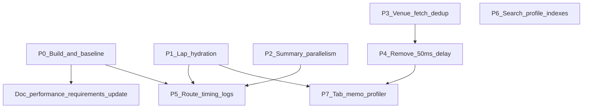

# Application performance remediation — implementation plan (March 2026)

This document turns the **ranked backlog (P0–P7)** and wave findings from
[application-performance-review-2026-03.md](../reviews/application-performance-review-2026-03.md)
into executable work packages: dependencies, files, acceptance criteria,
verification steps, and documentation updates.

**Constraints:** All runtime verification runs in **Docker** per
[AGENTS.md](../AGENTS.md) (`mre-app`, `mre-liverc-ingestion-service`). No host
`npm run dev` / raw `pytest` for “proof” of behavior.

---

## 1. Dependency overview

- **P0** unblocks accurate bundle measurement and green CI builds; do it first.
- **P5** (observability) should land after P0 and can run in parallel with
  **P1–P2** once interfaces are stable.
- **P3** and **P4** are dashboard UX; safe after P0; **P3** may interact with
  **P4** (test together).
- **P6** is independent (search core + DB).
- **P7** benefits from P1 (less data churn) and P4 (cleaner effect timing).
- **Documentation update** (Section 8) depends on P0 + at least one
  authenticated timing pass (P5 helps).

---

## 2. Work package P0 — Build green + capture bundle baseline

**Source:** Review §4.2, §9 P0, Wave C (implicit).

### 2.1 Problem

`next build` fails TypeScript check: `transformApiResponseToEventAnalysisData`
produces `races` that do not satisfy `EventAnalysisData` (notably **`raceUrl`**
is required on each race in core types but missing from
`EventAnalysisDataApiResponse` / transform path).

### 2.2 Implementation steps

1. **Single source of truth for API shape**
   - Inspect `EventAnalysisData` in
     [get-event-analysis-data.ts](../../src/core/events/get-event-analysis-data.ts)
     (race objects include `raceUrl`).
   - Align [dashboardSlice.ts](../../src/store/slices/dashboardSlice.ts)
     `EventAnalysisDataApiResponse` with the same fields.
   - Align
     [EventAnalysisSection.tsx](../../src/components/organisms/dashboard/EventAnalysisSection.tsx)
     local `EventAnalysisDataApiResponse` (duplicate type) with
     `raceUrl: string` on each race (and any other drifted fields the compiler
     reports).

2. **Transform**
   - Ensure `transformApiResponseToEventAnalysisData` maps every required
     `EventAnalysisData` field; prefer `...race` spread only after the API
     response type includes all server fields.

3. **Optional consolidation**
   - If duplication persists, extract a shared `EventAnalysisDataApiResponse`
     type to one module (e.g. `src/types/event-analysis-api.ts`) imported by
     slice + section — only if scope stays small.

### 2.3 Acceptance criteria

- `docker exec mre-app npm run build` exits **0** (TypeScript + Next build).
- Paste the build output **First Load JS** / route chunks (or full build
  summary) into the review doc §4.2 or a linked appendix.
- Compare rough gzipped JS to the **&lt; 200KB** recommendation in
  [performance-requirements.md](../architecture/performance-requirements.md)
  (document gap; do not block on hitting budget).

### 2.4 Estimated effort

Small (hours), unless many fields are out of sync.

---

## 3. Work package P1 — Reduce lap hydration in `getEventAnalysisData`

**Source:** Review §5 A1, §9 P1.

### 3.1 Problem

`getEventAnalysisData` uses `include` with nested `laps` for every race result
to derive metrics when aggregates are missing. DB and Node hydrate **all lap
rows** even though the HTTP response omits lap arrays from the client payload.

### 3.2 Discovery phase (before coding)

1. Identify call sites that rely on per-result lap arrays vs aggregates
   (`fastLapTime`, `avgLapTime`, `lapsCompleted`, etc.).
2. For a **large seeded event** (or staging data), enable Prisma query logging
   or add temporary `measureOperation` around the `findUnique` in Docker and
   record duration and row counts.

### 3.3 Implementation options (choose after spike)

| Option | Description                                                                                                   | Tradeoff                                  |
| ------ | ------------------------------------------------------------------------------------------------------------- | ----------------------------------------- |
| **A**  | Default query **without** `laps`; second query only for `raceResult` rows where aggregates are null/ambiguous | Extra round-trip for edge cases only      |
| **B**  | SQL/raw query or Prisma `$queryRaw` to compute derived metrics in the database                                | More maintenance, fastest for huge events |
| **C**  | Narrow `laps` select (e.g. only columns needed for derivation) + `take` if algorithm allows                   | Partial win                               |

**Correctness:** Preserve existing `deriveLapMetrics` / validation behavior for
edge cases documented in code.

### 3.4 Acceptance criteria

- For a representative large event, documented **before/after** server time or
  query count (append to review or this plan).
- API response JSON shape unchanged for clients unless versioned intentionally.
- Tests: extend or add unit/integration coverage in `src/__tests__` for analysis
  data shape if regressions are risky.

### 3.5 Estimated effort

High (multi-day); may span multiple PRs (spike PR + implementation PR).

---

## 4. Work package P2 — Parallelize independent Prisma work in `getEventSummary`

**Source:** Review §5 A3, A4, §9 P2.

### 4.1 Scope

File:
[get-event-analysis-data.ts](../../src/core/events/get-event-analysis-data.ts),
function `getEventSummary`.

### 4.2 Steps

1. **Group independent awaits** after `event` load: e.g. `raceStats`,
   `distinctDrivers`, `lapStats` can often run in `Promise.all` if Prisma client
   allows concurrent queries (verify connection pool in Docker).
2. The **three** `raceResult.findMany` blocks (fast lap / consistency / avg lap)
   — parallelize if they do not depend on each other’s results.
3. **`userId` branch** (~738–950): map sequential `findMany` calls; parallelize
   where dependencies allow; keep ordering guarantees for “best” rankings.

### 4.3 Acceptance criteria

- No behavior change in returned `EventSummary` object.
- Measure p95 for `GET /api/v1/events/:id/summary` before/after (authenticated
  curl or HAR), document in review appendix.
- Existing tests for summary, if any, still pass; add test if coverage is thin.

### 4.4 Estimated effort

Medium (1–2 days including verification).

---

## 5. Work package P3 — Avoid duplicate `fetchEventAnalysisData` on venue correction

**Source:** Review §7 C1, §9 P3.

**2026-04-13:** **Venue correction is fully deprecated** (see
[`docs/architecture/venue-correction-deprecation.md`](../architecture/venue-correction-deprecation.md)).
Prefer **removing** `fetchVenueCorrection` / success handlers entirely rather
than optimizing the double-fetch path. If this section is obsolete after UI
removal, close P3 as **won’t fix** / **superseded by deprecation**.

### 5.1 Files

- [EventAnalysisSection.tsx](../../src/components/organisms/dashboard/EventAnalysisSection.tsx)
  — `fetchVenueCorrection`, `handleVenueCorrectionSuccess`.

### 5.2 Design

1. When venue correction API returns `correction` and track metadata already
   matches what analysis needs, **skip** a second full analysis fetch; only
   refetch if the response indicates analysis-affecting delta (or always refetch
   summary row only if split endpoint exists).
2. Alternatively: **debounce** rapid double dispatches (correction success +
   effect) so only one `fetchEventAnalysisData` runs within N ms.

### 5.3 Acceptance criteria

- Network tab shows **one** `GET .../analysis` per user correction success path
  (unless product requires hard refresh).
- Venue display and analysis stay consistent; manual QA on dashboard.

### 5.4 Estimated effort

Low.

---

## 6. Work package P4 — Remove or justify 50ms `setTimeout` before analysis dispatch

**Source:** Review §7 C2, §9 P4.

### 6.1 Steps

1. Remove `setTimeout` and dispatch `fetchEventAnalysisData` directly when
   `selectedEventId` is set and prerequisites are met.
2. Run regression: rapid event switching, abort behavior, Redux
   `currentFetchRequestId` race (summary path).
3. If a race appears, replace timeout with a **proper** fix (e.g. `useEffect`
   deps, request id guard for analysis thunk similar to summary).

### 6.2 Acceptance criteria

- No increase in duplicate or stale analysis loads in manual testing.
- Optional: React Profiler shows earlier start of fetch (network waterfall
  starts sooner).

### 6.3 Estimated effort

Low; test with **P3** together.

---

## 7. Work package P5 — Structured timing on hot API routes

**Source:** Review §6 B3, B4, §9 P5.

### 7.1 Options

| Approach | Files                                                                                                       | Notes                                                                                  |
| -------- | ----------------------------------------------------------------------------------------------------------- | -------------------------------------------------------------------------------------- |
| **A**    | Wrap handlers with [withPerformanceLogging](../../src/lib/api-performance-wrapper.ts)                       | Adds `X-Response-Time`, uses [performance-logger](../../src/lib/performance-logger.ts) |
| **B**    | Extend [createRequestLogger](../../src/lib/request-context.ts) / handler pattern to log duration on success | Centralized, no double-wrapping                                                        |

### 7.2 Target routes (minimum)

- `GET`
  [events/[eventId]/analysis/route.ts](../../src/app/api/v1/events/[eventId]/analysis/route.ts)
- `GET`
  [events/[eventId]/summary/route.ts](../../src/app/api/v1/events/[eventId]/summary/route.ts)
- `GET` [search/route.ts](../../src/app/api/v1/search/route.ts)

### 7.3 Acceptance criteria

- Slow requests log above threshold (see `THRESHOLDS` in performance-logger).
- No duplicate `X-Request-ID` / header bugs; preserve existing auth and error
  handling.

### 7.4 Estimated effort

Low.

---

## 8. Work package P6 — Unified search profiling and indexes

**Source:** Review §6 B2, §9 P6.

### 8.1 Steps

1. **Trace** [unifiedSearch](../../src/core/search/search.ts) (and related
   modules): list Prisma queries for typical `q`, date range, session type.
2. Run `EXPLAIN ANALYZE` in Postgres (via `docker exec mre-postgres` or Prisma
   `$queryRaw` in dev) for slow statements.
3. Cross-check [schema.md](../../docs/database/schema.md) and Prisma schema for
   missing indexes on filtered/sorted columns.
4. Add migrations only with measured benefit; avoid speculative indexes.

### 8.2 Acceptance criteria

- Documented before/after p95 for `GET /api/v1/search` under representative
  queries.
- Migration + short note in schema docs if indexes added.

### 8.3 Estimated effort

Medium (depends on query shape).

---

## 9. Work package P7 — Event analysis tabs: Profiler + memoization

**Source:** Review §7 C4, §9 P7.

### 9.1 Steps

1. React Profiler (or React DevTools) on tab switches:
   [OverviewTab](../../src/components/organisms/event-analysis/OverviewTab.tsx),
   [DriversTab](../../src/components/organisms/event-analysis/DriversTab.tsx),
   [SessionsTab](../../src/components/organisms/event-analysis/SessionsTab.tsx),
   chart/table organisms.
2. Apply `React.memo`, `useMemo`, or split props only where profiler shows
   **material** wasted renders (avoid blanket memoization).
3. Consider **lazy** `dynamic()` for heavy chart packages if profiler + bundle
   show win.

### 9.2 Acceptance criteria

- Recorded Profiler before/after (screenshot or short note) stored in review
  appendix or this folder.
- No UX regressions (tab state, scroll position).

### 9.3 Estimated effort

Medium.

---

## 10. Documentation and ongoing measurement

**Source:** Review §4.1, §10.

| Action                                                                                                                                       | Owner   | When                                     |
| -------------------------------------------------------------------------------------------------------------------------------------------- | ------- | ---------------------------------------- |
| Append authenticated API p95 table (summary, analysis, search)                                                                               | Dev     | After P5 + stable session                |
| Update [performance-requirements.md](../architecture/performance-requirements.md) § Frontend Budget / Load Testing with **measured** numbers | Dev     | After P0 + timing pass                   |
| Optional: add ingestion timing note from structlog for one full event                                                                        | Ops/Dev | J4 validation                            |
| Link this plan from review doc §9                                                                                                            | Doc     | Once (optional one-line cross-reference) |

---

## 11. Cross-cutting verification checklist

Use after each merged PR touching performance paths:

- [ ] `docker exec mre-app npm run build` (or CI equivalent)
- [ ] `docker exec mre-app npm test` (Vitest) for affected areas
- [ ] Manual J1–J2 smoke on dashboard + event analysis
- [ ] If DB migrations: `prisma migrate` in Docker + smoke query

---

## 12. Suggested PR sequencing

| PR  | Contents           | Depends on                                     |
| --- | ------------------ | ---------------------------------------------- |
| 1   | P0 only            | —                                              |
| 2   | P5 (logging)       | PR 1 optional but easier to measure later work |
| 3   | P2                 | PR 1                                           |
| 4   | P3 + P4            | PR 1                                           |
| 5   | P1 (spike or full) | PR 2–3 for baseline logs                       |
| 6   | P6                 | —                                              |
| 7   | P7                 | P1/P4 as needed                                |
| 8   | Docs (§10)         | PR 1 + P5 timing                               |

Adjust if team parallelizes (e.g. P6 parallel to P2).
