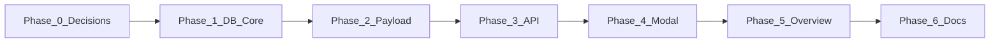

# Event host track (per-user) — implementation plan (April 2026)

This plan turns
[event-host-track-user-override.md](../architecture/event-host-track-user-override.md)
into ordered work packages with acceptance criteria. Runtime verification stays
**Docker-only** per [AGENTS.md](../AGENTS.md).

**Background:** **Update Host Track** **replaces** fully deprecated **venue
correction** (see
[venue-correction-deprecation.md](../architecture/venue-correction-deprecation.md)).
Implement host track **alongside or after** stripping old venue-correction APIs,
UI, and `getApprovedCorrection` call sites—**no** new integration with venue
correction.

---

## Phase 0 — Decisions locked in v1

- [ ] **Authorization model:** Confirm whether **any** authenticated user with
      event analysis access may set a host track, or only **event-linked**
      users. Default recommendation: **any authenticated** user with event
      analysis access. Document the final choice in the architecture doc.
- [ ] **Track search scope:** Confirm search is **global catalogue** (`tracks`
      table), `isActive = true` only, and sensible pagination/limits.

---

## Phase 1 — Database and domain layer

**Goal:** Persist `(user_id, event_id) → host_track_id` with migrations and
typed access in `src/core/`.

1. **Prisma schema**
   - Add `UserEventHostTrack` (or agreed name) with `userId`, `eventId`,
     `hostTrackId`, timestamps, `@@unique([userId, eventId])`, relations to
     `User`, `Event`, `Track`.
2. **Migration**
   - Generate and apply migration; verify in Docker (`mre-app`).
3. **Core module**
   - New file e.g. `src/core/events/user-event-host-track.ts` (or under
     `src/core/tracks/` if preferred): `getForUser`, `upsert`, `delete`,
     validate `track` exists and is eligible.
4. **Tests**
   - `src/__tests__/core/...` or alongside similar event tests: CRUD + unique
     constraint behavior.

**Acceptance:** Migration applies cleanly; unit tests pass in CI; no direct
Prisma from UI components (call through core helpers).

---

## Phase 2 — Event analysis payload

**Goal:** Analysis API returns optional `userHostTrack` for the requesting user.

1. **`get-event-analysis-data.ts`**
   - When `userId` is provided, load `UserEventHostTrack` for
     `(userId, event.id)`.
   - If present, join `Track` and map to a compact DTO (reuse address formatting
     patterns used for **venue / effective track** display — e.g.
     `formatTrackAddress` — avoid duplicating large string logic; extract a
     small helper if needed).
2. **Types / transform**
   - Extend `EventAnalysisData` (and API response types in the dashboard slice
     if required) so the client receives `userHostTrack` with a stable shape.
3. **Tests**
   - Extend or add tests in `src/__tests__` for `getEventAnalysisData` (fixture
     event + user + row).

**Acceptance:** Unauthenticated or missing row yields `userHostTrack: null`;
authenticated with row yields populated object. Host-track payload is
**independent** of venue correction. **Removing** venue-correction behaviour
from analysis/weather is **required** per
[venue-correction-deprecation.md](../architecture/venue-correction-deprecation.md)
(may ship in the same or a preceding PR).

---

## Phase 3 — HTTP API

**Goal:** CRUD endpoints for the override + **non-admin** track search.

1. **Host track routes**
   - `GET/PUT/DELETE` under e.g.
     `src/app/api/v1/user/events/[eventId]/host-track/route.ts` (split handlers
     as per project conventions).
   - Session/auth via existing patterns (`requireUser` or equivalent).
2. **Track search route**
   - New e.g. `GET /api/v1/tracks/search` (authenticated): query `trackName`
     (and optionally city) with `ILIKE` or full-text if already used elsewhere;
     return id, name, city, state, country, key URLs — **no** admin-only fields
     unless required.
3. **Rate limiting / limits**
   - Cap `limit` (e.g. max 50) to avoid abuse.

**Acceptance:** API tests or route tests cover success, unauthorized, invalid
`trackId`, and unknown event.

---

## Phase 4 — UI: modal and actions

**Goal:** User can open the flow from event analysis and save/clear selection.

1. **`EventAnalysisActionsMenu`**
   - Add **Update Host Track**; opens modal (local state or small slice — prefer
     local state unless cross-tab persistence is required).
2. **`HostTrackModal`**
   - Mirror `CarTaxonomyModal` structure: `Modal`, header, search, list, preview
     panel, **Save** / **Clear** (clear calls DELETE).
   - Fetch search results from Phase 3 endpoint; debounce input.
3. **Loading / error**
   - Use existing toast/error patterns from event analysis.

**Acceptance:** Save persists; refresh shows data from GET analysis payload;
Clear removes section after refetch.

---

## Phase 5 — UI: Overview tab

**Goal:** Dedicated **Host track** section matches **Venue info** styling;
visible only when `userHostTrack` is set.

1. **`OverviewTab`**
   - Add collapsible block (same border/spacing pattern as venue).
   - Copy structure from venue rows (dates are **event** dates, not track — do
     not duplicate event dates inside host block unless product asks; host block
     is track identity + address/contact).
2. **Empty state**
   - No section when `userHostTrack` is null (per product spec).

**Acceptance:** Visual parity with design system; no layout regressions on
mobile (see FLEXBOX checklist in AGENTS.md for scrollable regions).

---

## Phase 6 — Documentation and handoff

- [ ] Link this plan and the architecture doc from `docs/architecture/README.md`
      or an index if one exists for event analysis features (optional, only if
      there is an established index).
- [ ] Update [user-guides/event-analysis.md](../user-guides/event-analysis.md)
      with a short subsection when the feature ships (user-facing wording).

---

## Dependency graph

**Parallelism:** Phase 3 search route can start once Phase 1 exists (needs
`Track` only); host-track PUT can land before Phase 2 if types are stubbed —
prefer sequential **1 → 2 → 3** to avoid churn.

---

## Out of scope (unless explicitly added)

- Any use of **venue correction** types or APIs (fully deprecated).
- Changing **weather** or global **effective** venue to use personal host track
  (optional future ADR).
- Editing **`Track`** rows from this flow (read-only catalogue pick).

## Required cleanup (venue correction removal)

Follow
[venue-correction-deprecation.md](../architecture/venue-correction-deprecation.md):

- Remove **`getApprovedCorrection`** from **`get-event-analysis-data.ts`** and
  **`get-weather-for-event.ts`**.
- Remove user and admin **API routes**, **admin page**, **table component**, and
  client **fetchVenueCorrection** flows.
- **Prisma migration** to drop venue correction tables when references are gone.
