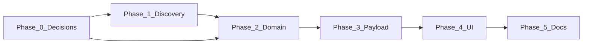

# Top qualifiers — implementation plan (April 2026)

This plan turns [top-qualifiers.md](../architecture/top-qualifiers.md) into
ordered work packages with acceptance criteria. Runtime verification stays
**Docker-only** per [AGENTS.md](../AGENTS.md).

**Background:** TQ is not yet implemented in code. Ingestion already provides
`Race`, `RaceResult`, `SessionType`, `qualifyingPosition` (Qual column), and
class links—see architecture doc for semantic cautions.

---

## Phase 0 — Decisions

Lock before or during Phase 2 (domain) so tests and API shapes stay stable.

- [ ] **v1 metric:** Confirm default: best `positionFinal` across races with
      `sessionType === qualifying` per `EventRaceClass` (per architecture doc).
- [ ] **Co-TQ:** Show all tied drivers vs single winner with tie-break; if
      single winner, lock tie-break order (`fastLapTime`, then …).
- [ ] **Persistence:** Confirm **compute-only** in analysis path for v1 vs
      materialized rows (architecture default: compute-only).
- [ ] **Heuristics:** When `sessionType` is missing, allow label-based fallback
      or return no TQ until ingestion fixes—document choice in architecture doc.

**Acceptance:** Decisions reflected in
[top-qualifiers.md](../architecture/top-qualifiers.md) or an ADR if a durable
persistence choice is made.

---

## Phase 1 — Discovery and fixtures

**Goal:** Evidence from real LiveRC fixtures for qualifying rounds and edge
cases.

1. Audit `ingestion/tests/fixtures/liverc/` (and any event analysis test
   fixtures) for events with qualifier rounds, multiple classes, and ambiguous
   labels.
2. Record 2–3 **representative examples** (event id / fixture name + expected TQ
   outcome) in a short subsection or appendix of the architecture doc, or a
   `docs/reports/` note linked from the architecture doc.

**Acceptance:** At least one fixture-backed narrative that future unit tests can
mirror; gaps documented (e.g. “no multi-drop format in fixtures yet”).

---

## Phase 2 — Domain layer

**Goal:** Deterministic, testable derivation from in-memory event analysis
structures (or Prisma-shaped DTOs).

1. Add pure helper(s) under `src/core/events/` (e.g. `top-qualifiers.ts` or
   alongside existing event helpers): input = races + results grouped by class;
   output = TQ map per `eventRaceClassId`.
2. Unit tests in `src/__tests__/` with **minimal fabricated races/results** (no
   need for full DB if helpers accept plain objects).
3. Edge cases: no qualifying sessions; empty class; ties; missing positions.

**Acceptance:** Tests pass in CI; no Prisma calls inside presentational
components; helpers match Phase 0 decisions.

---

## Phase 3 — Event analysis payload and API types

**Goal:** Consumers receive a stable DTO on the existing event analysis API.

1. **`get-event-analysis-data.ts`** — After races are assembled, attach derived
   `topQualifiers` (or agreed name) to `EventAnalysisData`.
2. **`src/types/event-analysis-api.ts`** — Mirror the shape for JSON responses.
3. Extend or add tests for `getEventAnalysisData` with fixture events if
   available.

**Acceptance:** Authenticated analysis response includes TQ fields; events with
no qualifying data yield empty or null per spec; OpenAPI / manifest updates if
the project generates them for this route.

---

## Phase 4 — UI

**Goal:** Users see TQ where product chooses (Overview, sessions table, or
driver rows).

1. Design parity with existing event analysis components (see
   [atomic-design-system.md](../architecture/atomic-design-system.md)).
2. Loading and empty states when no TQ exists for a class.
3. Optional: accessibility (badge text not color-only).

**Acceptance:** Manual verification in Docker; no flex regressions on mobile
(see FLEXBOX checklist in AGENTS.md).

---

## Phase 5 — Descriptive documentation and handoff

**Goal:** Descriptive docs match shipped behavior.

- [ ] `docs/database/schema.md` — only if schema changed.
- [ ] `docs/api/api-reference.md` and generated route manifest — if analysis API
      contract changed.
- [ ] `docs/frontend/component-catalog.md` — if new components added.
- [ ] `docs/user-guides/event-analysis.md` — short user-facing subsection when
      the feature ships.

---

## Dependency graph

**Parallelism:** Phase 1 can run alongside Phase 0; Phase 2 should wait for
Phase 0 decisions (or use feature flags / staged PRs).

---

## Out of scope (unless explicitly added)

- **Seeding rounds** productization (separate future spec).
- **Series rulebooks** (ROAR/FMAR points) as authoritative TQ without structured
  metadata.
- Changing LiveRC parsers solely for TQ unless discovery proves ingestion gaps;
  prefer analysis-time derivation first.

## ADR trigger

Add an ADR when **materialized storage** or **ingestion-time** TQ writes are
locked; until then, [top-qualifiers.md](../architecture/top-qualifiers.md)
suffices.
