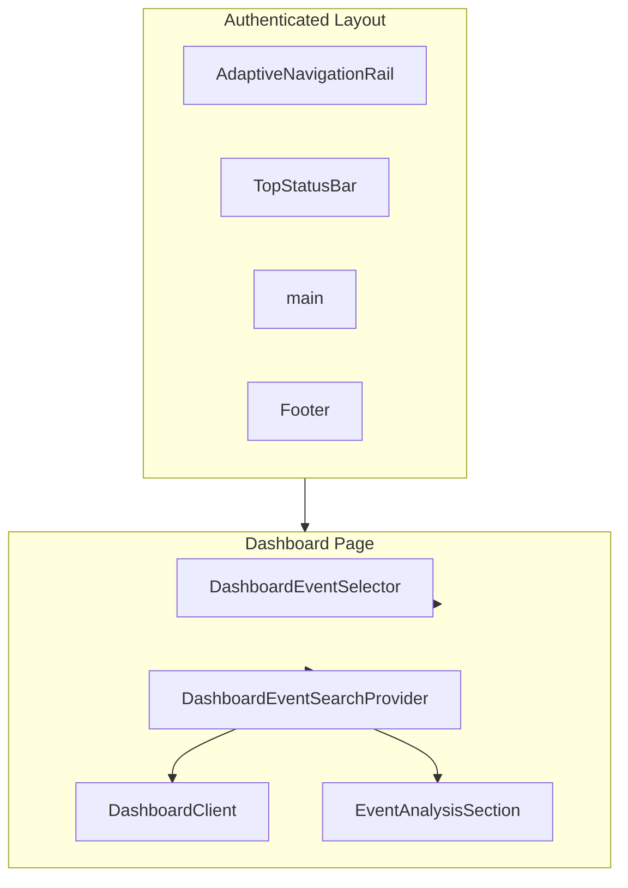

# Dashboard UI/UX Audit Report

**Date:** 2026-03-10  
**Scope:** Main dashboard (`/dashboard` – event selector + Event Analysis)  
**Audience:** Mixed (technical + strategic)

---

## Executive Summary

This audit reviews the main MRE dashboard for UI/UX consistency, design system
compliance, and usability. The dashboard is event-centric: users select an
event, then view analysis via tabs (Overview, Sessions, My Events, Drivers,
Track Leader Board). Key findings:

- **Typography:** No components import `typography.ts`; all use inline Tailwind
  classes. Heading hierarchy varies (text-2xl, text-xl, text-3xl for h1) and
  `font-bold` vs `font-semibold` is inconsistent with design guidelines.
- **Buttons:** Majority use raw `<button>` with ad-hoc classes; few use `Button`
  or `StandardButton`. UX principles mandate outlined/secondary style; the
  empty-state CTA uses accent fill. `Button` component still exposes deprecated
  `primary` variant.
- **Tables:** StandardTable is required by spec but only `RaceSelector` uses it.
  Six tables (CombinedDriversTable, SessionsTable, LapDataTable, EntryList,
  TrackLeaderboardTab, PracticeClassLeaderboard, MyEventsContent) use custom
  markup—inconsistent styling and potential accessibility gaps.
- **Charts:** All chart organisms use ChartContainer and ParentSize. Deviations:
  hardcoded hex palettes in LapByLapTrendChart, `#ffffff` axis color in
  ChartContainer.
- **Accessibility:** Shell and modals have good ARIA; tab navigation supports
  keyboard. Carousel lacks `prefers-reduced-motion`; some error states use
  hardcoded `text-red-500` instead of tokens.
- **Current state:** When an event is selected, DashboardClient returns `null`;
  all content is in EventAnalysisSection. Driver cards and weather are
  intentionally scoped to the Overview tab (by design). No above-the-fold
  hero/summary strip.

**Top 5 Recommendations:**

1. **Critical:** Adopt StandardTable for all dashboard tables
   (CombinedDriversTable, SessionsTable, LapDataTable, EntryList, etc.).
2. **Critical:** Replace raw buttons with `Button` or `StandardButton`; align
   empty-state CTA with outlined style or document primary CTA exception.
3. **High:** Import and use `typography` from `@/lib/typography` for headings
   and body text; deprecate inline text/font classes for hierarchy.
4. **High:** Replace hardcoded hex/rgb with semantic tokens in ChartContainer,
   LapByLapTrendChart, and error states.
5. **Medium:** Add `prefers-reduced-motion` handling for
   DriverCardsAndWeatherGrid carousel; use `--token-status-error-text` for error
   messages.

---

## 1. Current State of the Dashboard

### 1.1 Page Hierarchy

### 1.2 Composition

| Component                        | Role                                                                                       |
| -------------------------------- | ------------------------------------------------------------------------------------------ |
| **DashboardEventSelector**       | Syncs `?eventId=` query param to Redux; removes param from URL after sync                  |
| **DashboardEventSearchProvider** | Provides `openEventSearch()`; wraps Client + Section                                       |
| **DashboardClient**              | Handles rehydration, loading, empty, error; when event selected and loaded, returns `null` |
| **EventAnalysisSection**         | Renders when `selectedEventId` is set; fixed header, tab bar, tab content                  |

### 1.3 User Flow

1. **No event selected:** DashboardClient shows empty state ("Select an Event",
   CTA "Search for Events"). EventAnalysisSection is hidden.
2. **Event selected, loading:** DashboardClient shows "Loading event data...".
   EventAnalysisSection still hidden until data loads.
3. **Event selected, loaded:** DashboardClient returns `null`.
   EventAnalysisSection shows header (event name, date, track), tab bar, and tab
   content. Default tab: Overview.
4. **Tab content:** Overview shows DriverCardsAndWeatherGrid (carousel +
   weather); Sessions, My Events, Drivers, Track Leader Board show respective
   content.

### 1.4 Above-the-Fold vs Below-the-Fold

- **Above the fold:** Event header, tab bar, and start of Overview tab (driver
  carousel, weather).
- **Below the fold:** Remaining cards, charts, tables; Sessions/Drivers/My
  Events/Track Leader Board content.

### 1.5 State Inventory

| State            | Component            | UI                                                                         |
| ---------------- | -------------------- | -------------------------------------------------------------------------- |
| Rehydration      | DashboardClient      | "Loading dashboard..." in rounded card                                     |
| Event loading    | DashboardClient      | "Loading event data..." in rounded card                                    |
| Empty (no event) | DashboardClient      | "Select an Event" + CTA                                                    |
| Event error      | DashboardClient      | Error message in red box; CTA still shown                                  |
| Analysis loading | EventAnalysisSection | (No dedicated loading UI; content area may be blank until fetch completes) |
| Analysis error   | EventAnalysisSection | Centred error + "Retry" button                                             |
| No analysis data | EventAnalysisSection | "No analysis data available"                                               |

### 1.6 Known Gaps (from Jan 2026 review)

- **Blank main surface:** When event is selected, DashboardClient returns
  `null`; no at-a-glance hero/KPI strip above EventAnalysisSection.
- **Event context not in shell:** ContextRibbon does not display current event
  name; URL does not retain `eventId` for deep linking.

**Note:** Driver cards and weather are intentionally shown only on the Overview
tab. This is by design; no change recommended.

---

## 2. Typography Consistency

### 2.1 Typography Utility Usage

**Finding:** Zero components in dashboard or event-analysis import `typography`
from `@/lib/typography`. All typography is implemented via inline Tailwind
classes.

### 2.2 Typography Inventory (Sample)

| Component                           | Intended Level     | Actual Classes                               | Match?                                          |
| ----------------------------------- | ------------------ | -------------------------------------------- | ----------------------------------------------- |
| DashboardEmptyState h2              | h2 (section title) | `text-2xl font-bold`                         | Partial (typography uses font-semibold)         |
| EventAnalysisHeader h1              | h1 (page title)    | `text-2xl font-medium sm:text-3xl`           | Partial (typography h1: text-3xl font-semibold) |
| EventAnalysisSection "All Sessions" | h2                 | `text-xl font-semibold`                      | Close (typography h3: text-xl)                  |
| EventSearchModal title              | h3                 | `text-lg font-semibold`                      | Close (typography h4)                           |
| UserProfileModal h3                 | h3                 | `text-lg font-semibold`                      | Match h4                                        |
| Card titles (e.g. ChartControls)    | h4/h5              | `text-sm font-semibold`                      | Smaller than typography h5                      |
| Body text                           | body               | `text-sm text-[var(--token-text-secondary)]` | bodySecondary                                   |
| Labels                              | label              | `text-xs text-[var(--token-text-muted)]`     | caption/labelSmall                              |
| DriverCardsAndWeatherGrid metrics   | KPI                | `text-3xl font-bold`                         | No typography equivalent                        |

### 2.3 Deviations

- **font-bold vs font-semibold:** Design uses `font-semibold` for headings;
  DashboardEmptyState and ImprovementDriverCard use `font-bold`.
- **text-[10px] / text-[11px]:** ImprovementDriverCard,
  DriverCardsAndWeatherGrid use non-scale sizes; typography has
  `caption: text-xs` (12px) and `uppercase: text-[10px]`.
- **Inconsistent h1:** EventAnalysisHeader uses
  `text-2xl sm:text-3xl font-medium`; typography h1 is `text-3xl font-semibold`.

### 2.4 Recommendations

1. Import `typography` in dashboard and event-analysis components; replace
   inline heading/body classes.
2. Standardise heading weights to `font-semibold` per guidelines.
3. Add a `kpi` or `display` variant to typography for large metric numbers if
   needed; otherwise align to h2/h3.
4. Audit `text-[10px]` and `text-[11px]`; map to `typography.uppercase` or
   `typography.caption` where appropriate.

---

## 3. Button Consistency

### 3.1 Button Inventory

| Location                                        | Component        | Variant/Style                    |
| ----------------------------------------------- | ---------------- | -------------------------------- |
| DashboardClient empty state                     | Raw `<button>`   | Accent fill, custom shadow       |
| EventAnalysisSection error                      | Raw `<button>`   | Accent fill                      |
| EventActionsProvider                            | Raw `<button>`   | Outlined (matches UX principles) |
| ChartControls, EventAnalysisSidebar             | Raw `<button>`   | Outlined                         |
| CorrectVenueModal                               | `Button`         | default/primary/error            |
| MyLapsContent, ComparisonTest                   | `StandardButton` | Single outlined style            |
| DriverCardsAndWeatherGrid carousel              | Raw `<button>`   | Outlined with hover states       |
| ContextRibbon, TopStatusBar, EventSearchModal   | Raw `<button>`   | Varied (icon buttons, close)     |
| DashboardActionsPopover, AdaptiveNavigationRail | Raw `<button>`   | Menu items, nav items            |

### 3.2 Inconsistencies

- **UX principles:** Mandate outlined/secondary style; primary tokens
  deprecated. `Button` component still has `primary` and `error` variants.
- **Empty-state CTA:** Uses `bg-[var(--token-accent)]` with custom
  shadow—primary style. Principles say "only one primary button per screen" and
  prefer outlined.
- **Retry button (analysis error):** Same accent fill; no `Button` or
  `StandardButton` usage.
- **StandardButton/Button usage:** Only CorrectVenueModal, MyLapsContent,
  ComparisonTest use shared components; majority use raw `<button>`.

### 3.3 Recommendations

1. Use `StandardButton` or `Button` (default variant) for all action buttons.
2. Align empty-state and retry CTAs: either adopt outlined style or document a
   single primary CTA exception.
3. Deprecate or remove `Button` primary/error variants in code if UX principles
   deprecate them; update component docs.
4. Extract common button styles (e.g. menu item, icon button) into shared
   components or a design token reference.

---

## 4. Table Consistency

### 4.1 Table Inventory

| Component                | Uses StandardTable? | Markup                                                                  |
| ------------------------ | ------------------- | ----------------------------------------------------------------------- |
| RaceSelector             | Yes                 | StandardTable, StandardTableHeader, StandardTableRow, StandardTableCell |
| CombinedDriversTable     | No                  | Custom `<table>`, `<thead>`, `<tbody>`, `<tr>`, `<th>`, `<td>`          |
| SessionsTable            | No                  | Custom `<table>` with `bg-[var(--token-surface-alt)]` header            |
| LapDataTable             | No                  | Custom nested tables                                                    |
| EntryList                | No                  | Custom `<table>`                                                        |
| TrackLeaderboardTab      | No                  | Custom `<table className="w-full text-sm">`                             |
| PracticeClassLeaderboard | No                  | Custom `<table>`                                                        |
| MyEventsContent          | No                  | Custom `<table>`                                                        |

### 4.2 Consistency Findings

- **Table component spec:** Requires use of
  `@/components/molecules/StandardTable`. Only RaceSelector complies.
- **Styling:** Custom tables use similar tokens (border, text-secondary for
  headers) but vary in padding (`py-2 pr-4` vs `py-3 px-4`), header background
  (`bg-[var(--token-surface-alt)]` in some, none in others).
- **SessionsTable:** Uses `--token-surface-alt` which is not in globals.css (may
  be legacy or missing token).
- **LapDataTable:** Nested tables with different header/cell padding; complex
  structure.

### 4.3 Recommendations

1. **Critical:** Migrate CombinedDriversTable, SessionsTable, EntryList,
   TrackLeaderboardTab, PracticeClassLeaderboard, MyEventsContent to
   StandardTable. LapDataTable may require an extended pattern for nested rows.
2. Add `--token-surface-alt` to globals.css if intended, or replace with
   `--token-surface-elevated`.
3. Document any table patterns that need more than StandardTable (e.g.
   expandable rows, nested tables) in table-component-specification.md.

---

## 5. Chart/Graph Consistency

### 5.1 Chart Inventory

| Chart                   | ChartContainer | ParentSize | Margins | Colors                    |
| ----------------------- | -------------- | ---------- | ------- | ------------------------- |
| BestLapBarChart         | Yes            | Yes        | —       | Tokens                    |
| AvgVsFastestChart       | Yes            | Yes        | —       | Tokens                    |
| LapTimeLineChart        | Yes            | Yes        | —       | Tokens                    |
| UnifiedPerformanceChart | Yes            | Yes        | —       | Tokens                    |
| LapByLapTrendChart      | Yes            | Yes        | —       | **Hardcoded hex palette** |
| HeatProgressionChart    | Yes            | Yes        | —       | Tokens                    |
| DriverPerformanceChart  | Yes            | Yes        | —       | Tokens                    |
| OverviewChart           | Yes            | Yes        | —       | Tokens                    |
| TemperatureSparkline    | —              | —          | —       | (minimal)                 |

### 5.2 Compliance Checklist

| Standard                                                | Status                                                                     |
| ------------------------------------------------------- | -------------------------------------------------------------------------- |
| ChartContainer wrapper                                  | Pass – all charts use it                                                   |
| Default height 400px / 500px                            | Pass                                                                       |
| Margins `{ top: 20, right: 20, bottom: 100, left: 80 }` | Partial – verify per chart                                                 |
| Color tokens                                            | Fail – LapByLapTrendChart uses hex; ChartContainer uses `#ffffff` for axis |
| ParentSize for width                                    | Pass – charts using SVG use ParentSize                                     |
| Tooltips with token styling                             | Pass (where implemented)                                                   |
| formatLapTime for lap times                             | Pass                                                                       |

### 5.3 Deviations

- **ChartContainer.tsx:** `DEFAULT_AXIS_COLOR = "#ffffff"`; should use
  `var(--token-text-primary)` or equivalent.
- **LapByLapTrendChart:** `DRIVER_COLORS` array of hex values;
  `SESSION_BAND_DEFAULT_HEX`; `stroke="#ffffff"`. Should use theme tokens or a
  chart-specific token palette.
- **ChartContainer gradient:** `rgba(255, 255, 255, 0.03)` and
  `rgba(255, 255, 255, 0.1)` – acceptable for glass effect but could reference a
  token if one exists.

### 5.4 Recommendations

1. Replace `DEFAULT_AXIS_COLOR` with `var(--token-text-primary)` or
   `var(--token-text-secondary)`.
2. Define a driver/series colour palette in globals.css (e.g.
   `--token-chart-series-1` … `--token-chart-series-12`) and use in
   LapByLapTrendChart.
3. Replace `stroke="#ffffff"` with token-based stroke colour.

---

## 6. Accessibility (WCAG 2.1 AA)

### 6.1 Checklist

| Criterion                         | Status  | Notes                                                                          |
| --------------------------------- | ------- | ------------------------------------------------------------------------------ |
| Keyboard navigation (tabs, menus) | Pass    | TabNavigation, AdaptiveNavigationRail, EventSearchModal support keyboard       |
| Focus visible                     | Pass    | focus-visible:ring-2 used widely                                               |
| ARIA on shell (dialogs, menus)    | Pass    | role="dialog", aria-modal, aria-label, aria-expanded, aria-current             |
| Tab structure                     | Pass    | role="tablist", role="tab", aria-selected, role="tabpanel", aria-labelledby    |
| Contrast (text on surfaces)       | Pass    | Tokens designed for WCAG AA                                                    |
| 44px min touch targets            | Partial | Buttons often px-4 py-2 (32px height); shell nav items may be smaller          |
| Focus trap in modals              | Partial | EventSearchModal; verify focus return on close                                 |
| prefers-reduced-motion            | Fail    | DriverCardsAndWeatherGrid carousel has 5s auto-scroll; no reduced-motion check |
| Error/loading announcements       | Partial | No role="alert" or aria-live on error states                                   |

### 6.2 Component-Level Issues

- **DriverCardsAndWeatherGrid:** Auto-scroll every 5s; no
  `prefers-reduced-motion: reduce` handling. Should pause or disable when user
  prefers reduced motion.
- **UserProfileModal:** `text-red-500` for error bypasses theme;
  `getStatusBadgeColor` returns `bg-yellow-500/20 text-yellow-500` – consider
  tokens for status.
- **Clickable table rows / cards:** Some use onClick without role="button" or
  keyboard handler; verify SessionsTableRow, DriverCard, etc. for keyboard
  activation.
- **LapDataTable:** Has `aria-label="Lap data table"`; nested structure may need
  additional ARIA for screen readers.

### 6.3 Recommendations

1. Add `prefers-reduced-motion` check to DriverCardsAndWeatherGrid; pause
   auto-scroll when `reduce`.
2. Use `role="alert"` or `aria-live="polite"` for error and loading messages.
3. Audit all clickable rows/cards for keyboard support (tabIndex, onKeyDown).
4. Replace `text-red-500` with `--token-status-error-text` for errors.

---

## 7. Loading and Error States

### 7.1 State Inventory

| Component                              | Loading                                         | Error                       | Empty                        |
| -------------------------------------- | ----------------------------------------------- | --------------------------- | ---------------------------- |
| DashboardClient                        | "Loading dashboard...", "Loading event data..." | Inline error in empty state | "Select an Event" + CTA      |
| EventAnalysisSection                   | (implicit)                                      | Centred message + Retry     | "No analysis data available" |
| ChartContainer (used by charts/tables) | Skeleton/spinner                                | Error message               | "No data" message            |
| LapDataTable                           | ChartContainer loading                          | ChartContainer error        | ChartContainer empty         |
| DriverCardsAndWeatherGrid              | —                                               | —                           | (relies on data)             |
| EventSearchModal                       | —                                               | —                           | Empty results                |
| UserProfileModal                       | "Loading profile..."                            | `text-red-500` error        | —                            |

### 7.2 Consistency Assessment

- **Loading:** DashboardClient uses rounded cards with secondary text;
  ChartContainer has its own loading UI. Reasonably consistent.
- **Error:** EventAnalysisSection and UserProfileModal use different styles
  (tokens vs `text-red-500`). Retry affordance only in EventAnalysisSection.
- **Empty:** Clear CTAs in DashboardClient; "No analysis data" is minimal.
  Chart/tables have ChartContainer empty states.

### 7.3 Recommendations

1. Standardise error text colour to `--token-status-error-text` everywhere.
2. Add Retry or "Try again" to UserProfileModal on error.
3. Consider a shared `EmptyState` or `ErrorState` molecule for reuse.

---

## 8. Spacing and Density

### 8.1 Token Usage

| Token                          | Defined                                                   | Used In                               |
| ------------------------------ | --------------------------------------------------------- | ------------------------------------- |
| --dashboard-gap                | globals.css (1.5rem default; 0.75/2 for compact/spacious) | (Limited – many use space-y-6, gap-6) |
| --dashboard-card-padding       | globals.css                                               | (Limited)                             |
| --dashboard-font-scale         | globals.css                                               | (Rare)                                |
| --token-spacing-xs through 2xl | globals.css                                               | Rare in dashboard components          |

### 8.2 Arbitrary Values

- `space-y-6`, `gap-6`, `gap-4`, `p-8`, `px-4 py-3`, `px-5 py-5` – common.
- `mb-2`, `mb-4`, `mb-6`, `mt-6` – varied margins.
- Density modes (compact/comfortable/spacious) exist in Redux uiSlice and CSS;
  `data-density` applied to layout. Unclear how deeply dashboard cards respond.

### 8.3 Recommendations

1. Audit which components read `data-density` or `--dashboard-gap`; ensure cards
   and sections respond.
2. Replace common arbitrary spacing (e.g. `gap-6`) with
   `gap-[var(--dashboard-gap)]` where appropriate.
3. Document density behaviour in a single place; verify compact/spacious produce
   visible changes.

---

## 9. Color and Theme Consistency

### 9.1 Hardcoded Colour Inventory

| Location                                         | Value                                                   | Context                  |
| ------------------------------------------------ | ------------------------------------------------------- | ------------------------ |
| ChartContainer                                   | `#ffffff`                                               | DEFAULT_AXIS_COLOR       |
| ChartContainer                                   | `rgba(255,255,255,0.03)`, `rgba(255,255,255,0.1)`       | Gradients                |
| LapByLapTrendChart                               | `#3a8eff`, `#4ecdc4`, etc. (palette)                    | Driver series colours    |
| LapByLapTrendChart                               | `#6366f1`, `#fbbf24`                                    | Session band             |
| LapByLapTrendChart                               | `stroke="#ffffff"`                                      | Stroke                   |
| UserProfileModal                                 | `text-red-500`, `bg-yellow-500/20`, `text-yellow-500`   | Error and status         |
| UserProfileModal                                 | `getStatusBadgeColor` → `bg-red-500/20`                 | Status badge             |
| ChartControls                                    | `bg-yellow-500/20 text-yellow-600 dark:text-yellow-400` | Badge                    |
| ComparisonTest, MyLapsContent                    | `bg-yellow-500/20 text-yellow-600`                      | Rank badge               |
| EventAnalysisSidebar                             | Same yellow badge                                       | Class indicator          |
| DashboardClient, DriverCardsAndWeatherGrid, etc. | `rgba(0,0,0,0.15)`, `rgba(58,142,255,0.3)`              | Shadows (accent-derived) |

### 9.2 Token Compliance

- Most components use `--token-*` for surfaces, text, borders, accent.
- Status colours: `--token-status-success-*`, `--token-status-error-*` exist;
  warning/info used in some places. Yellow for "suggested" or rank-1 is custom.
- Error text: Several use `text-red-500` or `text-red-600 dark:text-red-400`
  instead of `--token-status-error-text`.

### 9.3 Recommendations

1. Replace all `text-red-*` with `text-[var(--token-status-error-text)]`.
2. Add `--token-status-warning-text` / `--token-status-warning-bg` or similar
   for yellow badges if design supports it; otherwise document yellow as a
   one-off for rank/suggested.
3. Replace chart hex palettes with CSS variables; add `--token-chart-series-*`
   if needed.
4. Replace `#ffffff` in ChartContainer with `var(--token-text-primary)`.

---

## 10. Icon Consistency

### 10.1 Icon Usage

| Source       | Components                                                                          |
| ------------ | ----------------------------------------------------------------------------------- |
| lucide-react | MainPodiumCard (ExternalLink), MyLapsContent (ExternalLink), OverviewTab (multiple) |
| Inline SVG   | EventAnalysisHeader, ContextRibbon, various buttons                                 |

### 10.2 Findings

- **Atomic design system:** Prefer lucide-react for new icons. Few dashboard
  components use it; many use inline SVG or no icons.
- **Sizing:** lucide-react icons typically `w-4 h-4` or `w-5 h-5`; inline SVGs
  vary.
- **Semantic alignment:** ExternalLink used for external links; otherwise icon
  meaning is context-dependent.

### 10.3 Recommendations

1. Audit inline SVGs in dashboard; migrate to lucide-react where a suitable icon
   exists.
2. Standardise icon size (e.g. `w-4 h-4` for inline, `w-5 h-5` for buttons).
3. Document icon mapping (e.g. delete → Trash2, external → ExternalLink) in
   atomic-design-system.md.

---

## 11. Form Consistency

### 11.1 Form Inventory

| Component                           | Fields                        | StandardInput? | Label Placement | Width                     |
| ----------------------------------- | ----------------------------- | -------------- | --------------- | ------------------------- |
| EventActionsProvider (driver modal) | Search, class dropdown        | No (custom)    | Label above     | —                         |
| ChartControls                       | Driver picker, class dropdown | No             | Label above     | —                         |
| ChartDriverPicker                   | Button + popover              | —              | —               | —                         |
| CombinedDriversTable                | "Find driver" filter          | —              | —               | `w-[9rem] min-w-[9rem]` ✓ |
| EventSearchModal                    | (in EventSearchContainer)     | —              | —               | —                         |

### 11.2 Standard Form Field Width

- **Spec:** Lookup/filter fields use `w-[9rem] min-w-[9rem]`.
  CombinedDriversTable complies; ChartControls and EventActionsProvider use
  custom widths.
- **Label above input:** Generally followed where labels exist.
- **Error placement:** Error messages shown; placement varies.

### 11.3 Recommendations

1. Apply `w-[9rem] min-w-[9rem]` to ChartControls and EventActionsProvider
   driver search/filter fields.
2. Use StandardInput for text inputs where possible.
3. Document dropdown/combobox patterns in form guidelines.

---

## 12. Navigation Consistency

### 12.1 Navigation Patterns

| Element        | Implementation                                          |
| -------------- | ------------------------------------------------------- |
| Sidebar        | AdaptiveNavigationRail – collapsed 80px, expanded 256px |
| Top bar        | TopStatusBar – user profile, command palette            |
| Context ribbon | ContextRibbon – "Select or change event"                |
| Tabs           | TabNavigation – role="tablist", keyboard support        |
| Breadcrumbs    | Not present on main dashboard page                      |

### 12.2 Consistency

- Sidebar and tabs follow navigation-patterns.md.
- Breadcrumbs are primary pattern per spec but dashboard page has no breadcrumbs
  (flat structure).
- Tab order and labels: Event Overview, Event Sessions, My Events, Drivers &
  Classes, Track Leader Board. Practice day: My Day, My Sessions, Class
  Reference, All Sessions, Track Leader Board.

### 12.3 Recommendations

1. Consider adding breadcrumb "Dashboard" or "Event Analysis" for consistency
   with other pages.
2. Verify tab min-height 44px for touch targets.
3. Ensure EventSearchModal focus trap and escape-to-close work correctly.

---

## 13. Information Architecture

### 13.1 Content Hierarchy

- **Level 1:** Event name (header)
- **Level 2:** Tab labels (Event Overview, Sessions, etc.)
- **Level 3:** Section titles within tabs (e.g. "All Sessions", chart titles,
  card titles)
- **Level 4:** Table headers, card content, labels

### 13.2 Grouping and Flow

- **Overview:** Driver carousel → user metrics → weather → podium/main cards →
  charts.
- **Sessions:** Session list/table → session details → lap data.
- **Drivers:** Class filter → driver table.
- **My Events:** Filter → event list.
- **Track Leader Board:** Class filter → leaderboard table → country card.

### 13.3 Discoverability

- Tab order is logical; default Overview gives quick snapshot (including driver
  cards and weather).
- Event context (current event) not in shell reduces orientability.

### 13.4 Recommendations

1. Show current event name in ContextRibbon or TopStatusBar.
2. Consider collapsible sections for long tab content to reduce scroll.

---

## 14. Microcopy and Content

### 14.1 Microcopy Inventory

| Location        | Text                                                                                       | Assessment                                |
| --------------- | ------------------------------------------------------------------------------------------ | ----------------------------------------- |
| Empty state     | "Select an Event", "Search for an event to view analysis and insights"                     | Clear, action-oriented ✓                  |
| Empty state CTA | "Search for Events"                                                                        | Good ✓                                    |
| Error retry     | "Retry"                                                                                    | Acceptable; "Retry loading" more explicit |
| Tab labels      | "Event Overview", "Event Sessions", "My Events", "Drivers & Classes", "Track Leader Board" | Clear ✓                                   |
| Practice tabs   | "My Day", "My Sessions", "Class Reference", "All Sessions"                                 | Clear ✓                                   |
| No data         | "No analysis data available"                                                               | Clear ✓                                   |
| Modal titles    | "Event Search", "Correct Venue"                                                            | Clear ✓                                   |

### 14.2 UX Principles Check

- **Button text:** Most are explicit ("Search for Events", "Retry", "Back",
  "Clear selected event"). Avoid "Submit", "OK", "Continue" – not observed in
  main flows.
- **Tone:** Professional, direct. No informal or marketing copy in scope.
- **Microcopy:** Short, avoids jargon.

### 14.3 Recommendations

1. Consider "Retry loading" instead of "Retry" for clarity.
2. Audit any "OK" or "Submit" in modals (e.g. CorrectVenueModal).
3. Ensure error messages are field-level where applicable and avoid generic
   "Something went wrong" in user-facing paths.

---

## Appendix A: File Inventory

### Components Reviewed

**Dashboard:**

- `src/app/(authenticated)/dashboard/page.tsx`
- `src/components/organisms/dashboard/DashboardClient.tsx`
- `src/components/organisms/dashboard/EventAnalysisSection.tsx`
- `src/components/organisms/dashboard/DashboardEventSelector.tsx`
- `src/components/organisms/dashboard/DriverCardsAndWeatherGrid.tsx`
- `src/components/organisms/dashboard/ImprovementDriverCard.tsx`
- `src/components/organisms/dashboard/EventActionsProvider.tsx`
- `src/components/organisms/dashboard/shell/AdaptiveNavigationRail.tsx`
- `src/components/organisms/dashboard/shell/TopStatusBar.tsx`
- `src/components/organisms/dashboard/shell/ContextRibbon.tsx`
- `src/components/organisms/dashboard/shell/EventSearchModal.tsx`
- `src/components/organisms/dashboard/shell/UserProfileModal.tsx`
- `src/components/organisms/dashboard/shell/DashboardActionsPopover.tsx`
- `src/components/organisms/dashboard/shell/CommandPalette.tsx`

**Event analysis (dashboard scope):**

- `src/components/organisms/event-analysis/EventAnalysisHeader.tsx`
- `src/components/organisms/event-analysis/EventAnalysisToolbar.tsx`
- `src/components/organisms/event-analysis/TabNavigation.tsx`
- `src/components/organisms/event-analysis/OverviewTab.tsx`
- `src/components/organisms/event-analysis/DriversTab.tsx`
- `src/components/organisms/event-analysis/SessionsTab.tsx`
- `src/components/organisms/event-analysis/MyEventsContent.tsx`
- `src/components/organisms/event-analysis/TrackLeaderboardTab.tsx`
- `src/components/organisms/event-analysis/PracticeMyDayTab.tsx`
- `src/components/organisms/event-analysis/PracticeMySessionsTab.tsx`
- `src/components/organisms/event-analysis/PracticeClassLeaderboard.tsx`
- `src/components/organisms/event-analysis/CombinedDriversTable.tsx`
- `src/components/organisms/event-analysis/EntryList.tsx`
- `src/components/organisms/event-analysis/sessions/SessionsTable.tsx`
- `src/components/organisms/event-analysis/sessions/LapDataTable.tsx`
- Chart components: BestLapBarChart, AvgVsFastestChart, LapTimeLineChart,
  UnifiedPerformanceChart, LapByLapTrendChart, HeatProgressionChart,
  DriverPerformanceChart, OverviewChart, ChartContainer
- Card components: MainPodiumCard, DriverCard, WeatherCard, etc.
- Other: ChartControls, EventAnalysisSidebar, CorrectVenueModal, RaceSelector,
  ChartDriverPicker, ListPagination, etc.

### Design Docs Referenced

- `docs/design/mre-ux-principles.md`
- `docs/design/mre-dark-theme-guidelines.md`
- `docs/design/chart-design-standards.md`
- `docs/design/table-component-specification.md`
- `docs/design/navigation-patterns.md`
- `docs/design/compact-label-value-card.md`
- `docs/design/standard-form-field-width.md`
- `docs/architecture/atomic-design-system.md`
- `src/lib/typography.ts`
- `src/app/globals.css`
- `docs/reviews/Old/dashboard-review-2026-01-31.md`

---

## Appendix B: Methodology

- **Grep patterns:** `typography\.`, `text-(xs|sm|base|lg|xl|2xl|3xl|4xl)`,
  `font-(normal|medium|semibold|bold)`, `<button`, `Button`, `StandardButton`,
  `StandardTable`, `<table`, `ChartContainer`, `ParentSize`,
  `#[0-9a-fA-F]{3,8}`, `rgb\(`, `rgba\(`, `lucide-react`, `aria-`, `role=`,
  `w-\[9rem\]`, `--dashboard-gap`, `text-red-`, `bg-yellow-`.
- **Review approach:** Code-level analysis of components; cross-reference with
  design docs. No visual regression testing or screenshot capture.
- **Prioritisation:** Critical = design system violation or spec non-compliance;
  High = consistency/UX impact; Medium = polish, accessibility, maintainability.
- **Scope boundary:** Main dashboard only; excluded admin, event-search page,
  guides, track-maps except where shared components (e.g. EventSearchModal) are
  used by dashboard.
