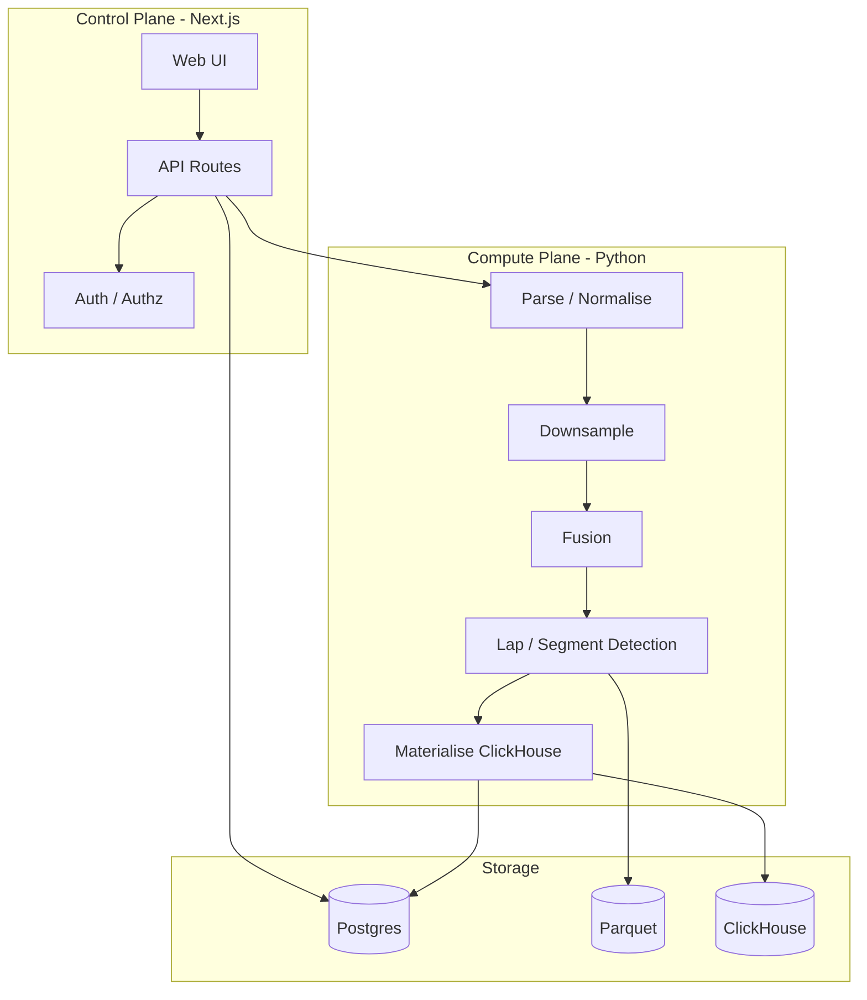
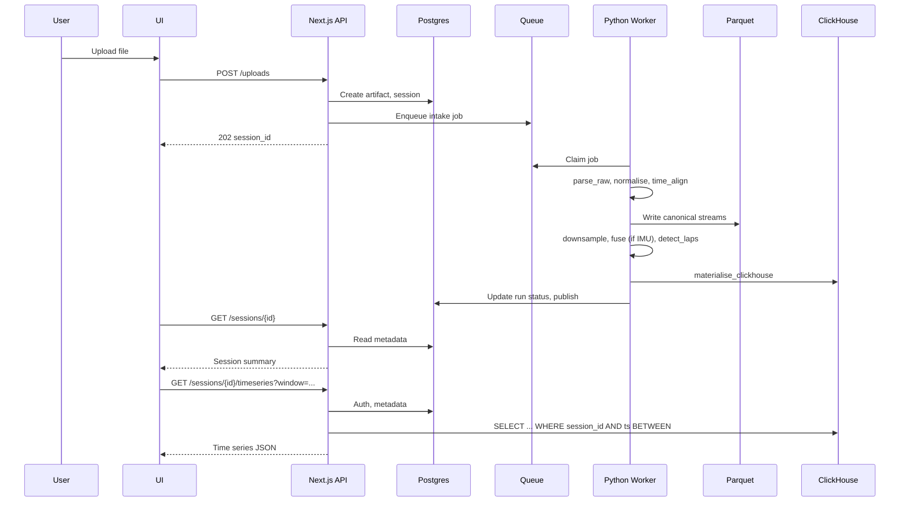
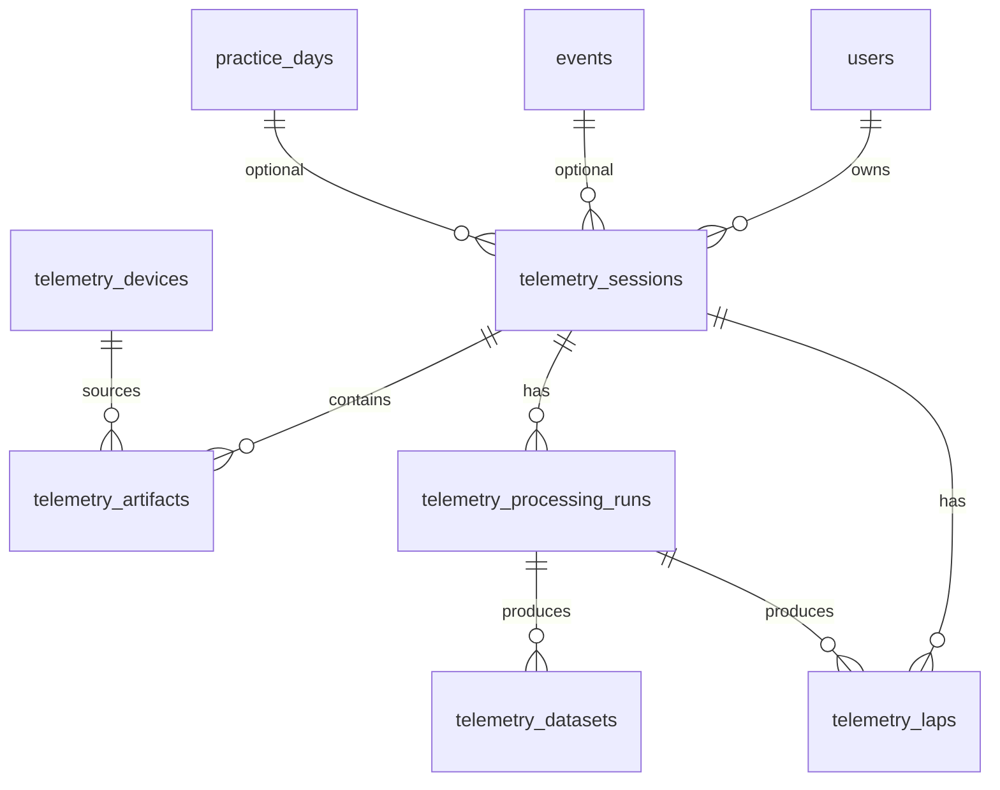
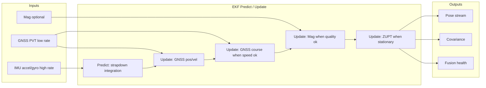

# MRE Telemetry Implementation Design

**Author:** MRE Team  
**Date:** 2026-02-16  
**Purpose:** A single implementation-ready design document that references existing telemetry docs, fills gaps, provides an implementation roadmap, and includes in-depth treatment of data models, architecture, data source examples, data quality options, Kalman filter pathways, and IMU capability tiers with concrete data examples.  
**Audience:** Implementers (engineers building the system)  
**License:** Proprietary, internal to MRE

---

## 1. Executive Summary and Document Map

### 1.1 Purpose

This document is the **implementation design** for MRE telemetry. It:

- **References** existing docs in `docs/telemetry/` without duplicating them
- **Fills gaps** and resolves ambiguities across the 14+ telemetry design docs
- **Provides an implementation roadmap** with phased delivery (MVP, v1, full)
- **Deep-dives** into data models, architecture, data sources, quality, Kalman fusion, and IMU tiers

### 1.2 Audience

Engineers implementing the telemetry pipeline, API, storage, and frontend. The document assumes familiarity with GNSS, IMU, and Kalman filter concepts at a working level.

### 1.3 Relationship to Existing Docs

This document **does not replace** the existing design docs. It consolidates implementation decisions and fills gaps. For full specification details, refer to the authoritative sources below.

### 1.4 Index of Authoritative Sources

| Document | Purpose |
| -------- | ------- |
| [Architecture Blueprint](Architecture_Blueprint_Telemetry_Ingest_Storage_Compute_Query.md) | Ingest, storage, compute, query system design |
| [API Contract](API_Contract_Telemetry.md) | Endpoints, query patterns, service boundaries |
| [Concrete Data Model and Contracts](Telemetry%20-%20Concrete%20Data%20Model%20And%20Contracts.md) | Postgres plus ClickHouse schema and contracts |
| [Processing Pipeline and State Machine](Telemetry%20Processing%20Pipeline%20Job%20Orchestration%20and%20State%20Machine.md) | Job orchestration, states, idempotency |
| [GNSS + IMU Fusion Blueprint](Gnss_plus_Imu_Fusion_Blueprint.md) | Normalisation and fusion algorithms |
| [Lap Segment and Corner Detection](Lap%20Segment%20and%20Corner%20Detection%20Specification.md) | Lap, segment, corner detection spec |
| [Supported Formats and Parser Specification](Supported%20Formats%20and%20Parser%20Specification.md) | File formats, parsers, capability detection |
| [Trust Quality Scoring and Honesty Rules](Trust%20Quality%20Scoring%20and%20Honesty%20Rules.md) | Quality scoring, when to warn or hide |
| [ADR-20260203: Parquet canonical, ClickHouse cache](../../adr/ADR-20260203-time-series-parquet-canonical-clickhouse-cache.md) | Storage authority and delete ordering |
| [ADR-20260131: Telemetry identifier strategy](../../adr/ADR-20260131-telemetry-identifier-strategy.md) | ID format (UUID) |
| [ADR-20260131: Raw retention](../../adr/ADR-20260131-telemetry-storage-and-raw-retention.md) | Raw upload retention policy |

### 1.5 Implementation Phase Overview

| Phase | Scope | Key Deliverables |
| ----- | ----- | ---------------- |
| **MVP** | Minimal path to import and display | Postgres metadata, CSV/GPX parsers, canonical Parquet write, basic session list |
| **v1** | Race-ready with fusion | All text parsers (CSV, GPX, NMEA, JSON, FIT), server-side GNSS+IMU fusion (Kalman), auto SFL lap detection, ClickHouse materialisation, full quality scoring with reason codes |
| **v2 / Full** | Advanced capabilities | UBX/binary parsers, track catalogue SFL, user-defined SFL, extended fusion modes, mag gating |

### 1.6 Key Dependencies and Decisions

| Decision | Choice | Rationale |
| -------- | ------ | --------- |
| Storage authority | Parquet canonical, ClickHouse derived cache | ADR-20260203; replayability, deterministic reprocessing |
| Identifier format | UUID (no type prefix) | ADR-20260131; consistent across sessions, runs, artifacts |
| Raw upload retention | Discard after canonicalisation | ADR-20260131; minimise storage, preserve metadata |
| Downsample naming | Rate-based in API (`ds_50hz`, `ds_10hz`), L0/L1/L2 internally | User clarity; pipeline alignment |
| Fusion | Server-side EKF for unfused; trust onboard when present | Full control; honesty via `pose_source` |
| Lap detection (v1) | Auto SFL only | No track catalogue dependency |
| LiveRC link | Optional (`eventId`, `practiceDayId` on session) | User associates later; no hard coupling |
| Export format | Parquet canonical; Arrow IPC deferred to v2 | Aligns with system of record |

---

## 2. Architecture (Deep Dive)

### 2.1 System Overview

MRE telemetry follows a **control plane** vs **compute plane** split:



**Control plane (Next.js):** Authentication, authorisation, session CRUD, job orchestration, metadata reads, signed URL minting.  
**Compute plane (Python):** Parse, normalise, downsample, fuse, lap/segment detection, materialise.

### 2.2 Data Flow

End-to-end pipeline stages:

1. **Upload** → API accepts file, creates artifact, enqueues intake
2. **Validate** → artifact_validate, artifact_classify
3. **Parse** → parse_raw, normalise_units, time_align
4. **Canonicalise** → Write canonical streams to Parquet (authoritative)
5. **Downsample** → L0 (raw), L1 (10x), L2 (100x) or equivalent rate-based levels
6. **Fusion** → fuse_gnss_imu (when 6-axis+ IMU present)
7. **Lap detection** → detect_laps (auto SFL in v1)
8. **Materialise** → materialise_clickhouse (derived cache)
9. **Publish** → Mark session READY, emit domain events

Reference: [Architecture Blueprint](Architecture_Blueprint_Telemetry_Ingest_Storage_Compute_Query.md), [Processing Pipeline](Telemetry%20Processing%20Pipeline%20Job%20Orchestration%20and%20State%20Machine.md).

### 2.3 Sequence Diagram: End-to-End Flow



### 2.4 Storage Architecture

| Tier | Store | Role | Authority |
| ---- | ----- | ---- | --------- |
| Metadata, jobs, laps, segments | Postgres | System of record | Yes |
| Canonical time series | Parquet (object storage) | System of record | Yes |
| Derived query cache | ClickHouse | Rebuildable cache | No |

**Delete ordering (ADR-20260203):** On session delete, delete canonical Parquet first, then ClickHouse derived rows, then Postgres metadata. Parquet is the compliance anchor.

#### ADR-20260203 Truth Table (Delete Semantics)

| Dataset class | Store | Authoritative | Delete trigger | Delete mechanism | Verification |
| ------------- | ----- | ------------- | -------------- | ---------------- | ------------ |
| Canonical time series | Object storage (Parquet) | Yes | User delete session, account delete, retention expiry | Delete objects under `session_id` and `processing_run_id` prefixes | List prefix returns empty |
| ClickHouse derived points and aggregates | ClickHouse | No | User delete session, account delete, retention expiry, rebuild | Delete rows by `session_id` and `processing_run_id`; TTL or drop partitions | Query returns no rows for scope |
| Processing metadata | Postgres | Yes | User delete account, retention expiry | Delete or anonymise as policy dictates | Select returns no rows |
| Raw upload bytes | Object storage | Policy dependent | Policy dependent | Policy dependent | Policy dependent |

### 2.5 Service Boundaries

**Python owns:** Ingest, parsing, format detection, unit normalisation, time alignment, downsampling, fusion, lap/segment detection, quality scoring, Parquet write, ClickHouse materialisation.  
**Next.js owns:** Auth, session CRUD, metadata reads, signed URL minting, job enqueue, request shaping, ETag/cache headers.

### 2.6 Job Orchestration

- **Queue:** Postgres-backed, `SELECT ... FOR UPDATE SKIP LOCKED` for claiming
- **Job types:** artifact_validate, artifact_classify, parse_raw, normalise_units, time_align, downsample_L0/L1/L2, fuse_gnss_imu, detect_laps, materialise_clickhouse, publish_session
- **State machine:** QUEUED → RUNNING → SUCCEEDED | FAILED
- **Capability gating:** Skip fuse_gnss_imu when no IMU; skip lap features when detection fails

Reference: [Telemetry Processing Pipeline Job Orchestration and State Machine](Telemetry%20Processing%20Pipeline%20Job%20Orchestration%20and%20State%20Machine.md).

---

## 3. Data Models (Detailed)

### 3.1 Postgres Schema (Summary)

Full schema is in [Concrete Data Model §7](Telemetry%20-%20Concrete%20Data%20Model%20And%20Contracts.md#7-postgres-schema-telemetry-domain). Key tables:

| Table | Purpose |
| ----- | ------- |
| `telemetry_sessions` | Top-level container; owner, track, status, currentRunId, optional eventId/practiceDayId (LiveRC link) |
| `telemetry_devices` | Device identity, capabilities JSONB (IMU DOF, channels, frame) |
| `telemetry_artifacts` | Uploaded inputs; sha256, byteSize for idempotency; status CANONICALISED after processing |
| `telemetry_processing_runs` | Immutable pipeline execution; pipelineVersion, inputArtifactIds, outputDatasetIds |
| `telemetry_datasets` | Catalogue of ClickHouse datasets; datasetType, clickhouseTable, schemaVersion |
| `telemetry_laps` | Lap boundaries; lapNumber, startTimeUtc, endTimeUtc, validity |
| `telemetry_segments` | Named segments; definition JSONB |
| `teams`, `team_members`, `telemetry_share_grants`, `telemetry_public_shares` | Sharing and access |

**LiveRC integration (optional):** `telemetry_sessions` may include `eventId` and `practiceDayId` FKs when the user associates a session with an Event or Practice Day. v1 supports optional association.

**Key columns by table (summary):**

| Table | Key columns |
| ----- | ----------- |
| telemetry_sessions | id, ownerUserId, driverProfileId, trackId, eventId (optional), practiceDayId (optional), startTimeUtc, endTimeUtc, status, currentRunId |
| telemetry_artifacts | id, sessionId, sha256, byteSize, artifactRole, formatDetected, status |
| telemetry_devices | id, capabilities (JSONB: sensors.imu.dof, sensors.imu.channels, sensors.imu.frame) |
| telemetry_processing_runs | id, sessionId, status, pipelineVersion, inputArtifactIds, outputDatasetIds |
| telemetry_laps | id, sessionId, runId, lapNumber, startTimeUtc, endTimeUtc, durationMs, validity |

See [Concrete Data Model §7](Telemetry%20-%20Concrete%20Data%20Model%20And%20Contracts.md#7-postgres-schema-telemetry-domain) for full field-by-field types, constraints, and indexes.

### 3.2 Entity-Relationship Diagram



### 3.3 ClickHouse Time-Series Schema

| Table | Purpose | Ordering Key |
| ----- | ------- | ------------- |
| `telemetry_gnss_v1` | Canonical GNSS PVT | (session_id, ts) |
| `telemetry_accel_v1` | Canonical accel | (session_id, ts) |
| `telemetry_gyro_v1` | Canonical gyro | (session_id, ts) |
| `telemetry_mag_v1` | Canonical mag (9-axis) | (session_id, ts) |
| `telemetry_pose_v1` | Fused pose | (session_id, ts) |
| `telemetry_gnss_ds10_v1`, `telemetry_pose_ds10_v1`, etc. | Downsampled | (session_id, ts) |

**Partitioning:** `PARTITION BY toYYYYMM(ts)`  
**Schema versioning:** New schema = new table `_v2`; do not mutate `_v1`.

Reference: [Concrete Data Model §8](Telemetry%20-%20Concrete%20Data%20Model%20And%20Contracts.md#8-clickhouse-schema-telemetry-time-series).

### 3.4 ClickHouse Query Patterns

#### Charting (Time Window)

For interactive charts, query by session and time window. Use downsampled tables when resolution hint < raw rate.

```sql
-- Pose stream for map/track (ds_10hz)
SELECT ts, x_m, y_m, vx_mps, vy_mps, yaw_rad
FROM telemetry_pose_ds10_v1
WHERE session_id = '{session_id}' AND run_id = '{run_id}'
  AND ts BETWEEN {start_ts} AND {end_ts}
ORDER BY ts;

-- GNSS for fallback (ds_10hz)
SELECT ts, lat_deg, lon_deg, speed_mps, course_deg
FROM telemetry_gnss_ds10_v1
WHERE session_id = '{session_id}' AND run_id = '{run_id}'
  AND ts BETWEEN {start_ts} AND {end_ts}
ORDER BY ts;
```

#### Lap Overlay

Per-lap time ranges from Postgres; query ClickHouse per lap or batch.

```sql
-- Pose per lap (lap start/end from telemetry_laps)
SELECT ts, x_m, y_m, vx_mps, vy_mps
FROM telemetry_pose_ds10_v1
WHERE session_id = '{session_id}' AND run_id = '{run_id}'
  AND ts BETWEEN {lap_start_ts} AND {lap_end_ts}
ORDER BY ts;
```

#### Exports (Large Payload)

For large exports, API returns signed Parquet URL (canonical); ClickHouse can serve downsampled export if needed.

```sql
-- Full session export (downsampled)
SELECT *
FROM telemetry_pose_ds10_v1
WHERE session_id = '{session_id}' AND run_id = '{run_id}'
ORDER BY ts;
```

Reference: [API Contract §4.7, §6](API_Contract_Telemetry.md) (large payload handling, time semantics).

### 3.5 API Endpoint Summary

| Endpoint | Purpose |
| -------- | ------- |
| POST /api/v1/telemetry/uploads | Create upload, return signed URL |
| POST /api/v1/telemetry/uploads/{id}/finalise | Create session, trigger ingestion |
| GET /api/v1/telemetry/sessions | List sessions (filter by track, date, status) |
| GET /api/v1/telemetry/sessions/{id} | Session detail, overview summary |
| GET /api/v1/telemetry/sessions/{id}/timeseries | Windowed time series (resolution hint) |
| GET /api/v1/telemetry/sessions/{id}/laps | Lap list with metrics |
| GET /api/v1/telemetry/sessions/{id}/quality | Quality explain (scores, reason codes) |
| GET /api/v1/telemetry/sessions/{id}/export | Signed Parquet URL (canonical export) |

All responses include `processing_run_id`, `schema_version`, `materialisation_status` where applicable.

Reference: [API Contract](API_Contract_Telemetry.md).

### 3.6 Parquet Canonical Layout

Path structure (ADR-20260203):

```
{tenant_id}/{driver_id}/{session_id}/{run_id}/
  gnss_pvt.parquet
  imu_accel.parquet
  imu_gyro.parquet
  imu_mag.parquet   (when 9-axis)
  pose.parquet
  lap_events.parquet
  L1/   (downsample level 1)
    gnss_pvt.parquet
    pose.parquet
  L2/
    ...
```

**Downsample naming:** Use rate-based labels (`ds_50hz`, `ds_10hz`, `ds_5hz`, `ds_1hz`) in API; internally map to L0/L1/L2. Document mapping in config.

### 3.7 Canonical Stream Contracts

**GNSS PVT:** `t`, `lat_deg`, `lon_deg`, `alt_m`, `speed_mps`, `course_deg`, `hacc_m`, `vacc_m`, `sat_count`, `fix_type`, `quality_flags`  
**IMU accel:** `t`, `ax_mps2`, `ay_mps2`, `az_mps2`, `quality_flags`  
**IMU gyro:** `t`, `gx_rps`, `gy_rps`, `gz_rps`, `quality_flags`  
**IMU mag:** `t`, `mx_uT`, `my_uT`, `mz_uT`, `cal_state`, `quality_flags`  
**Pose:** `t`, `x_e_m`, `y_n_m`, `z_u_m`, `vx_mps`, `vy_mps`, `yaw_rad`, `pose_source` (gnss_measured | onboard_fused | server_fused)

**Units:** WGS84 lat/lon deg, alt m, speed m/s, accel m/s², gyro rad/s, mag µT. ENU local frame for pose.  
Reference: [Supported Formats §7](Supported%20Formats%20and%20Parser%20Specification.md#7-canonical-stream-model).

---

## 4. Data Sources and Examples

### 4.1 Input Format Matrix

| Format | v1 Support | Level 1 | Level 2 | Level 3 | Typical Rate | Quality Fields |
| ------ | ---------- | ------- | ------- | ------- | ------------ | -------------- |
| CSV/TSV | Yes | Yes | Yes | Yes | 1–200 Hz | Optional |
| GPX | Yes | Yes | Yes | Limited | Variable | Extensions |
| NMEA | Yes | Yes | Yes | No | 1–5 Hz | GGA fix, sats |
| JSON | Yes | Yes | Yes | Yes | Varies | Device-dependent |
| FIT | Yes (text-like) | Yes | Yes | Yes | Varies | Record-dependent |
| UBX | v2 | — | — | — | 1–25 Hz | Rich |

**Support levels:** Level 1 = import and display; Level 2 = race-ready (quality scoring, lap timing); Level 3 = fusion (raw IMU, time alignment).

### 4.2 Format Summary Table (Fields, Sample Rows, Coordinate Frames)

| Format | Typical fields | Sample rate | Coordinate frame | Notes |
| ------ | -------------- | ----------- | ---------------- | ----- |
| CSV/TSV | timestamp, lat, lon, alt, speed, ax, ay, az, gx, gy, gz | 1–200 Hz | WGS84; IMU device-frame | Delimiter, header, locale vary |
| GPX | trkpt lat/lon, ele, time, extensions | Variable | WGS84 | Speed often in extensions |
| NMEA | GGA (lat, lon, fix, sats), RMC (course, speed) | 1–5 Hz | WGS84 | Fix type, sat count in GGA |
| JSON | Nested; position, velocity, sensors per device | Varies | Device-dependent | Schema varies by vendor |
| FIT | record messages (position, speed, timestamp) | Varies | WGS84 | Message types vary |
| UBX (v2) | NAV-PVT; RXM-RAWX optional | 1–25 Hz | WGS84 | Binary; rich DOP, accuracy |

**Parser capability detection:** From parsed streams, infer `has_gnss_position`, `has_gnss_velocity`, `has_imu_accel`, `has_imu_gyro`, `has_magnetometer`. Assign fusion mode: GNSS-only, 3-axis (accel only), 6-axis (accel+gyro), 9-axis (accel+gyro+mag). See [Supported Formats §6](Supported%20Formats%20and%20Parser%20Specification.md#6-device-capability-model).

### 4.3 Device Capability Matrix

| Capability | 3-axis | 6-axis | 9-axis |
| ---------- | ------ | ------ | ------ |
| Accel | Yes | Yes | Yes |
| Gyro | No | Yes | Yes |
| Mag | No | No | Yes |
| Fusion possible | Limited | Yes | Yes |
| Heading source | GNSS | GNSS + gyro | GNSS + gyro + mag |

### 4.4 Data Source Examples (Concrete)

**GNSS-only CSV (10 Hz):**
```
timestamp,lat,lon,speed_kmh
2026-02-16T10:00:00.000Z,-35.1234,149.5678,45.2
2026-02-16T10:00:00.100Z,-35.1235,149.5679,45.3
```

**RaceBox-style CSV (50 Hz GNSS, 200 Hz IMU):**
```
time_ms,lat,lon,alt,speed,ax,ay,az,gx,gy,gz
0,-35.1234,149.5678,600.1,12.5,0.1,0.2,-9.81,0.01,0.02,0.05
20,-35.12341,149.56781,600.1,12.6,0.11,0.19,-9.80,0.01,0.02,0.05
```

**GPX (variable rate):**
```xml
<trkpt lat="-35.1234" lon="149.5678">
  <ele>600</ele>
  <time>2026-02-16T10:00:00Z</time>
  <extensions><speed>12.5</speed></extensions>
</trkpt>
```

**NMEA (1–5 Hz):**
```
$GPGGA,100000.00,-3512.34,S,14934.07,E,1,08,1.2,600.0,M,0.0,M,,*4A
$GPRMC,100000.00,A,-3512.34,S,14934.07,E,12.5,180.0,160226,,,*2B
```

### 4.5 Multi-File Sessions

Sessions can contain multiple artifacts (e.g. GNSS file + IMU file). The pipeline:

- Treats uploads as an **artifact set**
- Requires time alignment: monotonic timestamps, drift correction between streams
- Stores capability per artifact; combined capabilities determine fusion path

Reference: [Supported Formats §5.3](Supported%20Formats%20and%20Parser%20Specification.md#53-multi-file-artifact-sets).

### 4.6 Parser Plugin Contract (Summary)

Parsers implement `detect(artifact_set)` and `parse(artifact_set, options)`. `ParseResult` includes:

- `device_family`, `device_model`
- `capabilities` map (has_gnss_position, has_imu_accel, has_imu_gyro, has_magnetometer, sample_rate_gnss_hz, sample_rate_imu_hz)
- `streams` dictionary keyed by stream type (gnss_pvt, imu_accel, imu_gyro, imu_mag, pose)
- `warnings`, `errors` with stable codes (e.g. CSV_NO_TIME_COLUMN, GPX_MISSING_TIME)
- `provenance` (parser version, parser id)

Classifier selects highest detection score above threshold. Parsers run under safety constraints: max file size, timeout, no outbound network.

Reference: [Supported Formats §8](Supported%20Formats%20and%20Parser%20Specification.md#8-parser-architecture).

---

## 5. IMU Options and Data They Provide

### 5.1 3-Axis (Accelerometer Only)

**Provides:** `ax_mps2`, `ay_mps2`, `az_mps2`

**Use cases:** Jumps, impacts, vertical acceleration proxy, rough braking hints, stationary detection (magnitude near 1g).

**Cannot provide:** Yaw rate, orientation, lateral accel (directly).

**Fusion:** GNSS-only for position. Accel used for jump/impact detection, not full pose. No strapdown INS.

**Data example:**
```
t=0.0, ax=0.1, ay=0.2, az=-9.81
```
(Gravity-dominated at rest.)

**UI guidance:** "IMU mode: Accelerometer only, heading from GNSS."

### 5.2 6-Axis (Accel + Gyro)

**Provides:** `ax_mps2`, `ay_mps2`, `az_mps2`, `gx_rps`, `gy_rps`, `gz_rps`

**Use cases:** Orientation integration, yaw rate, lateral accel (with orientation), braking events, corner stability, dead reckoning during GNSS gaps.

**Fusion:** EKF fuses GNSS + IMU. Gyro propagates between GNSS updates. Heading from GNSS course + gyro integration. ZUPT when stationary.

**Data example:**
```
t=0.0, ax=0.1, ay=0.2, az=-9.81, gx=0.01, gy=0.02, gz=0.05
```

**UI guidance:** "IMU mode: 6 axis, yaw corrected by GNSS course when moving."

### 5.3 9-Axis (Accel + Gyro + Magnetometer)

**Provides:** `ax`, `ay`, `az`, `gx`, `gy`, `gz`, `mx_uT`, `my_uT`, `mz_uT`

**Use cases:** Compass heading, heading in GNSS dropout, mag-assisted yaw, better low-speed orientation.

**Caveats:** Mag interference (motors, metal, wiring). Quality gates required. Fallback to GNSS when mag fails.

**Fusion:** 9-axis EKF; mag as measurement update when quality gates pass (magnitude in expected range, low variance, no spikes).

**Data example:**
```
t=0.0, ax=0.1, ay=0.2, az=-9.81, gx=0.01, gy=0.02, gz=0.05, mx=25.3, my=-12.1, mz=42.0
```

**UI guidance:** "IMU mode: 9 axis, mag used only when clean."

### 5.4 IMU Axis Detection

- Parser infers from presence of columns/channels
- `telemetry_devices.capabilities` JSONB: `sensors.imu.dof`, `sensors.imu.channels`, `sensors.imu.frame`, `sensors.imu.axisConvention`
- Pipeline gates fusion stage by capability: 3-axis → no fusion; 6-axis+ → fuse_gnss_imu

Reference: [Concrete Data Model §7.2](Telemetry%20-%20Concrete%20Data%20Model%20And%20Contracts.md#72-telemetrydevice).

---

## 6. Kalman Filter and Fusion Options

### 6.1 When Fusion Runs

| Input | Fusion behaviour |
| ----- | ---------------- |
| 6-axis+ IMU | Full GNSS+IMU EKF |
| 3-axis IMU | No orientation fusion; accel for events only |
| GNSS-only | No fusion; position from GNSS; speed/accel derived from position diff |

### 6.2 Fusion Architecture Options

| Option | Description | Pros | Cons |
| ------ | ----------- | ---- | ---- |
| **Server EKF** | MRE runs Kalman on raw GNSS+IMU | Full control, reprocess | Compute cost, time alignment |
| **Trust onboard** | Use device fused pose as-is | No compute, often smooth | Opaque, vendor lock-in |
| **Hybrid** | Use onboard when good; server when needed | Flexible | Complexity |

**v1:** Server-side fusion for unfused devices; trust onboard with `pose_source = onboard_fused` when device provides fused pose.

### 6.3 Kalman Filter Pathway (Server-Side)

**Inputs:** IMU (high rate), GNSS PVT (low rate), optional mag.

**State:** Position, velocity, orientation (quaternion), accel bias, gyro bias, optional mag bias.

**Predict:** Strapdown integration (gyro → orientation; accel → velocity → position). Covariance propagation.

**Update:** GNSS position/velocity; GNSS course (when speed above threshold); mag (when quality OK); ZUPT (when stationary).

**Outputs:** Pose stream (`pose_source = server_fused`), covariance, fusion health (innovation residuals, divergence flags, time in degraded mode).

**Degraded modes:**
- IMU-only during GNSS gap (increasing covariance)
- GNSS-only when IMU missing or unreliable

Reference: [GNSS+IMU Fusion Blueprint](Gnss_plus_Imu_Fusion_Blueprint.md), [Supported Formats §11.3](Supported%20Formats%20and%20Parser%20Specification.md#113-kalman-filter-pathway-specification).

### 6.4 Kalman Fusion Flow Diagram



### 6.5 Fusion Provenance

Every pose stream carries `pose_source`:

- `gnss_measured` — Position from GNSS directly
- `onboard_fused` — Device outputs fused pose
- `server_fused` — MRE produced pose via Kalman

**Honesty rule:** Never claim `server_fused` when using onboard. Label appropriately.

Reference: [Trust Quality Scoring](Trust%20Quality%20Scoring%20and%20Honesty%20Rules.md).

---

## 7. Data Quality Options and Framework

### 7.1 Quality Dimensions

- **Integrity:** Input authentic, uncorrupted, hash matches
- **Completeness:** Required data present, continuous, aligned
- **Accuracy:** Signals plausible, consistent with physics
- **Stability:** Outputs consistent across runs and versions
- **Explainability:** Can explain why the system produced a result

Reference: [Trust Quality Scoring §4](Trust%20Quality%20Scoring%20and%20Honesty%20Rules.md#4-trust-model).

### 7.2 Score Scale

| Range | Label |
| ----- | ----- |
| 90–100 | Excellent |
| 75–89 | Good |
| 55–74 | Fair |
| 35–54 | Poor |
| 0–34 | Unusable |

### 7.3 Task Suitability Scores

| Score | Purpose |
| ----- | ------- |
| `lap_timing` | Lap table, lap times, crossing validation |
| `racing_line` | Heatmaps, path comparison |
| `segments` | Segment analysis, corner inference |
| `comparison` | Lap-to-lap comparison, deltas |

### 7.4 Signal-Level Scoring

- **GNSS:** fix_type, sat_count, HDOP, dropout rate, jitter, teleport events
- **IMU:** Sample rate stability, saturation, bias drift, gravity consistency
- **Time alignment:** Drift, interpolation fraction, monotonicity
- **Fusion health:** Innovation residuals, divergence, degraded mode fraction
- **Racing semantics:** Lap detection stability, SFL confidence, segment consistency

### 7.5 Reason Codes (Full List)

| Code | Description | Typical Threshold | Remediation |
| ---- | ----------- | ----------------- | ----------- |
| `GNSS_GAPS_HIGH` | Dropout rate > 5% | > 5% | Check antenna, environment |
| `GNSS_JITTER_HIGH` | Position/speed jitter above limit | Variance > threshold | Higher rate GNSS, fusion |
| `GNSS_TELEPORT_EVENTS` | Impossible position jumps | Any detected | Re-export, check device |
| `TIME_ALIGNMENT_DRIFT` | Stream drift beyond tolerance | > 100 ms | Sync sources |
| `IMU_SATURATION` | Accel/gyro clipping | Any clip | Reduce gain, different mount |
| `FUSION_DIVERGED` | EKF innovation residuals too large | Residual > 3σ | Check calibration |
| `LAP_DETECTION_UNSTABLE` | Inconsistent lap boundaries | Variance across laps | User SFL override |
| `INTEGRITY_HASH_MISMATCH` | Artifact checksum failed | Any | Re-upload |
| `GNSS_FIX_POOR` | fix_type != 3D, sats < 4 | Per sample | Better sky view |
| `MAG_INTERFERENCE` | Magnetometer corrupted | Variance spike | Disable mag, use 6-axis |

### 7.6 Feature Gating Thresholds

| Feature | Minimum Score | Critical Flags |
| ------- | -------------- | -------------- |
| Lap table, lap times | `lap_timing >= 55` | None |
| Lap-to-lap comparison | `comparison >= 75` | fusion stable if used |
| Racing line heatmaps | `racing_line >= 75` | None |
| Segment analysis | `segments >= 75` | None |
| Coaching / recommendations | `comparison >= 75`, `racing_line >= 75` | None |

Critical flags (e.g. `INTEGRITY_HASH_MISMATCH`, time base corruption) override numeric thresholds.

### 7.7 UI Copy Guide

| Confidence | Copy |
| ---------- | ---- |
| High | "Reliable" |
| Medium | "Usable, some uncertainty" |
| Low | "Approximate, treat with caution" |
| Unusable | "Not enough data to compute this" |

**Explain panel:** Overall score, task scores, top 3 reason codes per task, link to run details and provenance.

### 7.8 Penalty Example (Illustrative)

Example penalty weights for signal score calculation (tune in config):

| Condition | Penalty |
| --------- | ------- |
| Dropout rate > 5% | -10 |
| Largest gap > 2 s | -10 |
| Teleport events | -15 per event (cap -40) |
| Sampling rate variance > threshold | -10 |
| HDOP missing (when required) | -5 |

Each penalty maps to a reason code. Store raw sub-scores and flags for debugging.

Reference: [Trust Quality Scoring](Trust%20Quality%20Scoring%20and%20Honesty%20Rules.md).

---

## 8. Lap Detection (v1)

### 8.1 v1 Scope

- **Auto SFL detection only** — no track catalogue, no user-defined SFL
- Algorithm infers start/finish line from trajectory geometry (e.g. most-crossed line, density clustering)
- Lap boundaries from crossings with validity rules (minimum lap time, maximum lap time, pit handling)

**Auto SFL algorithm outline (v1):**
1. Project trajectory into local ENU (origin at session centroid or first point).
2. Identify candidate SFLs: lines with high crossing density (grid search or clustering).
3. Select best SFL: most crossings, consistent direction, plausible lap length.
4. Detect crossings: trajectory segment intersects SFL in consistent direction.
5. Validate laps: min lap time (e.g. 30 s), max lap time (e.g. 600 s), discard outlaps/inlaps.

### 8.2 Inputs

- Pose stream (server_fused, onboard_fused) or GNSS position stream
- Local ENU coordinates
- Monotonic timestamps after time_align
- Velocity strongly recommended for crossing validation

### 8.3 Outputs

- `telemetry_laps`: lapNumber, startTimeUtc, endTimeUtc, durationMs, validity (VALID | INVALID | OUTLAP | INLAP)
- Lap-to-time-range index for query optimisation

### 8.4 Constraints

- 5 Hz minimum for acceptable lap detection; 10 Hz+ preferred
- Detection must not alter Level 0 canonical streams
- Any smoothing for detection must be in a derived stream with technique metadata

### 8.5 v2 Extensions

- Track catalogue SFL when session is assigned to a known track
- User-defined SFL (user draws line on map)
- Segment inference, corner detection

Reference: [Lap Segment and Corner Detection Specification](Lap%20Segment%20and%20Corner%20Detection%20Specification.md).

---

## 9. Implementation Roadmap

### 9.1 Phase MVP

1. Postgres metadata (sessions, artifacts, devices)
2. CSV and GPX parsers (Level 1)
3. Canonical Parquet write (GNSS PVT)
4. Basic session list UI
5. Upload API, artifact validation

### 9.2 Phase v1

1. All text parsers: CSV, GPX, NMEA, JSON, FIT
2. Full canonical stream set (GNSS, accel, gyro, mag as present)
3. Time alignment, unit normalisation
4. Downsample pyramid (L0, L1, L2)
5. Server-side GNSS+IMU fusion (Kalman) for 6-axis+
6. Auto SFL lap detection
7. ClickHouse materialisation
8. Full quality scoring with reason codes, task scores, feature gating
9. Optional LiveRC link (eventId, practiceDayId)
10. API: session CRUD, time-series read, lap list, quality explain

### 9.3 Phase v2

1. UBX and binary format parsers
2. Track catalogue SFL
3. User-defined SFL
4. 9-axis fusion with mag gating
5. Segment and corner detection
6. Extended comparison and coaching features

### 9.4 Suggested Implementation Order

1. Processing pipeline and state machine
2. API contract
3. Data model and schema (Postgres + Parquet + ClickHouse)
4. Trust, quality, honesty rules
5. Supported formats and parser spec

### 9.5 Milestone Checklist

#### Phase MVP

- [ ] Postgres metadata schema (telemetry_sessions, telemetry_artifacts, telemetry_devices)
- [ ] Upload API (POST /uploads, finalise)
- [ ] Artifact validation and classify
- [ ] CSV parser (Level 1)
- [ ] GPX parser (Level 1)
- [ ] Canonical Parquet write (gnss_pvt.parquet)
- [ ] Basic session list UI
- [ ] Session GET endpoint

#### Phase v1

- [ ] All text parsers: CSV, GPX, NMEA, JSON, FIT
- [ ] Time alignment, unit normalisation
- [ ] Full canonical stream set (GNSS, accel, gyro, mag as present)
- [ ] Downsample pyramid (L0, L1, L2)
- [ ] Server-side GNSS+IMU fusion (Kalman) for 6-axis+
- [ ] Auto SFL lap detection
- [ ] ClickHouse materialisation job
- [ ] ClickHouse tables (telemetry_gnss_v1, telemetry_pose_v1, etc.)
- [ ] Full quality scoring (reason codes, task scores, feature gating)
- [ ] Optional LiveRC link (eventId, practiceDayId on sessions)
- [ ] API: session CRUD, time-series read, lap list, quality explain
- [ ] ETag, cache headers on read endpoints

#### Phase v2

- [ ] UBX parser
- [ ] Binary format parsers (as needed)
- [ ] Track catalogue SFL
- [ ] User-defined SFL (draw on map)
- [ ] 9-axis fusion with mag gating
- [ ] Segment and corner detection
- [ ] Extended comparison and coaching features

---

## 10. Open Decisions and Appendix

### 10.1 Downsample Naming

**Recommendation:** Use rate-based labels in API (`ds_50hz`, `ds_10hz`, `ds_5hz`, `ds_1hz`) for user clarity. Internally map to L0/L1/L2. Document mapping in config.

### 10.2 Export Format

**Recommendation:** Parquet for canonical export (aligns with system of record). Arrow IPC optional for fast client parsing; defer to v2 if needed.

### 10.3 Public Share Scope

**Recommendation:** Document as open. Options: (a) full resolution, (b) downsampled only (e.g. ds_1hz), (c) deferred to v2. Default: downsampled only for v1 to limit exposure.

### 10.4 Dependency Summary

```
Pipeline stages:
  intake → parse → canonicalise → downsample → fusion → lap_detect → materialise → publish

Key config:
  - Downsample levels: L0, L1, L2 ↔ ds_50hz, ds_10hz, ds_1hz
  - Quality thresholds: lap_timing >= 55, comparison >= 75, etc.
  - Fusion: 6-axis+ for full EKF; 3-axis events only; GNSS-only no fusion
```

---

## References

- [Telemetry Documentation Index](../README.md)
- [Architecture Blueprint](Architecture_Blueprint_Telemetry_Ingest_Storage_Compute_Query.md)
- [API Contract](API_Contract_Telemetry.md)
- [Concrete Data Model and Contracts](Telemetry%20-%20Concrete%20Data%20Model%20And%20Contracts.md)
- [Processing Pipeline and State Machine](Telemetry%20Processing%20Pipeline%20Job%20Orchestration%20and%20State%20Machine.md)
- [GNSS + IMU Fusion Blueprint](Gnss_plus_Imu_Fusion_Blueprint.md)
- [Lap Segment and Corner Detection](Lap%20Segment%20and%20Corner%20Detection%20Specification.md)
- [Supported Formats and Parser Specification](Supported%20Formats%20and%20Parser%20Specification.md)
- [Trust Quality Scoring and Honesty Rules](Trust%20Quality%20Scoring%20and%20Honesty%20Rules.md)
- [ADR-20260203: Parquet canonical, ClickHouse cache](../../adr/ADR-20260203-time-series-parquet-canonical-clickhouse-cache.md)
