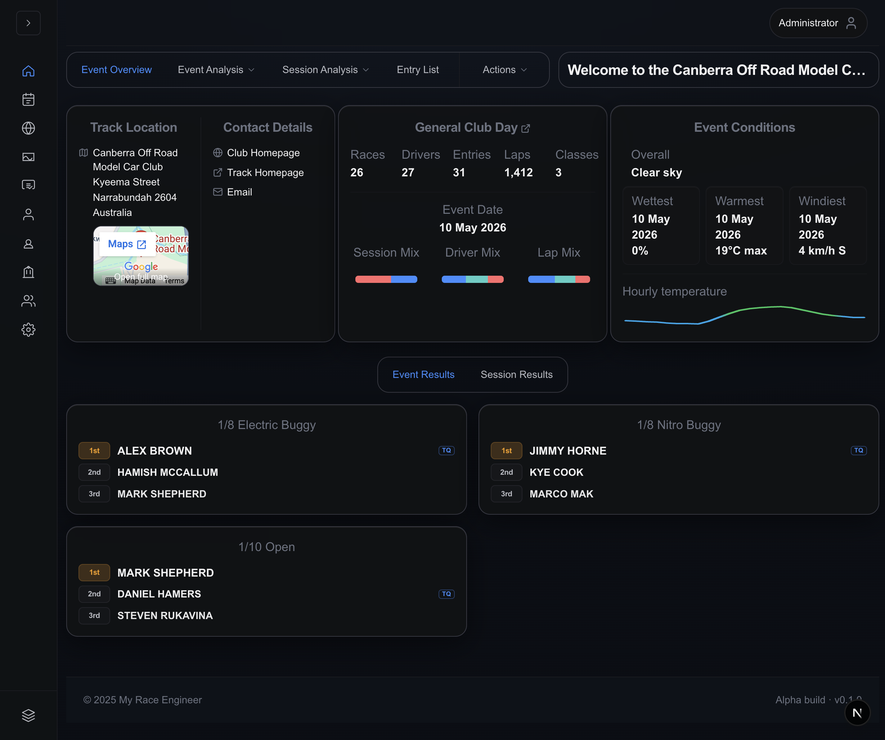

# My Event Analysis dashboard

The dashboard route (`/eventAnalysis`) is **not** a customizable widget canvas
in Alpha v0.1.0. Instead it is a **workflow shell**:

1. Choose an imported event from the banner selector or drawers.
2. Let `EventAnalysisSection` hydrate Redux with `/api/v1/events/{eventId}`
   summary payloads.
3. Work inside the scrolling analysis bands already described in
   [Event Analysis guide](event-analysis.md) (Overview vs **Analysis**,
   including the **Analysis** menu routing to Event Level vs Session workspaces
   and **Mains Ladder** — see
   [`event-analysis-mains-ladder.md`](../architecture/event-analysis-mains-ladder.md)).

Hero screenshot (same graphic used there for continuity):

## Preconditions

| Requirement     | Detail                                                                            |
| --------------- | --------------------------------------------------------------------------------- |
| Auth session    | Obtained via `/login`/`/register` or SSO posture configured by ops                |
| Imported event  | Imported via ingestion pipeline — search alone does not synthesize phantom events |
| Browser storage | Redux-persist restores `selectedEventId` between reloads                          |

## Landing states

### Nothing selected yet

`DashboardClient` renders the onboarding card prompting **Search / import**
actions. Selecting an event swaps in the immersive analysis scaffold.

### `?eventId=` query parameter

`DashboardEventSelector` watches `eventId` from Next search params:

- Dispatches `selectEvent` immediately when mismatched vs Redux.
- After sync, **`router.replace` strips `eventId`** to keep canonical URLs tidy.
- Redux still remembers the UUID; do not panic if bookmarking loses the query.

### Loading & error handling

Between persistence rehydrate and ingestion fetch you might see spinner copy
like “Loading dashboard…”. Separate **Retry loading** banners appear inside
`EventAnalysisSection` when API errors bubble up.

### Practice vs race layouts

Embedded tabs swap automatically when `analysisData.isPracticeDay` flips. See
Event Analysis guide matrix for respective tab rails.

### My Events rail latch

`/eventAnalysis` + **race-day selection** ⇒ rail shows **My Events** below the
home glyph. Selecting it swaps the large analysis canvas for fuzzy-event review
powered by `/api/v1/personas/driver/events`. Practice-day regimes hide the
latch.

## Actions & ingestion affordances

**Actions → Find and Import Events** opens `DashboardEventSearchProvider`
overlays (track filters, imports, pagination). Shortcut hints:

| Shortcut        | Behaviour                       |
| --------------- | ------------------------------- |
| `⌘` + `E`       | Focus find/import drawer        |
| `⌘` + `⌥` + `R` | Refresh active analysis payload |
| `⌘` + `⇧` + `E` | Clear persisted selection       |

(Windows/Linux users substitute `Ctrl` where applicable; exact bindings depend
on OS focus rules.)

## Map car types (global rules reminder)

Selecting **Actions → Map car types** persists **account-wide** mappings for
schedule text ↔ canonical taxonomy. Closing the drawer does not revoke earlier
saves; adjust via modal history.

Detailed narrative: [Car type mapping guide](car-type-mapping.md).

## Admin differences

Elevated admins pass through `/admin` first, but `/eventAnalysis` remains
identical aside from auditing metadata. Telemetry imports, ingestion triggers,
SQL scripts, etc. stay in ops docs — not surfaced as user-editable knobs here.

## Related guides

| Guide                                 | Highlights                 |
| ------------------------------------- | -------------------------- |
| [Event Analysis](event-analysis.md)   | Tab/menu breakdown         |
| [Global Search](event-search.md)      | Catalogue discovery        |
| [Driver Features](driver-features.md) | Fuzzy confirmations        |
| [Navigation](navigation.md)           | Rail map                   |
| [Troubleshooting](troubleshooting.md) | Spinner / ingestion triage |
