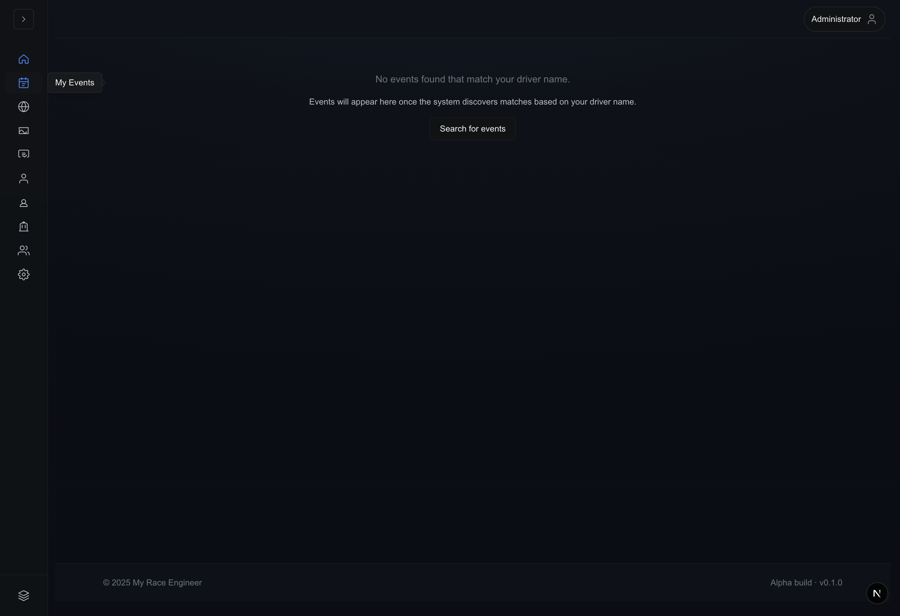

# Driver features & My Events

MRE proposes **possible participations** by comparing ingestion rows with driver
artifacts attached to your user record. Confidence flows through three match
modes with UI affordances surfaced on **My Events** (`MyEventsContent`):

| `matchType`   | Meaning                                                                                                           |
| ------------- | ----------------------------------------------------------------------------------------------------------------- |
| `transponder` | Hardware ID collisions — highest fidelity; auto-approved when ingestion lists transponder columns.                |
| `exact`       | Normalized casing/spacing-equal driver strings.                                                                   |
| `fuzzy`       | Similarity score above threshold (`similarityScore` expressed as fractional 0‑1 scaled to percentages in tables). |

Each row exposes `userDriverLinkStatus`:

| Status      | Behaviour                                                                                     |
| ----------- | --------------------------------------------------------------------------------------------- |
| `confirmed` | You or automation accepted linkage; events propagate into highlights.                         |
| `suggested` | Needs manual adjudication (“Is this actually me?”).                                           |
| `rejected`  | Negative acknowledgement – row should disappear from prioritized lists unless you reconsider. |

## Where you interact in the Alpha UI

Primary path:

1. Go to **`/eventAnalysis`** with **race programme** actively selected from
   Redux/cookie persistence.
2. Click **My Events** nested beneath **My Event Analysis** in the rail
   (`NavigationRailNavItems.tsx` renders only when prerequisites satisfied).

Rail empty state screenshot:

When events exist:

- Paginate like other analysis tables (`ListPagination`).
- Filter toggles differentiate **All vs Suggested**.
- Selecting a row invokes `selectEvent()` + rewinds stacked tab strip to
  Overview for dissecting that programme.

Standalone route `/eventAnalysis/my-event` (referenced in comments) parallels
this content for bookmarks.

## Participant review loop

Suggested rows show:

- Programme title + club/track metadata fetched through
  `/api/v1/personas/driver/events`.
- Similarity percentile callouts (rounded).
- Confirmation / rejection buttons firing
  `/api/v1/users/me/driver-links/events/{eventId}` with optimistic spinners
  guarded by client state sets.

Admins impersonating another persona share the component but still hit
user-scoped API routes guarded server-side — do not confuse with auditing tools.

### Persona prerequisites

`/api/v1/users/me` populates moderation flags (`isAdmin`, persona typing). Lack
of driver persona surfaces inline warning copy instructing route to Profiles.

## Telemetry tie-ins & future bulk tools

Selecting multiple fuzzy rows for batch confirm/reject is **not shipped** yet;
treat UI as iterative table even if architecture discussions mention bulk
ergonomics downstream.

Separate telemetry ingestion (`/eventAnalysis/my-telemetry`, with a per-session
viewer at `/eventAnalysis/my-telemetry/{sessionId}`) merges traces once hardware
exports exist — outside fuzzy matching doc scope but linked for holistic driver
storytelling. Driver personas themselves are managed under **My Driver
Profiles** (`/eventAnalysis/driver-profiles`).

## Best practices recap

| Tip                                                  | Detail                                                     |
| ---------------------------------------------------- | ---------------------------------------------------------- |
| Keep driver spelling aligned with sanctioning sheets | fuzzy thresholds still risk collisions for common initials |
| Maintain transponder numbers                         | upgrades match confidence dramatically                     |
| Reject hallucinated rows quickly                     | trims noise before coach reviews summaries                 |
| Revisit My Events weekly                             | ingestion jobs may retro-link historical meets             |

## Related guides

- [Getting Started](getting-started.md)
- [My Event Analysis](dashboard.md)
- [Event Analysis](event-analysis.md)
- [Global Search fallback](global-search.md)
- [Event Search (Find Events modal)](event-search.md)
- [Account Management personas](account-management.md)
- [Troubleshooting](troubleshooting.md)
