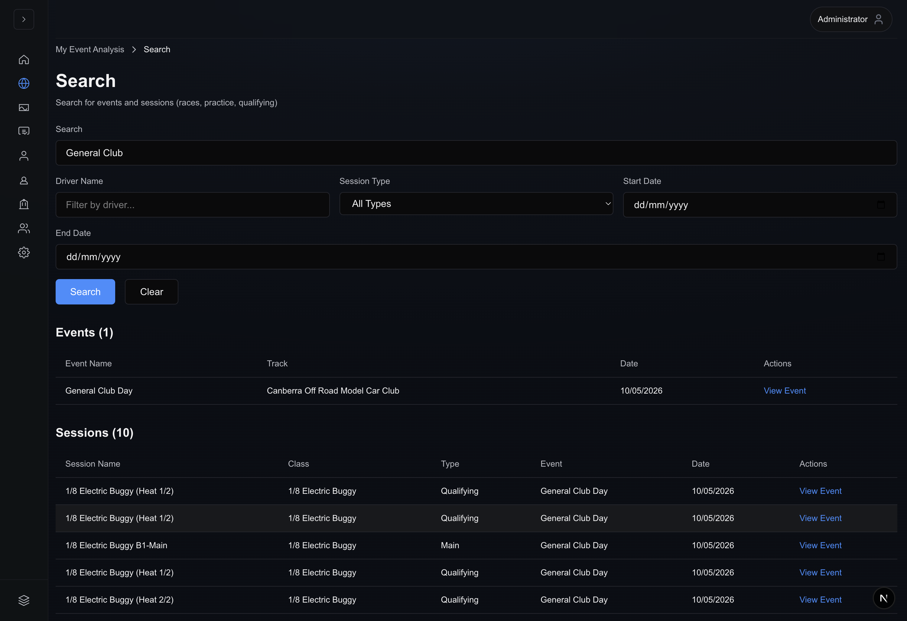

# Global Search (`/search`)

Global Search replaces the bookmark-only `/event-search` redirect slug. Prefer
the navigator label **Global Search** (`navigationRailConfig.tsx` ordering).

Once you submit criteria, Redux calls `performSearch()`, filling **Events** and
**Sessions** tables plus pagination widgets.

## Form layout

| Control               | Behaviour                                                                           |
| --------------------- | ----------------------------------------------------------------------------------- |
| **Search**            | Free-text spanning event + session corpus (placeholders cue cross-surface lookups). |
| **Driver Name**       | Optional narrowing filter forwarded to `/api/v1/search`.                            |
| **Session Type**      | Select `race`, `heat`, `main`, `seeding`, `practice`, `qualifying`, or “All Types”. |
| **Start / End dates** | Optional inclusive window (HTML `<input type="date">`).                             |
| **Search** button     | Validates + executes query. Disabled while Redux `isLoading` true.                  |
| **Clear**             | Resets slices + wipes tables back to untouched instructions.                        |

## Results tables

Sections render independently:

- **Events** — Columns: Event name, Track, Date, Actions (**View Event** →
  `/eventAnalysis?eventId=…`).
- **Sessions** — Session label, normalized class column, inferred type, parent
  event metadata, Actions link (same routing pattern anchored on `eventId`).

Large result sets honour **pagination** identical to Analysis list components:

- Page controls + **Rows per page** (`10`, `25`, `50`, `100`).
- `First / Previous / Next / Last` respecting disabled states.

## Importing versus searching

Searching **does not** replace ingestion. Use **Actions → Find and Import
Events** on My Event Analysis to queue LiveRC jobs. Search simply helps you
recall UUIDs / programme titles already resident in the warehouse.

Legacy documentation referencing standalone “bulk import from search alone” is
obsolete as of Alpha v0.1.0 UI.

## Breadcrumbs / navigation

`/search` shows `My Event Analysis › Search`; treat **My Event Analysis** crumb
as shortcut back home.

## Related guides

- [Getting started](getting-started.md)
- [My Event Analysis](dashboard.md)
- [Event Analysis visuals](event-analysis.md)
- [Navigation](navigation.md)
