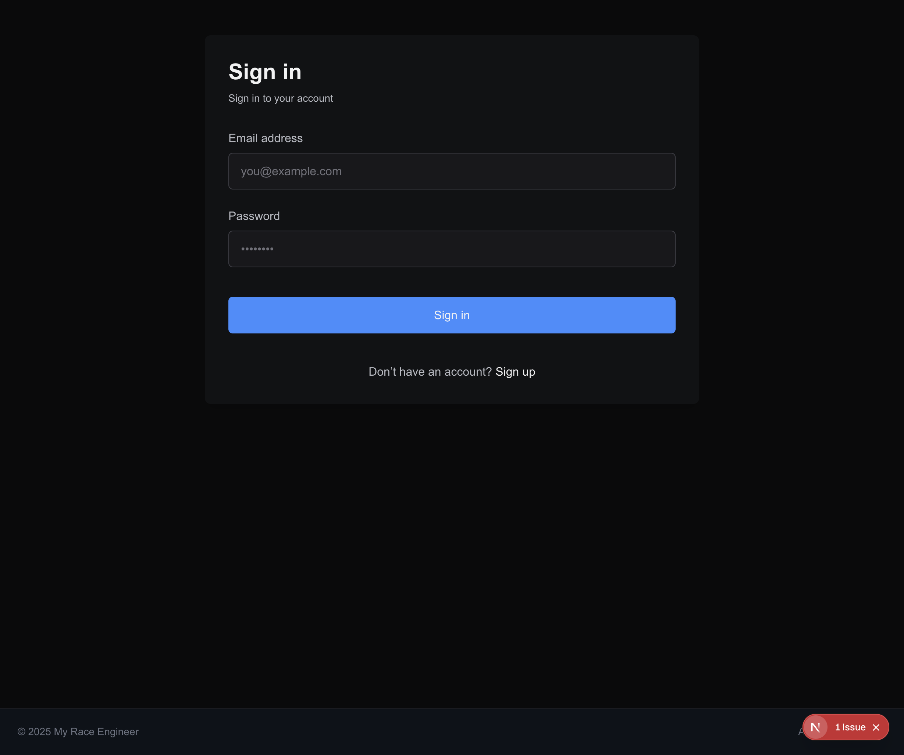
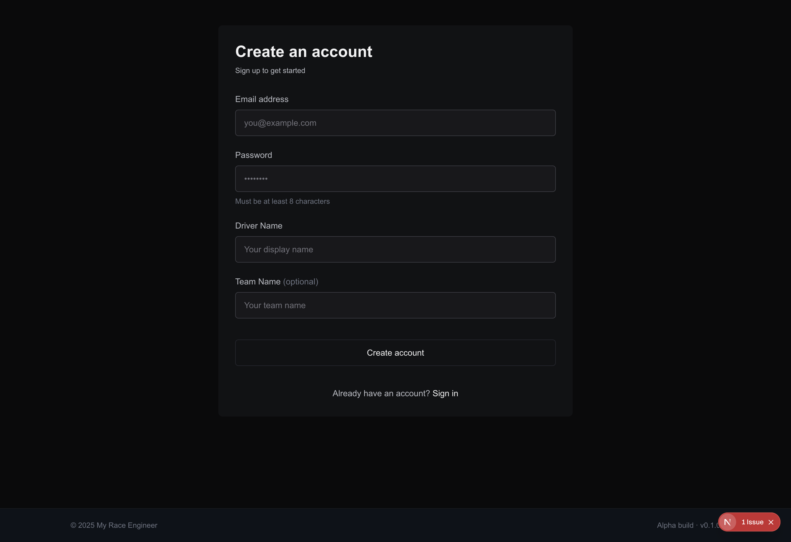
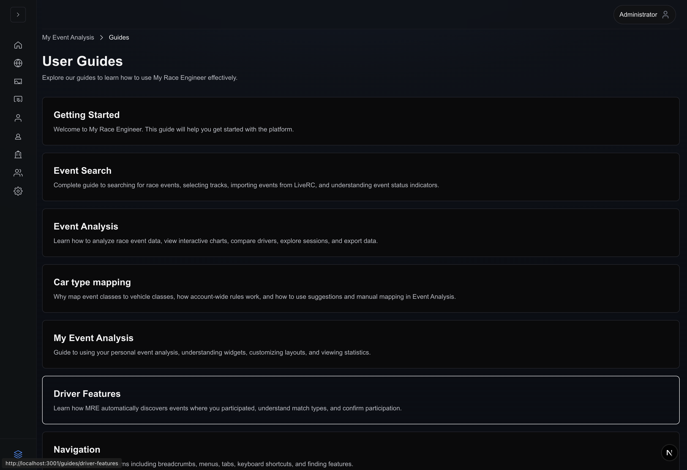
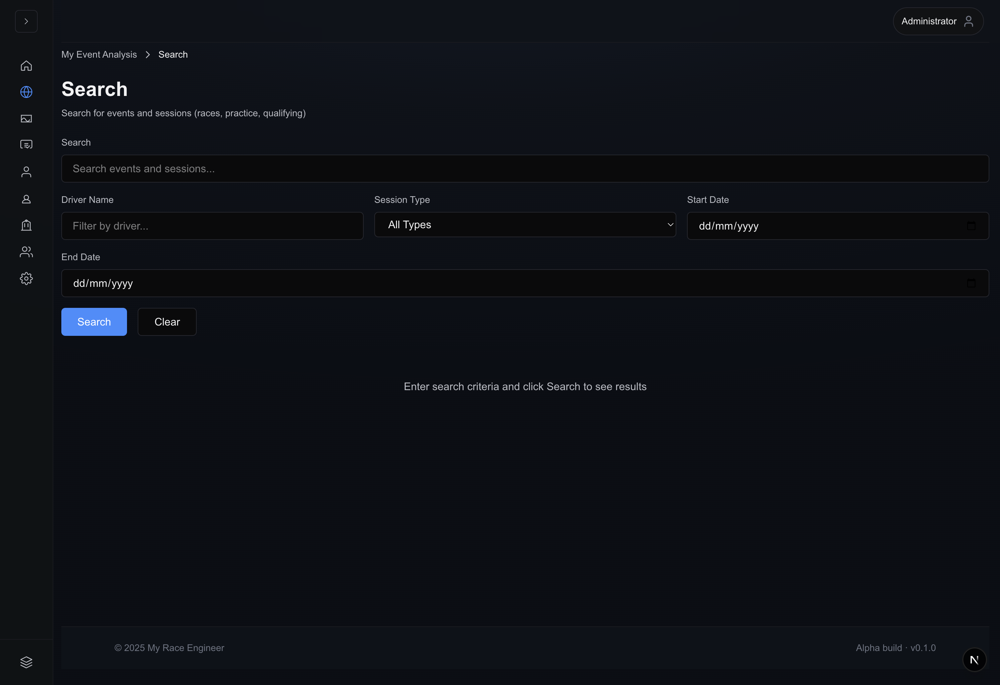
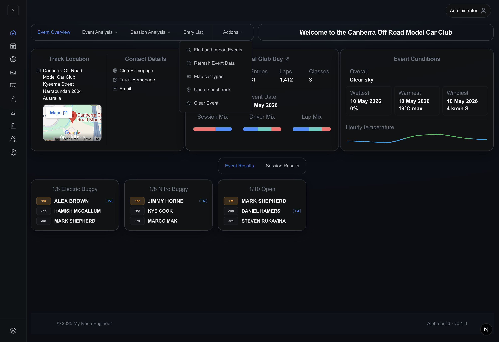

# Getting started with My Race Engineer

Welcome to **My Race Engineer (MRE)** — an Alpha-stage race engineering shell
focused on importing LiveRC programmes, inspecting sessions, tuning how classes
normalize for your persona, and onboarding telemetry data in parallel.

Screenshots below come from **Alpha · v0.1.0** (see authenticated footer badge).

## 1. Create an account

1. Browse to `/register`.
2. Complete the fields:
   - **Email address** (required — this is how you authenticate).
   - **Password** (required, eight characters minimum; helper copy reminds you
     inline).
   - **Driver Name** (required racing handle used for fuzzy matching pipelines).
   - **Team Name (optional)**.
3. Click **Create account**.

> **Important:** Align **Driver Name** with how scoring systems list you —
> capitalization and punctuation still matter downstream for reviewer workflows.

Upon success the app performs a credential login and redirects:

- Administrators → `/admin`
- Everyone else → `/eventAnalysis`

If auto-login fails, you receive the login screen with `?registered=true`.

## 2. Sign back in (`/login`)

1. Provide **Email address** + **Password**.
2. Press **Sign in**.

Destination mirrors registration:

- **`/admin`** for administrators (console metrics + ingestion shortcuts).
- **`/eventAnalysis`** for standard personas.

There is intentionally **no discrete “welcome” splash** after login—the mission
control experience starts immediately.

## 3. Core authenticated layout

Regardless of persona you keep:

| Region                 | Behaviour                                                                                                                                                    |
| ---------------------- | ------------------------------------------------------------------------------------------------------------------------------------------------------------ |
| **Left adaptive rail** | `My Event Analysis`, `Global Search`, telemetry & profile shortcuts, expandable **Guides** stack, contextual **My Events** latch (race-day selections only). |
| **Top immersive bar**  | Command palette/menu entry (`Expand navigation`), profile chip.                                                                                              |
| **Content column**     | Breadcrumbs plus page chrome.                                                                                                                                |

## 4. First tasks checklist

1. **Open Guides** (`/guides`) for editorial copy that ships inside the SPA.

2. **Search** for catalogue entries (`/search`), then pivot into analysis via
   **View Event**.

3. **Import or refresh** programmes from **Actions → Find and Import Events**
   once you have dashboard context:

4. **Review My Events matches** via the contextual rail latch or the empty-state
   CTA that deep-links search when nothing fuzzy has linked yet
   (`./images/my-events-panel.png`).

## 5. Where to dig deeper

| Topic                            | Guide                                               |
| -------------------------------- | --------------------------------------------------- |
| Shell + Redux selection model    | [My Event Analysis / dashboard guide](dashboard.md) |
| `/search` filters & pagination   | [Global Search guide](event-search.md)              |
| Tabs, submenu analytics, ladders | [Event Analysis guide](event-analysis.md)           |
| Class normalization              | [Car type mapping guide](car-type-mapping.md)       |
| Fuzzy confirmations              | [Driver Features guide](driver-features.md)         |

## Troubleshooting starters

If sign-in rejects credentials, duplicate email errors appear during signup, or
search never returns hits, pivot to **[Troubleshooting](troubleshooting.md)**
and mention the footer build string when contacting support.

---

**Next:** [Navigation patterns](navigation.md) once you understand the rail +
breadcrumb choreography.
