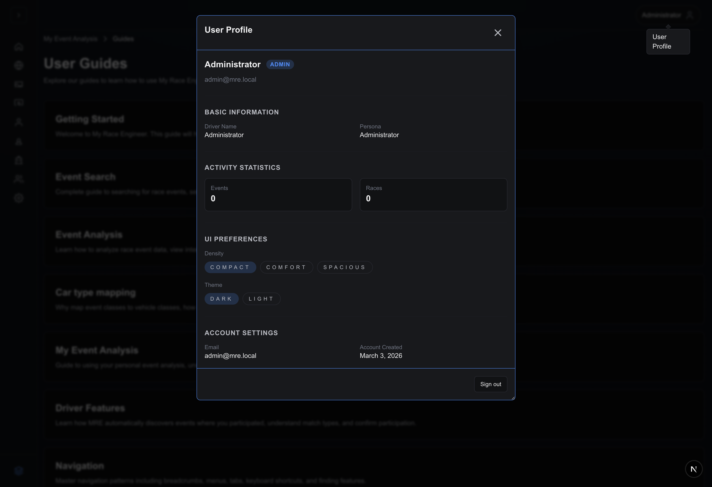

# Navigation guide

MRE Alpha v0.1.0 standardizes navigation around:

1. A **dense adaptive rail** (desktop default collapsed icons, optional
   expansion).
2. **Breadcrumbs** under the immersive chrome.
3. **Contextual latch controls** tied to Redux selection state (example: **My
   Events**).
4. **Actions** overlays with documented shortcut hints.

Screenshots illustrating combined chrome:


## Primary rail entries (authenticated)

Listed top → bottom (`navigationRailConfig.tsx` canonical order):

| Label                  | Route / Target                                   | Notes                                                      |
| ---------------------- | ------------------------------------------------ | ---------------------------------------------------------- |
| **My Event Analysis**  | `/eventAnalysis`                                 | Resets stacked tab Redux slice to Overview when reused.    |
| **Global Search**      | `/search`                                        | Previously `/event-search`.                                |
| **My Telemetry**       | `/eventAnalysis/my-telemetry`                    | Telemetry datasets + imports.                              |
| **My Car Profiles**    | `/eventAnalysis/car-profiles`                    | Car metadata / setups.                                     |
| **My Driver Profiles** | `/eventAnalysis/driver-profiles`                 | Persona overlays.                                          |
| **My Engineer**        | `/eventAnalysis/my-engineer`                     | Intelligence cockpit (still evolving).                     |
| **My Club**            | `/under-development?from=/eventAnalysis/my-club` | Ships placeholder UX until club dashboards GA.             |
| **My Team**            | `/under-development?from=/eventAnalysis/my-team` | Same treatment.                                            |
| **MRE Administration** | `/admin`                                         | Visible for admins — console metrics + ingestion triggers. |

**Guides** near the footer toggles the stack linking to `/guides/*` SPA pages
mirroring Markdown user docs.

Collapsed rail shows icon-only Guides control; expanding reveals textual **User
Guides** row.

Guides screenshot:


### My Events latch logic

`/eventAnalysis` + **race-day** event persisted ⇒ extra **My Events** button
nests under the home glyph. Selecting it swaps `activeEventAnalysisTab` to the
fuzzy review surface; choose **Search for events** CTA inside empty-state cards
if nothing fuzzy-linked yet (`./images/my-events-panel.png`).

### Expand / collapse ergonomics

- **Expand navigation** glyph (square chevron pill) restores textual labels
  without leaving page.
- On mobile breakpoints the rail overlays as drawer; ESC + outside tap close per
  focus-trap helpers.

### My Club submenu (future placeholders)

Collapsed **My Club** icon can expand nested shortcuts (Track leaderboard + Club
highlights placeholders in code paths). Until `/under-development` pages
graduate, clicking still routes informational stub.

## Breadcrumbs conventions

Represent path context only (no redundant query echo). Typical patterns:

```
My Event Analysis › Search
My Event Analysis › Guides › Getting Started
```

Click earlier crumb slices to rewind without nuking Redux unless target route
purposely resets slices (dashboard home intentionally normalizes Overview tab).

## Command palette vs hamburger misconception

Older docs referenced hamburger semantics. Actual top-left control:

- Opens **palette / nav expansion** hybrids per `AdaptiveNavigationRail`
  orchestration—not a classic “everything” drawer.

Additionally, **profile** opener surfaces account modal with density/theme
toggles.



Shortcuts inside profile:

- Density: **Compact / Comfort / Spacious**
- Theme: **Dark / Light** (persisted separately from OS)

## Tabs inside Event Overview row

Separate from rail: Event Overview tablist uses submenu affordances
(`Event Analysis`, `Session Analysis`). Refer to dedicated Event Analysis doc
for interplay.

### Documented ingestion shortcuts surfaced in Actions menu

Desktop browsers honour:

| Combination | Mapped action                    |
| ----------- | -------------------------------- |
| `⌘ + E`     | Find & Import                    |
| `⌘ + ⌥ + R` | Refresh ingestion-backed payload |
| `⌘ + ⇧ + E` | Clear event selection            |

Non-mac users should translate `⌘ → Ctrl`; actual binding acceptance depends on
browser focus contexts.

Escape closes overlays + palette.

## Troubleshooting cues

| Symptom                      | Fix                                                                    |
| ---------------------------- | ---------------------------------------------------------------------- |
| **My Events** missing        | Ensure race-day ingest + Redux selection; Practice-day UX hides latch. |
| Guides stack stuck collapsed | Toggle Guides icon twice; persists via `localStorage`.                 |
| Breadcrumb missing crumb     | Rare on root-only paths (Admin console uses internal nav pills).       |

## Related guides

- [Getting started](getting-started.md)
- [My Event Analysis](dashboard.md)
- [Global Search](event-search.md)
- [Driver Features](driver-features.md)
