# User Journeys Documentation

**Status:** Authoritative  
**Scope:** All personas, scenarios, edge cases, and variations for MRE version 0.1.0  
**Purpose:** Comprehensive end-to-end user journey documentation covering all user types, their complete workflows, error scenarios, and platform variations.

This document provides detailed, step-by-step user journeys for all MRE personas. Each journey includes visual flowcharts, API interactions, UI elements, error handling, and cross-references to related user stories and technical documentation.

---

## Table of Contents

1. [Introduction](#introduction)
2. [Driver Persona Journeys](#driver-persona-journeys)
   - [First-time Driver Journey](#first-time-driver-journey)
   - [Returning Driver Journey](#returning-driver-journey)
   - [Driver Event Discovery via Fuzzy Matching](#driver-event-discovery-via-fuzzy-matching)
   - [Driver Error Scenarios](#driver-error-scenarios)
3. [Admin Persona Journeys](#admin-persona-journeys)
   - [First-time Admin Journey](#first-time-admin-journey)
   - [Returning Admin Journey](#returning-admin-journey)
   - [Admin User Management Journey](#admin-user-management-journey)
   - [Admin Event Management Journey](#admin-event-management-journey)
   - [Admin Ingestion Management Journey](#admin-ingestion-management-journey)
   - [Admin Error Scenarios](#admin-error-scenarios)
4. [Team Manager Persona Journeys](#team-manager-persona-journeys)
5. [Race Engineer Persona Journeys](#race-engineer-persona-journeys)
6. [Cross-Persona Journeys](#cross-persona-journeys)
   - [Authentication Error Scenarios](#authentication-error-scenarios)
   - [Network Error Scenarios](#network-error-scenarios)
   - [Mobile vs Desktop Variations](#mobile-vs-desktop-variations)

---

## Introduction

### Purpose and Scope

This document provides comprehensive end-to-end user journey documentation for the My Race Engineer (MRE) application. It covers:

- **All Personas**: Driver, Admin, Team Manager, and Race Engineer
- **All Scenarios**: First-time users, returning users, error scenarios, edge cases
- **All Variations**: Mobile and desktop differences, different user states
- **Complete Flows**: From entry point to exit point with all decision points

### How to Read the Journeys

Each journey follows a consistent structure:

1. **Journey Metadata**: Persona, scenario, entry/exit points, prerequisites
2. **High-Level Flow Diagram**: Mermaid flowchart showing the overall journey
3. **Detailed Step-by-Step Flow**: Each step includes:
   - User action
   - UI elements
   - API calls
   - Backend processes
   - Success states
   - Error states
   - Next steps
4. **Visual Flow Diagrams**: Sequence diagrams for complex interactions
5. **Edge Cases and Variations**: Mobile/desktop differences, alternative flows
6. **Technical Details**: API endpoints, database operations, session management

### Relationship to User Stories

This journey documentation complements the [User Stories](../user-stories/README.md) by providing:

- **End-to-end flows** that connect multiple user stories
- **Visual representations** of complex workflows
- **Error scenarios** and edge cases not covered in individual stories
- **Cross-persona** interactions and variations

Each journey references relevant user stories from:
- [Authentication Epic](authentication.md)
- [User Management Epic](user-management.md)
- [Administrator Epic](admin.md)
- [LiveRC Integration Epic](liverc-integration.md)

### Diagram Legend

**Mermaid Flowchart Symbols:**
- `[Rectangle]` - Process/action
- `{Diamond}` - Decision point
- `(Rounded)` - Start/end point
- `-->` - Flow direction
- `-.-` - Error path

**Mermaid Sequence Diagram Symbols:**
- `participant` - Actor/system component
- `->` - Synchronous call
- `-->` - Asynchronous call
- `->>` - Return/response

---

## Driver Persona Journeys

### First-time Driver Journey

**Persona**: Driver  
**Scenario**: First-time user registration and initial event discovery  
**Entry Point**: Landing page or direct registration URL (`/register`)  
**Exit Point**: Event Analysis page (`/events/analyse/[eventId]`)  
**Prerequisites**: None (this is the entry journey for new users)

**Related User Stories:**
- [User Registration](authentication.md#user-registration)
- [User Login](authentication.md#user-login)
- [User Welcome Page](user-management.md#user-welcome-page)
- [Track Selection](liverc-integration.md#track-selection)
- [Event Discovery](liverc-integration.md#event-discovery)
- [On-Demand Ingestion](liverc-integration.md#on-demand-ingestion)
- [Data Visualization](liverc-integration.md#data-visualization)

**Related Workflows:**
- [LiveRC Event Search and Event Analysis User Workflow](../frontend/liverc/user-workflow.md)

#### High-Level Flow Diagram

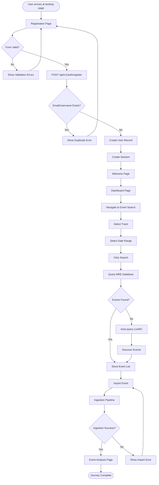

#### Detailed Step-by-Step Flow

**Step 1: User Arrives at Landing Page**

- **User Action**: User navigates to MRE application (e.g., `http://localhost:3001`)
- **UI Elements**: Landing page with navigation to Register/Login
- **API Calls**: None
- **Backend Process**: None
- **Success State**: Landing page displayed
- **Error States**: None
- **Next Step**: User clicks "Register" or navigates to `/register`

**Step 2: Registration Form Display**

- **User Action**: User views registration form
- **UI Elements**: 
  - Email/Username input field (required)
  - Password input field (required)
  - Driver Name input field (required)
  - Team Name input field (optional)
  - "Create Account" button
  - Form validation error messages (initially hidden)
- **API Calls**: None (form display only)
- **Backend Process**: None
- **Success State**: Registration form displayed with all fields
- **Error States**: None
- **Next Step**: User fills in form fields

**Step 3: Form Validation (Client-Side)**

- **User Action**: User fills form and attempts submission
- **UI Elements**: 
  - Real-time validation on blur
  - Field-level error messages beneath relevant fields
  - Error messages use `--token-error-text` color
  - Submit button disabled until validation passes
- **API Calls**: None (client-side validation only)
- **Backend Process**: None
- **Success State**: All fields valid, submit button enabled
- **Error States**: 
  - "Email/Username is required" if empty
  - "Password must be at least 8 characters" if too short
  - "Driver Name is required" if empty
  - "Start date must be before or equal to end date" (if applicable)
- **Next Step**: If valid, proceed to submission. If invalid, show errors and wait for correction.

**Step 4: Registration API Call**

- **User Action**: User clicks "Create Account" button
- **UI Elements**: 
  - Loading state on submit button
  - Button disabled during submission
- **API Calls**: `POST /api/v1/auth/register`
  - Request body: `{ email, password, driverName, teamName? }`
- **Backend Process**:
  1. Validate request body
  2. Check for duplicate email/username
  3. Hash password using Argon2id
  4. Create user record in PostgreSQL via Prisma
  5. Normalize driver name and store in `User.normalizedName`
  6. Assign Driver persona automatically
  7. Create session
- **Success State**: User created, session established, redirect to `/welcome`
- **Error States**: 
  - `409 Conflict`: "An account with this email/username already exists."
  - `400 Bad Request`: Field-level validation errors
  - `500 Internal Server Error`: "Unable to create account. Please try again."
- **Next Step**: On success → Welcome page. On error → Show error message, remain on registration form.

**Step 5: Welcome Page Display**

- **User Action**: User automatically redirected to welcome page
- **UI Elements**: 
  - Centered message: "Welcome back <Driver Name>"
  - No additional UI elements (per v0.1.0 scope)
- **API Calls**: None (user data from session)
- **Backend Process**: Retrieve user data from session
- **Success State**: Welcome message displayed with driver name
- **Error States**: If session invalid → redirect to login
- **Next Step**: User navigates to Dashboard or Event Search

**Step 6: Dashboard Navigation**

- **User Action**: User navigates to Dashboard (via navigation or direct URL)
- **UI Elements**: Dashboard page with navigation to Event Search
- **API Calls**: None (or dashboard data if implemented)
  - Optional: `GET /api/v1/personas/driver/events` (to show discovered events via fuzzy matching)
- **Backend Process**: 
  - If implemented: Query `EventDriverLink` for events where user participated (via transponder, exact, or fuzzy matching)
  - Display discovered events with match type indicators
- **Success State**: Dashboard displayed (optionally with discovered events)
- **Error States**: None
- **Next Step**: User navigates to Event Search or views discovered events
- **Note**: Events discovered via fuzzy matching (see [Driver Event Discovery via Fuzzy Matching](#driver-event-discovery-via-fuzzy-matching)) may be displayed here if the system has already ingested events matching the user's driver name.

**Step 7: Event Search Page**

- **User Action**: User navigates to Event Search page (`/event-search`)
- **UI Elements**: 
  - Track selection field (opens modal)
  - Date range picker (start date, end date)
  - "Search" button
  - "Reset" button
- **API Calls**: `GET /api/v1/tracks` (to populate track modal)
- **Backend Process**: Retrieve track list from database
- **Success State**: Event Search form displayed with track list available
- **Error States**: 
  - Network error: "Unable to load tracks. Please try again."
  - Empty tracks: "No tracks available. Tracks may need to be refreshed by an administrator."
- **Next Step**: User selects track and date range

**Step 8: Track Selection**

- **User Action**: User clicks track field, opens modal, searches and selects track
- **UI Elements**: 
  - Track selection modal (full-screen on mobile, centered on desktop)
  - Search input at top
  - Track list with favourite stars
  - Favourite tracks section at top
  - "Cancel" button
- **API Calls**: `GET /api/v1/tracks` (if not already loaded)
- **Backend Process**: Filter tracks by search query, return matching tracks
- **Success State**: Track selected, modal closed, track name displayed in field
- **Error States**: None (search is client-side filtering)
- **Next Step**: User selects date range

**Step 9: Date Range Selection**

- **User Action**: User selects start date and end date
- **UI Elements**: 
  - Start date input (native date picker on mobile)
  - End date input (native date picker on mobile)
  - Validation errors beneath fields if invalid
- **API Calls**: None (client-side validation)
- **Backend Process**: None
- **Success State**: Valid date range selected (max 3 months, no future dates)
- **Error States**: 
  - "Date range cannot exceed 3 months. Please select a shorter range."
  - "Cannot select future dates. Please select today or earlier."
  - "Start date must be before or equal to end date."
- **Next Step**: User clicks "Search" button

**Step 10: Event Search**

- **User Action**: User clicks "Search" button
- **UI Elements**: 
  - Loading state on search button
  - "Searching for events..." message
- **API Calls**: `GET /api/v1/events/search?track_id={track_id}&start_date={start_date}&end_date={end_date}`
- **Backend Process**: 
  1. Validate track_id exists
  2. Validate date range (start <= end, max 3 months, no future dates)
  3. Query MRE database for events matching criteria
  4. Return event list with ingestion status
- **Success State**: Event list returned
- **Error States**: 
  - `400 Bad Request`: Validation errors
  - `404 Not Found`: Track not found
  - `500 Internal Server Error`: "Unable to search events. Please try again."
- **Next Step**: If events found → show event list. If no events → auto-query LiveRC.

**Step 11: LiveRC Auto-Discovery (If No DB Results)**

- **User Action**: System automatically queries LiveRC (no user action)
- **UI Elements**: 
  - "No events found in database. Checking LiveRC..." message
  - Loading indicator
- **API Calls**: `POST /api/v1/events/discover` (or equivalent LiveRC discovery endpoint)
- **Backend Process**: 
  1. Query LiveRC for events matching track and date range
  2. Filter out events already in MRE database
  3. Return discovered events with status "New (LiveRC only)"
- **Success State**: Discovered events returned
- **Error States**: 
  - LiveRC unavailable: "LiveRC is temporarily unavailable. Please try again later."
  - Network error: "Unable to check LiveRC. Please check your connection."
- **Next Step**: Show discovered events in event list

**Step 12: Event List Display**

- **User Action**: User views event list
- **UI Elements**: 
  - Event table/list (mobile: cards, desktop: table)
  - Columns: Event Name, Event Date, Status
  - Status tags: "Stored", "New (LiveRC only)", "Importing", "Failed import"
  - Checkboxes for importable events
  - "Analyse event" button for imported events
- **API Calls**: None (using results from previous search)
- **Backend Process**: None
- **Success State**: Event list displayed with status indicators
- **Error States**: None
- **Next Step**: User selects events to import or clicks "Analyse event"

**Step 13: Event Import**

- **User Action**: User selects events and clicks "Import X selected events"
- **UI Elements**: 
  - Bulk import action bar
  - Progress indicator: "Importing X of Y..."
  - Status updates per event
- **API Calls**: `POST /api/v1/events/{event_id}/ingest` (for each selected event, sequential)
- **Backend Process**: 
  1. Trigger ingestion pipeline for each event
  2. Update event status to "Importing"
  3. Process event data from LiveRC
  4. Store races, drivers, results, laps
  5. Update status to "Stored" on success or "Failed import" on error
- **Success State**: Events imported successfully, status updated to "Stored"
- **Error States**: 
  - `INGESTION_IN_PROGRESS`: "Ingestion already in progress for this event. Please wait."
  - `INGESTION_FAILED`: "Unable to ingest event data. The LiveRC website may be temporarily unavailable."
  - `NOT_FOUND`: "Event not found. It may have been removed."
- **Next Step**: User clicks "Analyse event" for imported event

**Step 14: Event Analysis**

- **User Action**: User clicks "Analyse event" button
- **UI Elements**: 
  - Event Analysis page with tabs: Overview, Drivers, Sessions/Heats, Comparisons
  - Interactive charts showing lap times, positions, gaps
  - Driver selection controls
  - Export to CSV button
- **API Calls**: 
  - `GET /api/v1/events/{eventId}`
  - `GET /api/v1/events/{eventId}/analysis`
  - `GET /api/v1/races/{raceId}`
  - `GET /api/v1/races/{raceId}/laps`
- **Backend Process**: Retrieve event data, race results, lap data, generate analysis
- **Success State**: Event analysis displayed with charts and data
- **Error States**: 
  - `404 Not Found`: "Event not found. Event may need to be ingested."
  - Network error: "Unable to load event data. Please try again."
- **Next Step**: User analyzes data, exports CSV, or navigates to another event

#### Sequence Diagram: Registration and Session Creation

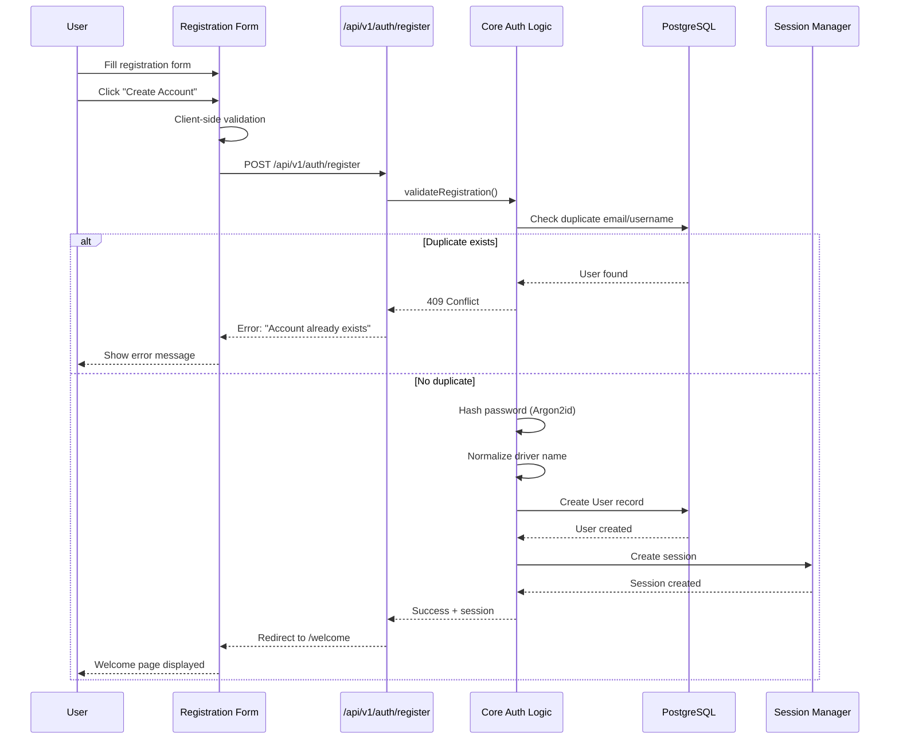

#### Edge Cases and Variations

**Mobile vs Desktop:**
- **Mobile**: Track modal is full-screen overlay
- **Desktop**: Track modal is centered dialog (max-width: 600px)
- **Mobile**: Date inputs use native date picker
- **Desktop**: May use enhanced calendar picker (but degrades to native)
- **Mobile**: Event table displays as cards/list
- **Desktop**: Event table displays as table with columns

**Form Persistence:**
- Last selected track and date range persisted in localStorage
- Values restored on page reload
- Reset button clears persisted values

**Error Recovery:**
- Registration errors: User can correct and resubmit
- Import errors: User can retry failed imports individually
- Network errors: Retry button provided

---

### Returning Driver Journey

**Persona**: Driver  
**Scenario**: Returning user login and event search  
**Entry Point**: Login page (`/login`)  
**Exit Point**: Event Analysis page or Dashboard  
**Prerequisites**: User account exists, user has previously registered

**Related User Stories:**
- [User Login](authentication.md#user-login)
- [User Welcome Page](user-management.md#user-welcome-page)
- [Track Selection](liverc-integration.md#track-selection)
- [Event Discovery](liverc-integration.md#event-discovery)

**Related Workflows:**
- [LiveRC Event Search and Event Analysis User Workflow](../frontend/liverc/user-workflow.md)

#### High-Level Flow Diagram

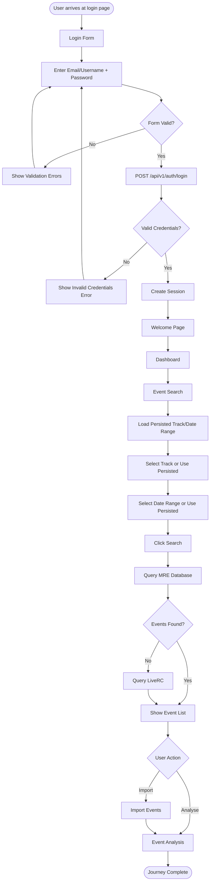

#### Detailed Step-by-Step Flow

**Step 1: Login Page Display**

- **User Action**: User navigates to login page (`/login`)
- **UI Elements**: 
  - Email/Username input field
  - Password input field
  - "Sign in" or "Log In" button
  - Link to registration page
- **API Calls**: None
- **Backend Process**: None
- **Success State**: Login form displayed
- **Error States**: None
- **Next Step**: User enters credentials

**Step 2: Login Form Submission**

- **User Action**: User enters credentials and clicks "Sign in"
- **UI Elements**: 
  - Loading state on submit button
  - Button disabled during submission
- **API Calls**: `POST /api/v1/auth/login`
  - Request body: `{ email, password }`
- **Backend Process**: 
  1. Validate request body
  2. Find user by email/username
  3. Verify password using Argon2id
  4. Check `isAdmin` flag
  5. Create session
- **Success State**: Session created, redirect based on user type
- **Error States**: 
  - `401 Unauthorized`: "Invalid email/username or password." (generic for security)
  - `404 Not Found`: "Invalid email/username or password." (generic for security)
  - `500 Internal Server Error`: "Unable to log in. Please try again."
- **Next Step**: On success → redirect to `/welcome` (Driver) or `/admin` (Admin). On error → show error, remain on login form.

**Step 3: Welcome Page (Same as First-time Journey)**

- **User Action**: User automatically redirected to welcome page
- **UI Elements**: "Welcome back <Driver Name>"
- **API Calls**: None (user data from session)
- **Backend Process**: Retrieve user data from session
- **Success State**: Welcome message displayed
- **Error States**: If session invalid → redirect to login
- **Next Step**: User navigates to Dashboard or Event Search

**Step 4: Event Search with Persisted Values**

- **User Action**: User navigates to Event Search
- **UI Elements**: 
  - Track field pre-populated with last selected track (if persisted)
  - Date range pre-populated with last selected range (if persisted)
  - Form ready for search or modification
- **API Calls**: `GET /api/v1/tracks` (to populate track modal)
- **Backend Process**: Retrieve track list
- **Success State**: Form displayed with persisted values (if available)
- **Error States**: None
- **Next Step**: User modifies or uses persisted values, then searches

**Step 5-14**: Same as First-time Driver Journey Steps 8-14 (Track Selection through Event Analysis)

#### Edge Cases and Variations

**Session Persistence:**
- User session persists across browser sessions (if configured)
- Session expiration handled gracefully with redirect to login

**Form Persistence:**
- Last track and date range persisted in localStorage
- Values restored automatically on page load
- User can modify or use persisted values

**Existing Events:**
- If user searches for events already in database, they see "Stored" status
- User can immediately click "Analyse event" without importing
- System may still query LiveRC if user clicks "Check LiveRC" button

---

### Driver Event Discovery via Fuzzy Matching

**Persona**: Driver  
**Scenario**: System automatically discovers events where driver participated using fuzzy name matching  
**Entry Point**: After login/welcome or during event ingestion  
**Exit Point**: User viewing discovered events or confirming participation  
**Prerequisites**: User registered with driver name, events exist in system or are being ingested

**Related User Stories:**
- [User Registration](authentication.md#user-registration)
- [On-Demand Ingestion](liverc-integration.md#on-demand-ingestion)

**Related Documentation:**
- [MRE Personas - Driver Persona](../design/mre-personas.md#1-driver-persona)

#### High-Level Flow Diagram

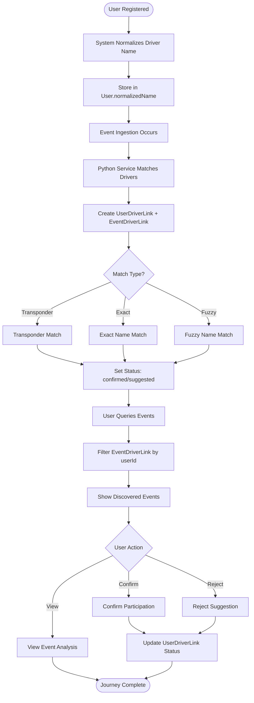

#### Detailed Step-by-Step Flow

**Step 1: Driver Name Normalization (During Registration)**

- **User Action**: User registers with driver name
- **UI Elements**: Registration form
- **API Calls**: `POST /api/v1/auth/register`
- **Backend Process**: 
  1. Normalize driver name using `Normalizer.normalize_driver_name()`
  2. Store normalized name in `User.normalizedName`
- **Success State**: Normalized name stored
- **Error States**: None
- **Next Step**: User account created, ready for event matching

**Step 2: Event Ingestion with Driver Matching**

- **User Action**: Event ingestion occurs (admin-triggered or user-triggered)
- **UI Elements**: None (backend process)
- **API Calls**: Ingestion service processes events
- **Backend Process**: 
  1. Python ingestion service processes event data
  2. For each driver in event:
     - Match against all users using:
       - Transponder number (if available)
       - Exact name match
       - Fuzzy name match (similarity threshold)
     - Create `UserDriverLink` record with match type and status
     - Create `EventDriverLink` record linking user to event
- **Success State**: Links created with appropriate match type and status
- **Error States**: Ingestion errors handled per ingestion error handling docs
- **Next Step**: Links available for user query

**Step 3: User Queries Discovered Events**

- **User Action**: User navigates to events list or dashboard
- **UI Elements**: 
  - Events list showing discovered events
  - Status indicators: "Confirmed", "Suggested"
  - Match type indicators: "Transponder", "Exact", "Fuzzy"
- **API Calls**: `GET /api/v1/personas/driver/events`
- **Backend Process**: 
  1. Query `EventDriverLink` where `userId` matches current user
  2. Filter by `matchType` (transponder, exact, fuzzy)
  3. Filter by status (confirmed, suggested)
  4. Return events with participation details
- **Success State**: Discovered events returned with match information
- **Error States**: 
  - `500 Internal Server Error`: "Unable to load events. Please try again."
- **Next Step**: User views discovered events

**Step 4: User Confirms or Rejects Participation**

- **User Action**: User confirms or rejects suggested participation
- **UI Elements**: 
  - "Confirm" button for suggested matches
  - "Reject" button for suggested matches
  - Confirmed events show "Confirmed" status
- **API Calls**: `PATCH /api/v1/users/{userId}/driver-links/{linkId}` (future endpoint)
- **Backend Process**: 
  1. Update `UserDriverLink` status to "confirmed" or "rejected"
  2. Update related `EventDriverLink` records
- **Success State**: Status updated, events reflect user's confirmation
- **Error States**: 
  - `404 Not Found`: Link not found
  - `500 Internal Server Error`: "Unable to update participation. Please try again."
- **Next Step**: User views confirmed events or continues browsing

**Step 5: User Views Event Analysis**

- **User Action**: User clicks on discovered event to view analysis
- **UI Elements**: Event Analysis page (same as standard event analysis)
- **API Calls**: Same as standard event analysis
- **Backend Process**: Same as standard event analysis
- **Success State**: Event analysis displayed
- **Error States**: Same as standard event analysis
- **Next Step**: User analyzes event data

#### Sequence Diagram: Fuzzy Matching Process

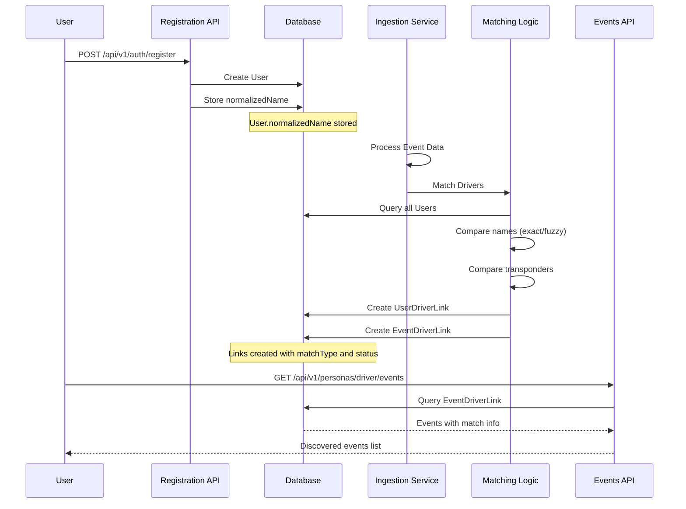

#### Edge Cases and Variations

**Match Type Priority:**
- Transponder match takes highest priority
- Exact match takes second priority
- Fuzzy match takes lowest priority
- If multiple match types exist, highest priority is used

**Fuzzy Match Threshold:**
- Similarity score threshold determines fuzzy matches
- Lower threshold = more matches (but more false positives)
- Higher threshold = fewer matches (but more accurate)

**Status Management:**
- "Confirmed" status: User explicitly confirmed participation
- "Suggested" status: System suggests participation (fuzzy match)
- "Rejected" status: User rejected suggestion (future feature)

---

### Driver Error Scenarios

**Persona**: Driver  
**Scenario**: Error handling for various failure modes  
**Entry Point**: Various (registration, login, event search, import)  
**Exit Point**: Error resolved or user abandons  
**Prerequisites**: User attempting various actions

**Related User Stories:**
- [User Registration](authentication.md#user-registration) - Error handling section
- [User Login](authentication.md#user-login) - Error handling section
- [Event Discovery](liverc-integration.md#event-discovery) - Error handling section
- [On-Demand Ingestion](liverc-integration.md#on-demand-ingestion) - Error handling section

#### Registration Error Scenarios

**Scenario 1: Duplicate Email/Username**

- **User Action**: User attempts to register with existing email/username
- **UI Elements**: Error message: "An account with this email/username already exists."
- **API Response**: `409 Conflict`
- **Error Handling**: 
  - Error displayed prominently
  - User can correct email/username or navigate to login
  - Form remains populated (except password)
- **Recovery Path**: User corrects email/username or clicks "Already have an account? Log in"

**Scenario 2: Validation Failure**

- **User Action**: User submits form with invalid data
- **UI Elements**: Field-level error messages beneath relevant fields
- **API Response**: `400 Bad Request` with field-level errors
- **Error Handling**: 
  - Each field shows specific error message
  - Submit button disabled until errors resolved
  - Focus moves to first error field
- **Recovery Path**: User corrects errors and resubmits

**Scenario 3: Network Error**

- **User Action**: User submits form but network fails
- **UI Elements**: Error message: "Unable to create account. Please check your connection and try again."
- **API Response**: Network error (no response)
- **Error Handling**: 
  - Generic error message (no technical details)
  - Retry option provided
  - Form data preserved
- **Recovery Path**: User checks connection and retries

#### Login Error Scenarios

**Scenario 1: Invalid Credentials**

- **User Action**: User enters incorrect email/username or password
- **UI Elements**: Error message: "Invalid email/username or password." (generic for security)
- **API Response**: `401 Unauthorized`
- **Error Handling**: 
  - Generic error message (prevents account enumeration)
  - Form remains populated (except password)
  - User can retry
- **Recovery Path**: User re-enters credentials

**Scenario 2: Account Not Found**

- **User Action**: User enters non-existent email/username
- **UI Elements**: Error message: "Invalid email/username or password." (generic for security)
- **API Response**: `404 Not Found`
- **Error Handling**: 
  - Same generic message as invalid credentials (security)
  - Link to registration page provided
- **Recovery Path**: User navigates to registration or corrects email/username

**Scenario 3: Session Creation Failure**

- **User Action**: User logs in successfully but session creation fails
- **UI Elements**: Error message: "Unable to log in. Please try again."
- **API Response**: `500 Internal Server Error`
- **Error Handling**: 
  - User remains on login page
  - Credentials cleared for security
- **Recovery Path**: User retries login

#### Event Search Error Scenarios

**Scenario 1: No Events Found**

- **User Action**: User searches but no events found in database or LiveRC
- **UI Elements**: Empty state message: "No events found for this track and date range. Try changing your dates or selecting a different track."
- **API Response**: `200 OK` with empty array
- **Error Handling**: 
  - Friendly empty state message
  - Suggestions for user action
  - "Reset Search" button provided
- **Recovery Path**: User modifies search criteria or selects different track

**Scenario 2: LiveRC Unavailable**

- **User Action**: System attempts to query LiveRC but service unavailable
- **UI Elements**: Error message: "LiveRC is temporarily unavailable. Please try again later."
- **API Response**: `503 Service Unavailable` or network error
- **Error Handling**: 
  - Error message displayed
  - Retry option provided
  - User can continue with database results if available
- **Recovery Path**: User retries later or uses database results

**Scenario 3: Invalid Date Range**

- **User Action**: User selects invalid date range (> 3 months or future dates)
- **UI Elements**: Validation error beneath date fields
- **API Response**: `400 Bad Request` (if client-side validation bypassed)
- **Error Handling**: 
  - Client-side validation prevents submission
  - Clear error messages
  - Date picker disables invalid dates
- **Recovery Path**: User corrects date range

#### Import Error Scenarios

**Scenario 1: Ingestion Already in Progress**

- **User Action**: User attempts to import event already being imported
- **UI Elements**: Error message: "Ingestion already in progress for this event. Please wait."
- **API Response**: `409 Conflict` with error code `INGESTION_IN_PROGRESS`
- **Error Handling**: 
  - Status shows "Importing"
  - User cannot trigger duplicate import
  - Status updates automatically when complete
- **Recovery Path**: User waits for import to complete

**Scenario 2: Ingestion Failed**

- **User Action**: Event import fails
- **UI Elements**: Status shows "Failed import" with red indicator
- **API Response**: `500 Internal Server Error` with error code `INGESTION_FAILED`
- **Error Handling**: 
  - Status updated to "Failed import"
  - Retry option provided
  - Error logged server-side (not exposed to user)
- **Recovery Path**: User retries import

**Scenario 3: Partial Import Failure (Bulk Import)**

- **User Action**: User imports multiple events, some fail
- **UI Elements**: Toast notification: "Imported X of Y events. Z failed. Please retry failed imports."
- **API Response**: Individual responses per event
- **Error Handling**: 
  - Success count and failure count displayed
  - Failed events remain in list with "Failed import" status
  - User can retry failed events individually
- **Recovery Path**: User retries failed imports

---

## Admin Persona Journeys

### First-time Admin Journey

**Persona**: Admin  
**Scenario**: Backend-created admin account first login  
**Entry Point**: Backend admin creation → Login page  
**Exit Point**: Admin Console dashboard  
**Prerequisites**: Admin account created via seed script, database migration, or manual database update

**Related User Stories:**
- [Administrator Login](admin.md#administrator-login)
- [Administrator Console](admin.md#administrator-console)

#### High-Level Flow Diagram

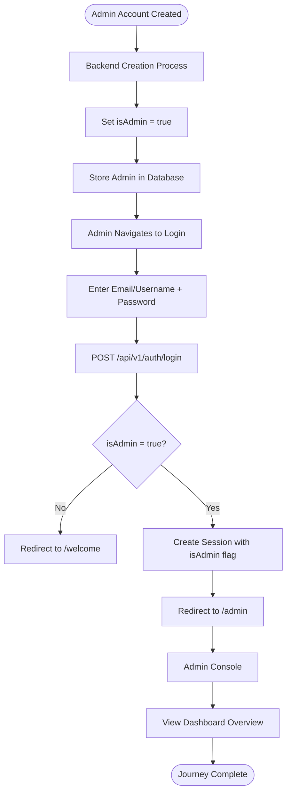

#### Detailed Step-by-Step Flow

**Step 1: Backend Admin Creation**

- **User Action**: Admin account created via backend mechanism (not user action)
- **UI Elements**: None (backend process)
- **API Calls**: None (direct database operation or seed script)
- **Backend Process**: 
  1. Admin account created via one of:
     - Seed script (`prisma/seed.ts`)
     - Database migration
     - Manual database update
  2. `isAdmin` flag set to `true`
  3. Admin persona assigned (if persona system implemented)
- **Success State**: Admin account created with `isAdmin = true`
- **Error States**: None (backend process)
- **Next Step**: Admin navigates to login page

**Step 2: Admin Login**

- **User Action**: Admin navigates to login page and enters credentials
- **UI Elements**: Same login form as regular users
- **API Calls**: `POST /api/v1/auth/login`
  - Request body: `{ email, password }`
- **Backend Process**: 
  1. Validate credentials
  2. Check `isAdmin` flag on user record
  3. Create session with `isAdmin: true` in session data
- **Success State**: Session created with admin flag, redirect to `/admin`
- **Error States**: Same as regular user login errors
- **Next Step**: Redirect to Admin Console

**Step 3: Admin Console Access**

- **User Action**: Admin automatically redirected to Admin Console (`/admin`)
- **UI Elements**: 
  - Admin Console dashboard
  - Navigation to admin features:
    - Dashboard Overview
    - User Management
    - Event Management
    - Track Management
    - Ingestion Controls
    - Audit Logs
    - Health Checks
    - Log Viewing
- **API Calls**: `GET /api/v1/admin/stats` (for dashboard)
- **Backend Process**: 
  1. Verify admin authentication (middleware)
  2. Retrieve system statistics
  3. Return dashboard data
- **Success State**: Admin Console displayed with dashboard
- **Error States**: 
  - If not admin: Access denied, redirect to `/welcome`
  - If not authenticated: Redirect to login
- **Next Step**: Admin explores admin features

**Step 4: Dashboard Overview**

- **User Action**: Admin views dashboard overview
- **UI Elements**: 
  - System statistics cards:
    - User count
    - Event count
    - Track count
    - Database size
  - Health status indicators
  - Quick action cards
  - Recent activity feed
- **API Calls**: `GET /api/v1/admin/stats`
- **Backend Process**: 
  1. Query database for counts
  2. Calculate database size
  3. Check system health
  4. Retrieve recent activity
- **Success State**: Dashboard displayed with statistics
- **Error States**: 
  - Database error: "Unable to load statistics. Please try again."
- **Next Step**: Admin navigates to specific admin features

#### Sequence Diagram: Admin Login and Redirect

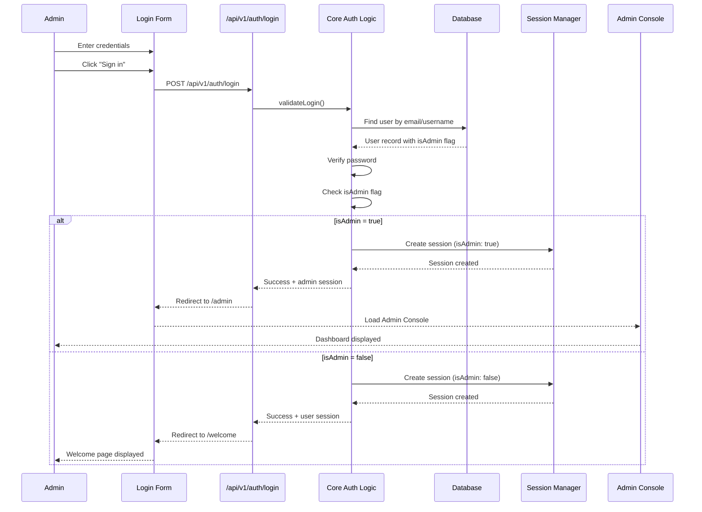

#### Edge Cases and Variations

**Admin Detection:**
- Admin status verified server-side only (never trust client)
- Session includes `isAdmin` flag for quick checks
- Middleware protects admin routes

**Access Control:**
- Non-admin users cannot access `/admin` routes
- Access denied redirects to `/welcome`
- Admin routes protected by middleware

---

### Returning Admin Journey

**Persona**: Admin  
**Scenario**: Returning admin login and various admin tasks  
**Entry Point**: Login page  
**Exit Point**: Various (depends on admin task completed)  
**Prerequisites**: Admin account exists, admin has previously logged in

**Related User Stories:**
- [Administrator Login](admin.md#administrator-login)
- [Administrator Console](admin.md#administrator-console)
- [Admin Dashboard Overview](admin.md#admin-dashboard-overview)
- [User Management](admin.md#user-management)
- [Event Management](admin.md#event-management)
- [Track Management](admin.md#track-management)
- [LiveRC Ingestion Controls](admin.md#liverc-ingestion-controls)
- [Audit Logs](admin.md#audit-logs)
- [Health Checks](admin.md#health-checks)
- [Log Viewing](admin.md#log-viewing)

#### High-Level Flow Diagram

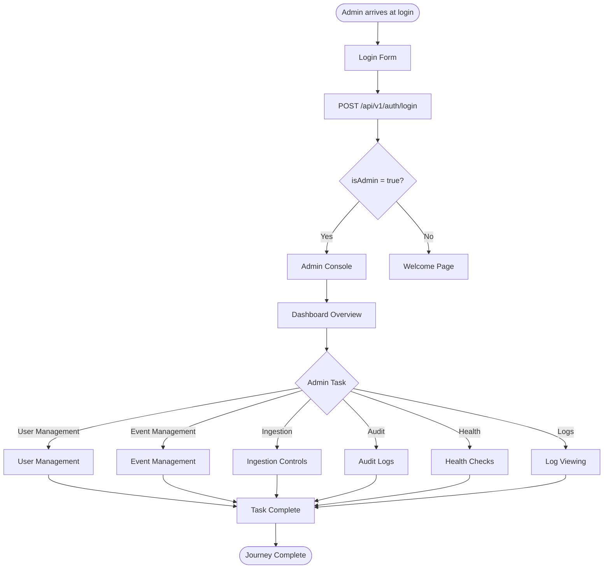

#### Detailed Step-by-Step Flow

**Step 1-3**: Same as First-time Admin Journey Steps 2-4 (Login, Admin Console Access, Dashboard Overview)

**Step 4: Admin Task Selection**

- **User Action**: Admin navigates to specific admin feature
- **UI Elements**: Admin Console navigation with feature links
- **API Calls**: Varies by feature
- **Backend Process**: Varies by feature
- **Success State**: Selected admin feature displayed
- **Error States**: Access denied if not admin
- **Next Step**: Admin performs specific admin task

**Note**: Detailed flows for each admin task are documented in subsequent journey sections (User Management, Event Management, Ingestion Management).

---

### Admin User Management Journey

**Persona**: Admin  
**Scenario**: Admin manages users (view, edit, delete, promote/demote)  
**Entry Point**: Admin Console → User Management  
**Exit Point**: User Management page or Admin Console  
**Prerequisites**: Admin logged in, users exist in system

**Related User Stories:**
- [User Management](admin.md#user-management)

#### High-Level Flow Diagram

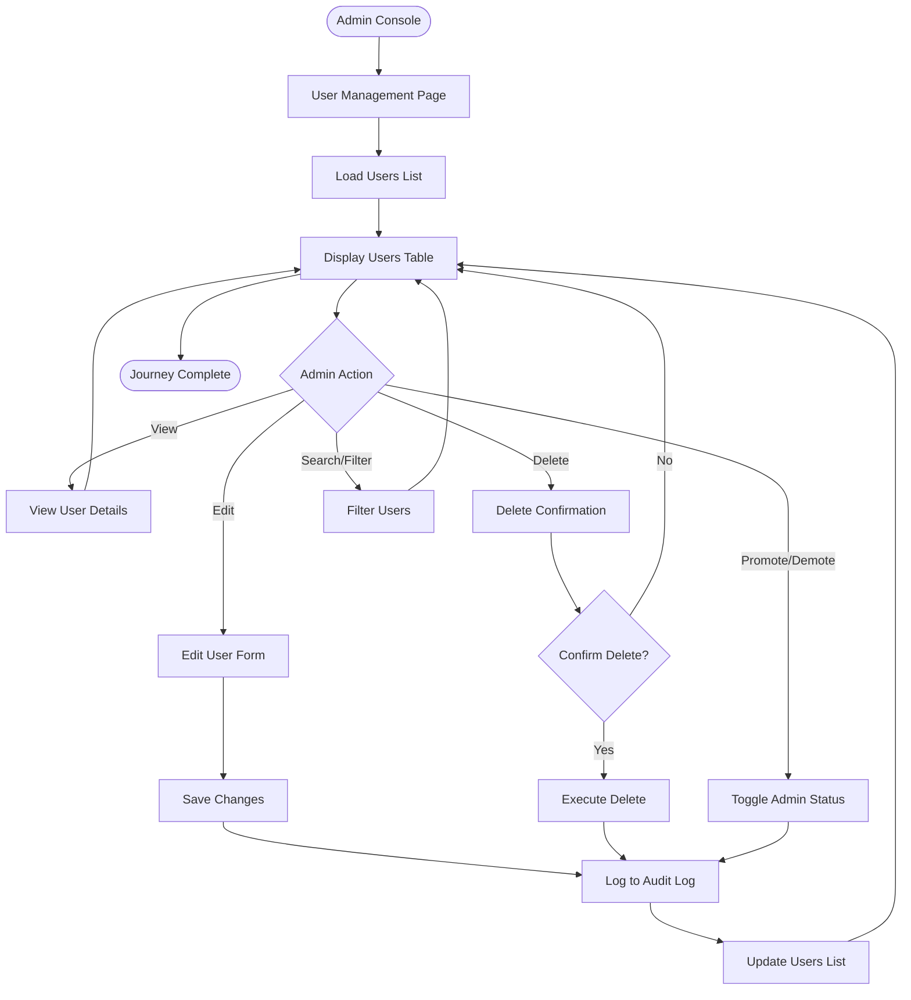

#### Detailed Step-by-Step Flow

**Step 1: Navigate to User Management**

- **User Action**: Admin clicks "User Management" in Admin Console navigation
- **UI Elements**: User Management page with users table
- **API Calls**: `GET /api/v1/admin/users?page=1&limit=20&sort=createdAt&order=desc`
- **Backend Process**: 
  1. Verify admin authentication
  2. Query users with pagination
  3. Apply sorting and filtering
  4. Return user list
- **Success State**: Users table displayed with pagination
- **Error States**: 
  - `403 Forbidden`: "Access denied. Admin privileges required."
  - `500 Internal Server Error`: "Unable to load users. Please try again."
- **Next Step**: Admin views users or performs actions

**Step 2: View Users Table**

- **User Action**: Admin views users table
- **UI Elements**: 
  - Sortable table columns: Email, Driver Name, Team Name, Admin Status, Created Date
  - Pagination controls
  - Search/filter inputs
  - Action buttons per row: Edit, Delete, Toggle Admin
- **API Calls**: `GET /api/v1/admin/users` (with query parameters)
- **Backend Process**: Retrieve and filter users
- **Success State**: Users displayed in table
- **Error States**: None (data already loaded)
- **Next Step**: Admin performs action on user

**Step 3: Edit User**

- **User Action**: Admin clicks "Edit" on user row
- **UI Elements**: 
  - Edit modal/form
  - Fields: Email, Driver Name, Team Name
  - "Save" and "Cancel" buttons
- **API Calls**: 
  - `GET /api/v1/admin/users/{userId}` (to load user data)
  - `PATCH /api/v1/admin/users/{userId}` (to save changes)
- **Backend Process**: 
  1. Verify admin authentication
  2. Load user data
  3. Validate changes
  4. Update user record
  5. Log action to audit log
- **Success State**: User updated, table refreshed
- **Error States**: 
  - `404 Not Found`: "User not found."
  - `400 Bad Request`: Validation errors
  - `500 Internal Server Error`: "Unable to update user. Please try again."
- **Next Step**: Table refreshed with updated data

**Step 4: Delete User**

- **User Action**: Admin clicks "Delete" on user row
- **UI Elements**: 
  - Confirmation dialog: "Are you sure you want to delete this user? This action cannot be undone."
  - "Delete" and "Cancel" buttons
- **API Calls**: `DELETE /api/v1/admin/users/{userId}`
- **Backend Process**: 
  1. Verify admin authentication
  2. Verify user exists
  3. Delete user record (cascade deletes handled by database)
  4. Log action to audit log
- **Success State**: User deleted, table refreshed
- **Error States**: 
  - `404 Not Found`: "User not found."
  - `500 Internal Server Error`: "Unable to delete user. Please try again."
- **Next Step**: Table refreshed, user removed from list

**Step 5: Promote/Demote Admin**

- **User Action**: Admin clicks "Toggle Admin" on user row
- **UI Elements**: 
  - Confirmation dialog: "Promote this user to administrator?" or "Remove administrator privileges?"
  - "Confirm" and "Cancel" buttons
- **API Calls**: `PATCH /api/v1/admin/users/{userId}` with `{ isAdmin: true/false }`
- **Backend Process**: 
  1. Verify admin authentication
  2. Update `isAdmin` flag
  3. Log action to audit log
- **Success State**: Admin status updated, table refreshed
- **Error States**: 
  - `404 Not Found`: "User not found."
  - `500 Internal Server Error`: "Unable to update admin status. Please try again."
- **Next Step**: Table refreshed with updated admin status

**Step 6: Search and Filter Users**

- **User Action**: Admin enters search term or applies filters
- **UI Elements**: 
  - Search input (searches email, driver name)
  - Filter dropdowns: Admin status, team name
  - "Clear Filters" button
- **API Calls**: `GET /api/v1/admin/users?search={term}&isAdmin={true/false}&teamName={name}`
- **Backend Process**: 
  1. Apply search filters
  2. Query database with filters
  3. Return filtered results
- **Success State**: Filtered users displayed
- **Error States**: None
- **Next Step**: Admin views filtered results or clears filters

#### Sequence Diagram: User Edit Flow

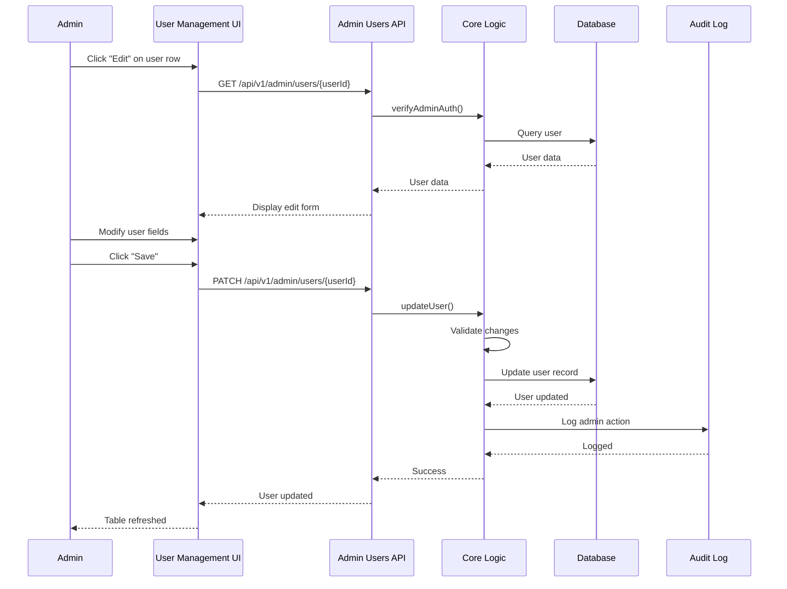

---

### Admin Event Management Journey

**Persona**: Admin  
**Scenario**: Admin manages events (view, re-ingest, delete)  
**Entry Point**: Admin Console → Event Management  
**Exit Point**: Event Management page or Admin Console  
**Prerequisites**: Admin logged in, events exist in system

**Related User Stories:**
- [Event Management](admin.md#event-management)

#### High-Level Flow Diagram

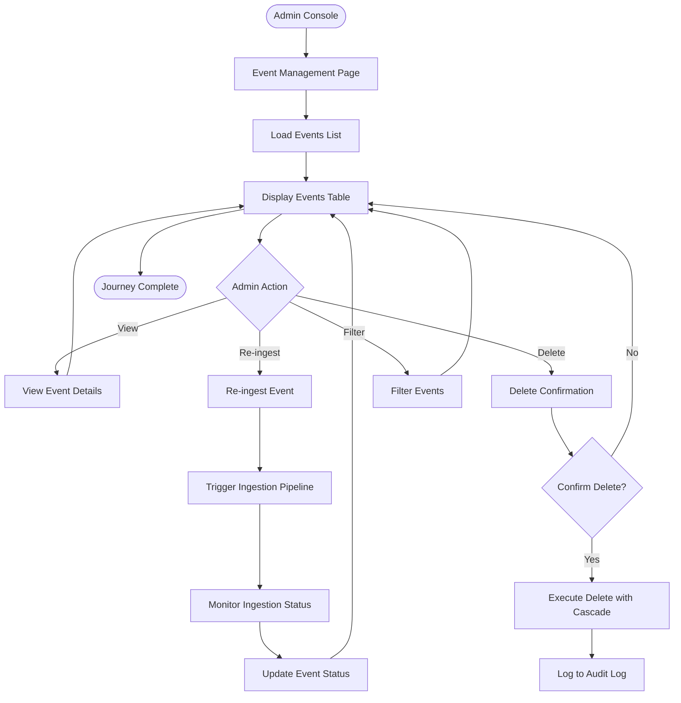

#### Detailed Step-by-Step Flow

**Step 1: Navigate to Event Management**

- **User Action**: Admin clicks "Event Management" in Admin Console navigation
- **UI Elements**: Event Management page with events table
- **API Calls**: `GET /api/v1/admin/events?page=1&limit=20&sort=eventDate&order=desc`
- **Backend Process**: 
  1. Verify admin authentication
  2. Query events with pagination
  3. Apply sorting and filtering
  4. Return event list with ingestion status
- **Success State**: Events table displayed
- **Error States**: 
  - `403 Forbidden`: "Access denied. Admin privileges required."
  - `500 Internal Server Error`: "Unable to load events. Please try again."
- **Next Step**: Admin views events or performs actions

**Step 2: View Events Table**

- **User Action**: Admin views events table
- **UI Elements**: 
  - Sortable table columns: Event Name, Event Date, Track, Ingestion Status, Last Ingested
  - Pagination controls
  - Filter inputs: Track, Date Range, Ingestion Status
  - Action buttons per row: Re-ingest, Delete
- **API Calls**: `GET /api/v1/admin/events` (with query parameters)
- **Backend Process**: Retrieve and filter events
- **Success State**: Events displayed in table
- **Error States**: None
- **Next Step**: Admin performs action on event

**Step 3: Re-ingest Event**

- **User Action**: Admin clicks "Re-ingest" on event row
- **UI Elements**: 
  - Confirmation dialog: "Re-ingest this event? This will update existing data."
  - "Re-ingest" and "Cancel" buttons
  - Status updates to "Importing" during ingestion
- **API Calls**: `POST /api/v1/admin/events/{eventId}/reingest`
- **Backend Process**: 
  1. Verify admin authentication
  2. Trigger ingestion pipeline for event
  3. Update event status to "Importing"
  4. Process event data from LiveRC
  5. Update event status on completion
  6. Log action to audit log
- **Success State**: Event re-ingested, status updated
- **Error States**: 
  - `404 Not Found`: "Event not found."
  - `409 Conflict`: "Ingestion already in progress."
  - `500 Internal Server Error`: "Unable to re-ingest event. Please try again."
- **Next Step**: Status updated, table refreshed

**Step 4: Delete Event**

- **User Action**: Admin clicks "Delete" on event row
- **UI Elements**: 
  - Confirmation dialog: "Delete this event? This will also delete all related races, results, and lap data. This action cannot be undone."
  - "Delete" and "Cancel" buttons
- **API Calls**: `DELETE /api/v1/admin/events/{eventId}`
- **Backend Process**: 
  1. Verify admin authentication
  2. Verify event exists
  3. Delete event record (cascade deletes handled by database)
  4. Log action to audit log
- **Success State**: Event deleted, table refreshed
- **Error States**: 
  - `404 Not Found`: "Event not found."
  - `500 Internal Server Error`: "Unable to delete event. Please try again."
- **Next Step**: Table refreshed, event removed from list

**Step 5: Filter Events**

- **User Action**: Admin applies filters (track, date range, ingestion status)
- **UI Elements**: 
  - Filter dropdowns and inputs
  - "Clear Filters" button
- **API Calls**: `GET /api/v1/admin/events?trackId={id}&startDate={date}&endDate={date}&ingestDepth={depth}`
- **Backend Process**: Apply filters and query database
- **Success State**: Filtered events displayed
- **Error States**: None
- **Next Step**: Admin views filtered results

---

### Admin Ingestion Management Journey

**Persona**: Admin  
**Scenario**: Admin manages LiveRC ingestion (trigger jobs, view status, view logs)  
**Entry Point**: Admin Console → Ingestion Controls  
**Exit Point**: Ingestion Controls page or Admin Console  
**Prerequisites**: Admin logged in, ingestion service available

**Related User Stories:**
- [LiveRC Ingestion Controls](admin.md#liverc-ingestion-controls)

#### High-Level Flow Diagram

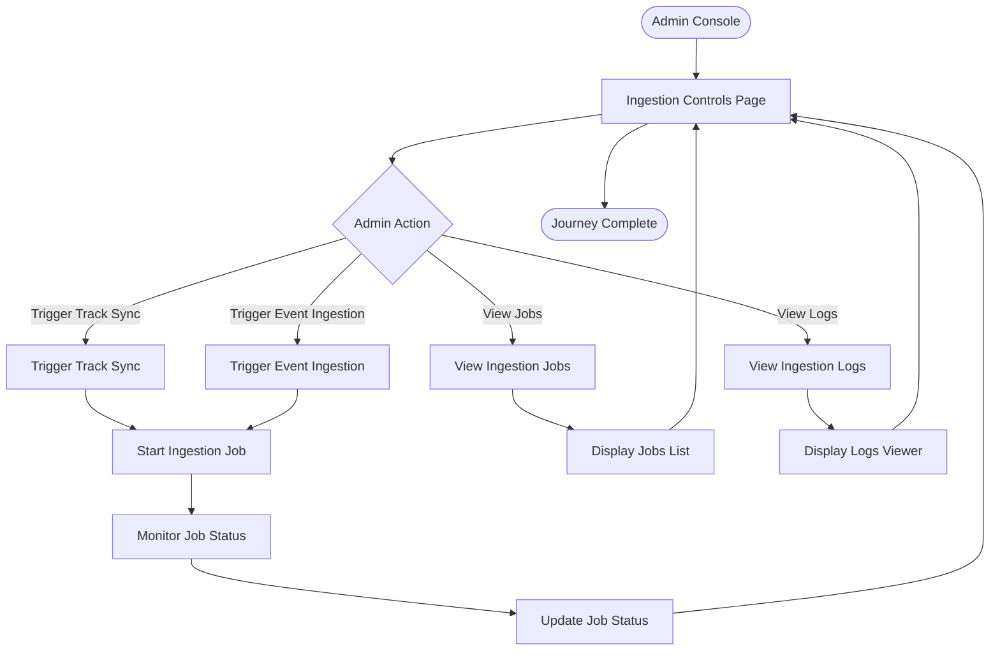

#### Detailed Step-by-Step Flow

**Step 1: Navigate to Ingestion Controls**

- **User Action**: Admin clicks "Ingestion Controls" in Admin Console navigation
- **UI Elements**: Ingestion Controls page with:
  - Manual trigger buttons: "Sync Tracks", "Ingest Event"
  - Jobs list (recent/active jobs)
  - Log viewer
- **API Calls**: `GET /api/v1/admin/ingestion/jobs`
- **Backend Process**: 
  1. Verify admin authentication
  2. Retrieve recent/active ingestion jobs
  3. Return job list with status
- **Success State**: Ingestion Controls page displayed
- **Error States**: 
  - `403 Forbidden`: "Access denied. Admin privileges required."
  - `500 Internal Server Error`: "Unable to load ingestion jobs. Please try again."
- **Next Step**: Admin triggers job or views logs

**Step 2: Trigger Track Sync**

- **User Action**: Admin clicks "Sync Tracks" button
- **UI Elements**: 
  - Confirmation dialog: "Sync tracks from LiveRC? This may take several minutes."
  - "Sync" and "Cancel" buttons
  - Job status indicator
- **API Calls**: `POST /api/v1/admin/ingestion/sync-tracks`
- **Backend Process**: 
  1. Verify admin authentication
  2. Trigger track sync job
  3. Create job record
  4. Start async track sync process
  5. Log action to audit log
- **Success State**: Job started, status displayed
- **Error States**: 
  - `500 Internal Server Error`: "Unable to trigger track sync. Please try again."
  - Ingestion service unavailable: "Ingestion service is unavailable. Please check service status."
- **Next Step**: Monitor job status

**Step 3: View Ingestion Jobs**

- **User Action**: Admin views jobs list
- **UI Elements**: 
  - Jobs table with columns: Job Type, Status, Started At, Completed At, Duration
  - Filter by status: All, Running, Completed, Failed
  - Refresh button
- **API Calls**: `GET /api/v1/admin/ingestion/jobs?status={status}`
- **Backend Process**: 
  1. Query ingestion jobs
  2. Filter by status if specified
  3. Return job list
- **Success State**: Jobs list displayed
- **Error States**: None
- **Next Step**: Admin views job details or logs

**Step 4: View Ingestion Logs**

- **User Action**: Admin clicks "View Logs" for specific job or opens log viewer
- **UI Elements**: 
  - Log viewer with:
    - Real-time log streaming (Server-Sent Events or WebSocket)
    - Paginated historical logs
    - Search and filter: Log level, service, date range, search term
    - Pretty-print JSON logs with syntax highlighting
- **API Calls**: 
  - `GET /api/v1/admin/logs` (historical logs)
  - `GET /api/v1/admin/logs/stream` (real-time streaming)
  - `GET /api/v1/admin/logs/sources` (log sources)
- **Backend Process**: 
  1. Retrieve logs from ingestion service
  2. Filter by criteria
  3. Stream logs in real-time (if streaming)
- **Success State**: Logs displayed
- **Error States**: 
  - `500 Internal Server Error`: "Unable to load logs. Please try again."
  - Log service unavailable: "Log service is unavailable."
- **Next Step**: Admin monitors logs or closes viewer

---

### Admin Error Scenarios

**Persona**: Admin  
**Scenario**: Error handling for admin operations  
**Entry Point**: Various admin operations  
**Exit Point**: Error resolved or operation aborted  
**Prerequisites**: Admin logged in, attempting admin operations

**Related User Stories:**
- All admin user stories include error handling sections

#### Common Admin Error Scenarios

**Scenario 1: Access Denied (Non-Admin User)**

- **User Action**: Non-admin user attempts to access admin route
- **UI Elements**: Error message or redirect to `/welcome`
- **API Response**: `403 Forbidden`
- **Error Handling**: 
  - Access denied message or silent redirect
  - User cannot access admin features
- **Recovery Path**: User cannot proceed (by design)

**Scenario 2: Database Connection Error**

- **User Action**: Admin attempts operation but database unavailable
- **UI Elements**: Error message: "Unable to connect to database. Please check system health."
- **API Response**: `503 Service Unavailable`
- **Error Handling**: 
  - Error displayed prominently
  - Link to Health Checks page provided
- **Recovery Path**: Admin checks system health, retries when database available

**Scenario 3: Ingestion Service Unavailable**

- **User Action**: Admin attempts to trigger ingestion but service unavailable
- **UI Elements**: Error message: "Ingestion service is unavailable. Please check service status."
- **API Response**: `503 Service Unavailable`
- **Error Handling**: 
  - Error displayed
  - Link to Health Checks page provided
- **Recovery Path**: Admin checks ingestion service health, retries when available

**Scenario 4: Concurrent Operation Conflict**

- **User Action**: Admin attempts operation already in progress
- **UI Elements**: Error message: "Operation already in progress. Please wait for current operation to complete."
- **API Response**: `409 Conflict`
- **Error Handling**: 
  - Error displayed
  - Status shows operation in progress
- **Recovery Path**: Admin waits for operation to complete

---

## Team Manager Persona Journeys

**Note**: Team Manager persona is defined but not fully implemented in version 0.1.0. The following journeys document the intended behavior based on persona specifications.

### Team Manager Assignment Journey

**Persona**: Team Manager  
**Scenario**: User assigned Team Manager persona  
**Entry Point**: Backend assignment or user registration with team  
**Exit Point**: Team Manager dashboard or team management page  
**Prerequisites**: User account exists, `isTeamManager` flag set, `teamName` provided

**Related Documentation:**
- [MRE Personas - Team Manager Persona](../design/mre-personas.md#3-team-manager-persona)

#### High-Level Flow Diagram

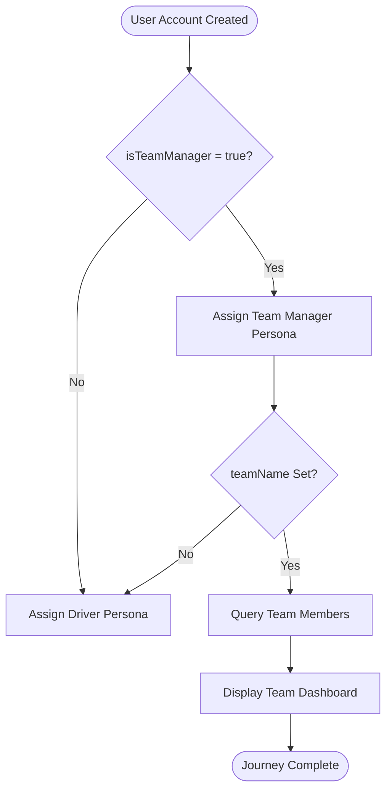

#### Detailed Flow (Future Implementation)

**Step 1: Team Manager Assignment**

- **User Action**: User account created with `isTeamManager = true` and `teamName`
- **UI Elements**: None (backend assignment)
- **API Calls**: None (backend process)
- **Backend Process**: 
  1. Check `isTeamManager` flag
  2. Verify `teamName` is set
  3. Assign Team Manager persona
  4. Query users with matching `teamName` (team members)
- **Success State**: Team Manager persona assigned, team members identified
- **Error States**: None
- **Next Step**: Team Manager accesses team features

**Step 2: Team Dashboard**

- **User Action**: Team Manager navigates to team dashboard
- **UI Elements**: 
  - Team name display
  - Team members list
  - Team events list
  - Team performance metrics (future)
- **API Calls**: `GET /api/v1/personas/team-manager/team`
- **Backend Process**: 
  1. Query users with matching `teamName`
  2. Query events where team members participated
  3. Return team data
- **Success State**: Team dashboard displayed
- **Error States**: 
  - `404 Not Found`: "Team not found."
  - `500 Internal Server Error`: "Unable to load team data. Please try again."
- **Next Step**: Team Manager manages team or views team events

---

## Race Engineer Persona Journeys

**Note**: Race Engineer persona is defined but not fully implemented in version 0.1.0. The following journeys document the intended behavior based on persona specifications.

### Race Engineer Selection Journey

**Persona**: Race Engineer  
**Scenario**: User selects Race Engineer persona  
**Entry Point**: Persona selection page (future)  
**Exit Point**: Race Engineer interface  
**Prerequisites**: User account exists, Race Engineer persona available

**Related Documentation:**
- [MRE Personas - Race Engineer Persona](../design/mre-personas.md#4-race-engineer-persona)

#### High-Level Flow Diagram

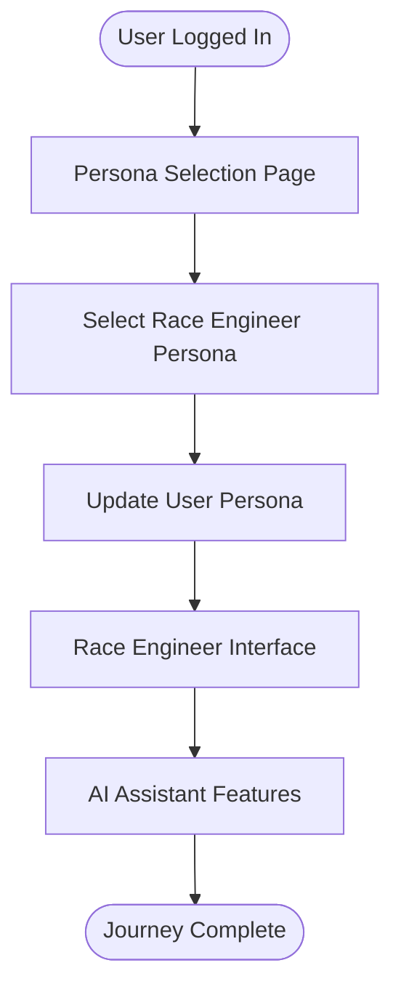

#### Detailed Flow (Future Implementation)

**Step 1: Persona Selection**

- **User Action**: User navigates to persona selection and selects Race Engineer
- **UI Elements**: 
  - Persona selection interface
  - Available personas: Driver, Admin, Team Manager, Race Engineer
  - Race Engineer description and features
- **API Calls**: `POST /api/v1/users/me/persona` with `{ personaId: "race_engineer_id" }`
- **Backend Process**: 
  1. Verify user authentication
  2. Update user's `personaId` to Race Engineer
  3. Return updated persona
- **Success State**: Race Engineer persona assigned
- **Error States**: 
  - `404 Not Found`: "Persona not found."
  - `400 Bad Request`: "Cannot assign this persona."
- **Next Step**: User accesses Race Engineer features

**Step 2: AI Assistant Interface**

- **User Action**: User interacts with AI assistant
- **UI Elements**: 
  - Conversational interface
  - Setup recommendation cards
  - Tuning guidance
- **API Calls**: Future AI assistant endpoints
- **Backend Process**: Future AI processing
- **Success State**: AI assistant responds
- **Error States**: Future error handling
- **Next Step**: User receives recommendations

---

## Cross-Persona Journeys

### Authentication Error Scenarios

**Personas**: All  
**Scenario**: Common authentication errors across all personas  
**Entry Point**: Authentication attempts  
**Exit Point**: Error resolved or user abandons  
**Prerequisites**: User attempting authentication

**Related User Stories:**
- [User Registration](authentication.md#user-registration) - Error handling
- [User Login](authentication.md#user-login) - Error handling
- [Administrator Login](admin.md#administrator-login) - Error handling

#### Common Authentication Errors

**Error 1: Invalid Credentials**

- **User Action**: User enters incorrect email/username or password
- **UI Elements**: Error message: "Invalid email/username or password."
- **API Response**: `401 Unauthorized`
- **Error Handling**: 
  - Generic message (prevents account enumeration)
  - Form remains populated (except password)
  - User can retry
- **Recovery Path**: User re-enters credentials or clicks "Forgot password" (future)

**Error 2: Account Not Found**

- **User Action**: User enters non-existent email/username
- **UI Elements**: Error message: "Invalid email/username or password." (generic for security)
- **API Response**: `404 Not Found`
- **Error Handling**: 
  - Same generic message as invalid credentials
  - Link to registration provided
- **Recovery Path**: User navigates to registration or corrects email/username

**Error 3: Session Expired**

- **User Action**: User's session expires while using application
- **UI Elements**: Redirect to login page with message: "Your session has expired. Please log in again."
- **API Response**: `401 Unauthorized` on protected route access
- **Error Handling**: 
  - Automatic redirect to login
  - Session cleared
  - User can log in again
- **Recovery Path**: User logs in again

**Error 4: Rate Limiting**

- **User Action**: User exceeds rate limit for authentication endpoints
- **UI Elements**: Error message: "Too many requests. Please try again later."
- **API Response**: `429 Too Many Requests`
- **Error Handling**: 
  - Rate limit message displayed
  - User must wait before retrying
  - Retry-After header indicates wait time
- **Recovery Path**: User waits and retries

---

### Network Error Scenarios

**Personas**: All  
**Scenario**: Network failures during various operations  
**Entry Point**: Any API call  
**Exit Point**: Error resolved or operation aborted  
**Prerequisites**: User attempting any operation requiring network

#### Common Network Errors

**Error 1: Connection Timeout**

- **User Action**: User attempts operation but connection times out
- **UI Elements**: Error message: "Connection timed out. Please check your connection and try again."
- **API Response**: Network timeout (no response)
- **Error Handling**: 
  - Generic error message
  - Retry option provided
  - Operation state preserved where possible
- **Recovery Path**: User checks connection and retries

**Error 2: Network Unavailable**

- **User Action**: User attempts operation but network unavailable
- **UI Elements**: Error message: "Network unavailable. Please check your connection and try again."
- **API Response**: Network error (no response)
- **Error Handling**: 
  - Generic error message
  - Retry option provided
- **Recovery Path**: User checks connection and retries

**Error 3: Service Unavailable**

- **User Action**: User attempts operation but service unavailable
- **UI Elements**: Error message: "Service temporarily unavailable. Please try again later."
- **API Response**: `503 Service Unavailable`
- **Error Handling**: 
  - Service unavailable message
  - Retry option provided
  - Link to status page (if available)
- **Recovery Path**: User retries later or checks service status

---

### Mobile vs Desktop Variations

**Personas**: All  
**Scenario**: Platform-specific differences in user experience  
**Entry Point**: User accesses application on mobile or desktop  
**Exit Point**: Same journey completion, different UI/UX  
**Prerequisites**: User accessing application on mobile or desktop device

**Related Documentation:**
- [MRE Mobile UX Guidelines](../design/mre-mobile-ux-guidelines.md)
- [MRE Dark Theme Guidelines](../design/mre-dark-theme-guidelines.md)

#### Layout Differences

**Mobile (0-899px):**
- Single-column layouts
- Full-width form elements
- Full-screen modals
- Card/list format for tables
- Native date pickers
- Touch-optimized interactions (44px minimum touch targets)

**Desktop (900px+):**
- Two-column layouts (where applicable)
- Auto-width form elements
- Centered modals (max-width constraints)
- Table format for data
- Enhanced calendar pickers (with native fallback)
- Mouse-optimized interactions

#### Interaction Differences

**Mobile:**
- Touch gestures (tap, swipe, pinch)
- No hover states
- Native keyboard for inputs
- Full-screen overlays for modals
- Bottom sheets for actions

**Desktop:**
- Mouse interactions (click, hover, drag)
- Hover states for interactive elements
- Keyboard shortcuts
- Centered dialogs for modals
- Dropdown menus for actions

#### Responsive Breakpoints

- **Mobile**: 0-599px (phones)
- **Tablet**: 600-899px (tablets)
- **Desktop**: 900px+ (desktops, laptops)

#### Platform-Specific Features

**Mobile:**
- Native date/time pickers
- Touch-optimized form inputs
- Swipe gestures for navigation
- Pull-to-refresh (where applicable)
- Bottom navigation (where applicable)

**Desktop:**
- Enhanced calendar pickers
- Keyboard navigation
- Right-click context menus (where applicable)
- Multi-select with checkboxes
- Drag-and-drop (where applicable)

---

## Related Documentation

This user journey documentation references and complements:

- **[User Stories README](README.md)**: Overview of user stories organization
- **[Authentication Epic](authentication.md)**: Registration and login user stories
- **[User Management Epic](user-management.md)**: Welcome page user stories
- **[Administrator Epic](admin.md)**: Admin login and console user stories
- **[LiveRC Integration Epic](liverc-integration.md)**: Event search and analysis user stories
- **[LiveRC User Workflow](../frontend/liverc/user-workflow.md)**: Detailed Event Search and Analysis workflow
- **[MRE Personas](../design/mre-personas.md)**: Comprehensive persona definitions
- **[MRE Version 0.1.0 Feature Scope](../specs/mre-v0.1-feature-scope.md)**: Version 0.1.0 feature specifications
- **[Mobile-Safe Architecture Guidelines](../architecture/mobile-safe-architecture-guidelines.md)**: Technical architecture requirements
- **[LiveRC API Contracts](../architecture/liverc-ingestion/05-api-contracts.md)**: API endpoint specifications
- **[MRE UX Principles](../design/mre-ux-principles.md)**: UX design principles
- **[MRE Mobile UX Guidelines](../design/mre-mobile-ux-guidelines.md)**: Mobile-specific UX requirements
- **[MRE Dark Theme Guidelines](../design/mre-dark-theme-guidelines.md)**: Visual design standards

---

## License

Internal use only. This documentation governs user journey definitions for the MRE application.

